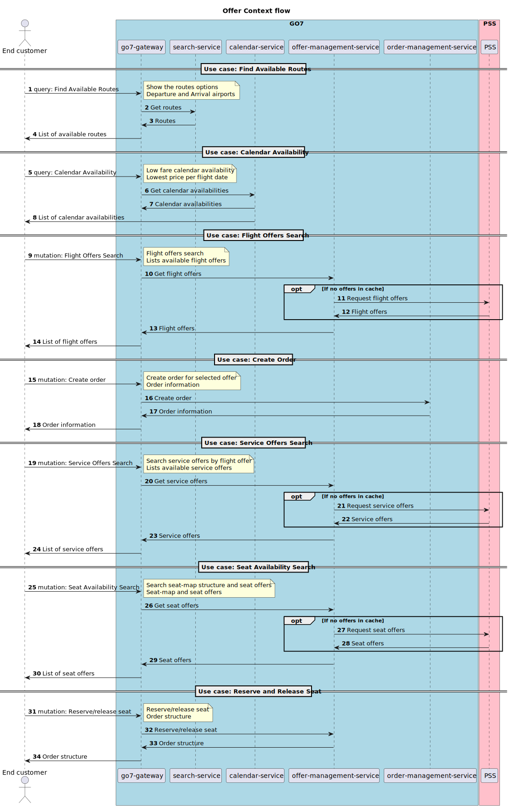

# HUB Offer Context API

## Table of Contents

- [Introduction](#introduction)
- [Business Flow](#business-flow)
- [Postman Collection](#postman-collection)
- [Offer Context Flow API](#offer-context-flow-api)

## Change Log

| Change Description                                   | Changed By            | Change Date |
|------------------------------------------------------|-----------------------|-------------|
| Initial creation of the document                     | Ruslan Miroshnychenko | 2025-02-28  |

 

# Introduction

This document outlines the integration of the HUB API for Offer Context functionality

## Endpoints

### Test Endpoints

|                  | Test                                                  |
|------------------|-------------------------------------------------------|
| REST API         | https://go7-gateway.dev.go7.io/graphiql?path=/graphql |

### Production Endpoints

|                  | Production                                            |
|------------------|-------------------------------------------------------|
| REST API         |                                                       |

# Business Flow

This diagram illustrates the API call sequence for searching available routes, request list of calendar items, find flight offers and service offers, request seat-map and reserve/release seat.

# Postman Collection

# Offer Context Flow API

|       | Production | Test                                    |
|-------|------------|-----------------------------------------|
| API   |            | https://go7-gateway.dev.go7.io/graphql  |

- [Sales Channel Properties](endpoints/sales_channel_properties.md)
- [Find Available Routes](endpoints/routes_availability.md)
- [Calendar Availability](endpoints/calendar_availability.md)
- [Flight Offers Search](endpoints/flight_offers_search.md)
- [Service Offers Search](endpoints/service_offers_search.md)
- [Seat availability search](endpoints/seat_availability.md)
- [Reserve and release seat](endpoints/reserve_release_seat.md)

