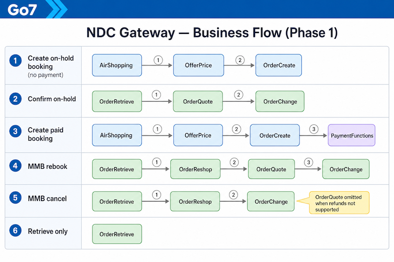
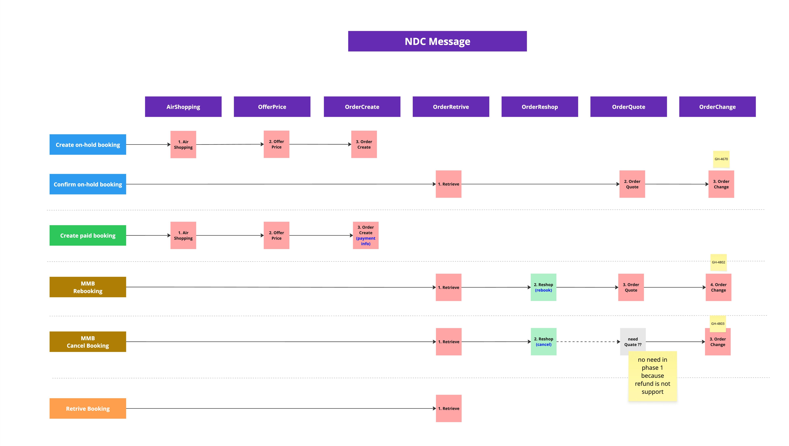

# NDC API Generic Integration Guide

## Table of Contents

- [NDC API Generic Integration Guide](#ndc-api-generic-integration-guide)
  - [Table of Contents](#table-of-contents)
  - [Change Log](#change-log)
- [Introduction](#introduction)
  - [Base URLs](#base-urls)
  - [HTTP Headers](#http-headers)
  - [Authentication](#authentication)
- [Business Flow](#business-flow)
  - [Sequence diagram](#sequence-diagram)
    - [Mermaid sequence (source)](#mermaid-sequence-source)
  - [Phase 1 scenario summary](#phase-1-scenario-summary)
  - [NDC Gateway workflow (Phased 1)](#ndc-gateway-workflow-phased-1)
- [NDC XML (Offers & Orders)](#ndc-xml-offers--orders)
- [Postman Collection](#postman-collection)
- [Code Lists](#code-lists)
  - [Passenger Type (PTC)](#passenger-type-ptc)
  - [Cabin Type](#cabin-type)
  - [Document Type](#document-type)
- [NDC for Offers & Orders workflow](#ndc-for-offers--orders-workflow)
  - [Basic request format (API key)](#basic-request-format-api-key)

## Change Log

| Change Description | Changed By | Change Date |
|-------------------|------------|-------------|
| OTA-style workflow with one-way / round-trip and scenario examples | — | 2026-05-06 |
| Centralized authentication in this guide (API key only); removed JWT/token sections | — | 2026-05-05 |
| Mermaid sequence source: `ndc/mermaid/ndc-business-flow-sequence.mmd` (alongside PNG) | — | 2026-05-06 |
| Business Flow overview diagram image (`ndc-business-flow.png`) | — | 2026-05-05 |
| Workflow step examples live only under `ndc/endpoints/*.md`; hub keeps index + curl template | — | 2026-05-06 |
| Endpoint docs moved under `ndc/endpoints/<message>/`; hub aligned with OTA generic guide layout | — | 2026-05-05 |
| Initial NDC guide: Phased 1 scenarios, workflow diagram, message references | — | 2026-05-05 |

> **TODO:** Add a dedicated NDC changelog page and link it here (parity with OTA *For detailed changelog see: [Generic Changelog](../ota/generic-changelog.md)*).

# Introduction

This document outlines generic integration with the Go7 **NDC Gateway** using **IATA NDC Offers & Orders** XML messages. Schema distribution **21.3** is exposed under the HTTP path **`/v21.3.5`**. Per-message field references also live under [`ndc/endpoints/`](endpoints/airshopping.md).

Requests use **XML bodies** with **`Content-Type: application/xml`** (or `application/xml;charset=UTF-8`). **[Authentication](#authentication)** describes tenant/channel headers and API key usage.

## Base URLs

Use these hosts with the paths documented per endpoint (for example `POST …/v21.3.5/AirShopping`).

| Environment | Base URL |
|-------------|-----------|
| Production (platform API) | `https://api.go7.io` |

> **TODO:** Add **Test** / QA base URL row when finalized (parity with OTA Production + Test table in `ota/OTA_API.md`).

All Offers & Orders messages documented here are posted under:

`https://api.go7.io/v21.3.5/<MessageName>`

## HTTP Headers

Attach the following headers to NDC Gateway requests unless an endpoint page specifies otherwise.

| Header | Description | Example |
|--------|-------------|---------|
| `x-tenant` | Tenant identifier | `test-qa-rc` |
| `x-SalesChannel` | Sales channel (`NDC`, `IBE`, …) | `NDC` |
| `x-api-key` | API key authentication | `{api_key}` |
| `Content-Type` | Request body type | `application/xml` |

Use `x-api-key` for authentication on NDC Gateway requests.

## Authentication

Every request must include **`x-tenant`** and **`x-SalesChannel`** (see [HTTP Headers](#http-headers)).

Use **`x-api-key`** for caller authentication on all NDC Gateway endpoints in this guide.

Order retrieve / view mapping (`OrderRetrieveRQ` → REST) uses the **order management** APIs documented in [Order Retrieve mapping](endpoints/orderretrieve.md); follow that service auth model.

# Business Flow

Phased 1 scenarios cover shopping and pricing offers, creating or confirming orders, reshop/requote paths, and order retrieve.

## Sequence diagram

The diagram shows **Customer → Integrator Application → NDC Gateway** flows for each Phase 1 scenario (messages under `/v21.3.5`).



*Cancel flow omits `OrderQuote` when refunds are not supported.*

### Mermaid sequence (source)

For diagram-as-code review and diffs (similar to the Mermaid-only Business Flow in [`ota/OTA_API.md`](../ota/OTA_API.md)), maintain the sequence here:

**[ndc-business-flow-sequence.mmd](mermaid/ndc-business-flow-sequence.mmd)**

Render locally with your Mermaid toolchain, or paste the file contents into any Mermaid-compatible viewer.

## Phase 1 scenario summary

| Scenario | Message sequence |
|----------|-------------------|
| Create on-hold booking | `AirShopping` → `OfferPrice` → `OrderCreate` (no payment). |
| Confirm on-hold booking | Order retrieve → `OrderQuote` → `OrderChange`. |
| Create paid booking | `AirShopping` → `OfferPrice` → `OrderCreate` (with payment). |
| Manage booking — rebook | Order retrieve → `OrderReshop` → `OrderQuote` → `OrderChange`. |
| Manage booking — cancel | Order retrieve → `OrderReshop` (cancel); **`OrderQuote` not used in Phase 1** when refunds are unsupported → `OrderChange`. |
| Retrieve booking | Order retrieve / view only. |

## NDC Gateway workflow (Phased 1)

Official scenario grid (**NDC Gateway — NDC Workflow Process, Phased 1**):



IATA **`OrderRetrieveRQ`** is mapped to internal order REST reads (UUID vs record locator + traveler name): see [Order Retrieve mapping](endpoints/orderretrieve.md).

# NDC XML (Offers & Orders)

Use IATA **OffersAndOrders** message XML (`IATA_AirShoppingRQ`, `IATA_OrderCreateRQ`, etc.) as shown in each endpoint document. Official XSDs are published by IATA for distribution **21.3**; align payloads with the examples in [`ndc/endpoints/`](endpoints/airshopping.md).

> **TODO:** Publish a downloadable archive under `/docs/assets/resources/` (e.g. XSD bundle or tooling zip) and link it here (parity with **OTA XML Schema 2015** in `ota/OTA_API.md`).

# Postman Collection

> **TODO:** Add a Postman collection JSON under `/docs/assets/resources/` and document variable names here (parity with **Postman Collection** in `ota/OTA_API.md` — e.g. tenant, API key, realm, sales channel).

When the collection exists, document variables here (expected examples: `apiKey`, `tenant`, `salesChannel`, `base_url`).

# Code Lists

> **TODO:** Add **Booking Class / RBD** code list when documented for NDC offers (OTA separates **Booking Class** from cabin in `ota/OTA_API.md`).

## Passenger Type (PTC)

| Code | Description |
|------|-------------|
| ADT | Adult |
| CHD | Child |
| INF | Infant |

## Cabin Type

| Code | Description |
|------|-------------|
| Y | Economy |
| C | Business |
| F | First |

## Document Type

> **TODO:** Define traveler identity document codes used in NDC payloads (e.g. `OrderCreate` / Pax identity) when aligned with airline implementation (parity with **Document Type** in `ota/OTA_API.md`).

# NDC for Offers & Orders workflow

Same pattern as **[OTA for Reservation workflow](../ota/OTA_API.md#ota-for-reservation-workflow)**: this section is an **index only**. Each **step** links to the endpoint `.md` file where requests, responses, and scenario anchors live. See **[Authentication](#authentication)**.

Typical Phased 1 chain: **AirShopping → OfferPrice → OrderCreate**, then retrieve / reshop / quote / change as needed (see [Phase 1 scenario summary](#phase-1-scenario-summary)).

| | Production-style base | Message path pattern |
|--|------------------------|----------------------|
| Offers & Orders API | `https://api.go7.io` | `/v21.3.5/<MessageName>` |

> **TODO:** Add **Test** column when sandbox hosts are finalized.

- **1 — [Air Shopping](endpoints/airshopping.md)** — `POST …/AirShopping` · `IATA_AirShoppingRQ` / `RS`
  - [One-way trip](endpoints/airshopping.md#airshopping-one-way-trip)
  - [Round trip](endpoints/airshopping.md#airshopping-round-trip)
- **2 — [Offer Price](endpoints/offerprice.md)** — `POST …/OfferPrice` · priced offer for **OrderCreate**
  - [One-way](endpoints/offerprice.md#offerprice-one-way-trip)
  - [Round trip](endpoints/offerprice.md#offerprice-round-trip)
- **3 — [Order Create](endpoints/ordercreate.md)** — `POST …/OrderCreate` · accept priced offer; optional payment
  - [Pay later (on hold)](endpoints/ordercreate.md#ordercreate-pay-later)
  - [Instant pay](endpoints/ordercreate.md#ordercreate-instant-pay)
- **4 — [Order Retrieve mapping](endpoints/orderretrieve.md)** — `OrderRetrieveRQ` → **`GET /orders/…`** (no gateway `POST`)
  - [One-way, on hold (`DRAFT`)](endpoints/orderretrieve.md#orderretrieve-one-way-on-hold)
  - [One-way, instant pay (`OPEN`)](endpoints/orderretrieve.md#orderretrieve-one-way-instant)
  - [Round trip, on hold](endpoints/orderretrieve.md#orderretrieve-round-trip-on-hold)
  - [Round trip, instant pay](endpoints/orderretrieve.md#orderretrieve-round-trip-instant)
- **5 — [Order Reshop](endpoints/orderreshop.md)** — `POST …/OrderReshop` · alternatives for rebook or cancel
  - [Rebook](endpoints/orderreshop.md#orderreshop-rebook)
  - [Cancel order](endpoints/orderreshop.md#orderreshop-cancel-order)
- **6 — [Order Quote](endpoints/orderquote.md)** — `POST …/OrderQuote` · quote before **OrderChange**
  - [Rebook quote](endpoints/orderquote.md#orderquote-rebook)
  - [Cancel quote](endpoints/orderquote.md#orderquote-cancel)
  - [Booking (confirm on-hold quote)](endpoints/orderquote.md#orderquote-booking)
- **7 — [Order Change](endpoints/orderchange.md)** — `POST …/OrderChange` · pay **DRAFT**, or accept quoted / rebook offers
  - [Payment on hold booking](endpoints/orderchange.md#orderchange-payment-on-hold)
  - [Payment with debit](endpoints/orderchange.md#orderchange-payment-debit)
  - [Payment with credit](endpoints/orderchange.md#orderchange-payment-credit)
  - [Rebook with new offers](endpoints/orderchange.md#orderchange-rebook)

## Basic request format (API key)
{: #workflow-basic-curl}

```bash
curl -X POST "https://api.go7.io/v21.3.5/<MessageName>" \
  -H "x-tenant: {tenant}" \
  -H "x-SalesChannel: NDC" \
  -H "x-api-key: {api_key}" \
  -H "Content-Type: application/xml" \
  -d @request.xml
```

Replace `<MessageName>` with `AirShopping`, `OfferPrice`, `OrderCreate`, etc.
