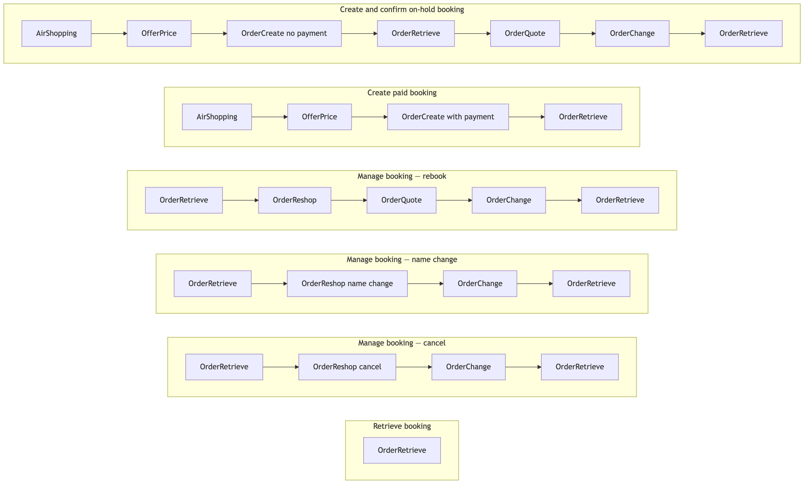
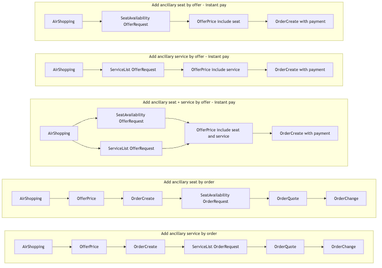

# NDC API Generic Integration Guide

## Table of Contents

- [NDC API Generic Integration Guide](#ndc-api-generic-integration-guide)
  - [Table of Contents](#table-of-contents)
  - [Change Log](#change-log)
- [Introduction](#introduction)
  - [Base URLs](#base-urls)
  - [HTTP Headers](#http-headers)
  - [Authentication](#http-headers)
- [Business Flow](#business-flow)
  - [Phase 1 scenario summary](#phase-1-scenario-summary)
  - [Phase 2 scenario summary](#phase-2-scenario-summary)
- [NDC XML (Offers & Orders)](#ndc-xml-offers--orders)
- [Postman Collection](#postman-collection)
- [Code Lists](#code-lists)
  - [Passenger Type (PTC)](#passenger-type-ptc)
  - [Cabin Type](#cabin-type)
  - [Document Type](#document-type)
- [NDC for Offers & Orders workflow](#ndc-for-offers--orders-workflow)
  - [Basic request format (API key)](#basic-request-format-api-key)

## Change Log

| Change Description                                                  | Changed By              | Change Date |
|---------------------------------------------------------------------|-------------------------|-------------|
| Phase 2 by-offer: OfferPrice only after SeatAvailability/ServiceList; instant-pay note; mixed seat+service flow | Jarun Jiamtaweeboon     | 2026-07-23  |
| Updated OfferPrice for Phase 2 combined flight + service / seat pricing | Jarun Jiamtaweeboon     | 2026-07-22  |
| Updated Phase 2 add-ancillary flows, workflow images, credit-card PCI payment | Naphachara Rattanawilai | 2026-07-20  |
| Updated Postman collection with Phase 2 endpoints                   | Tyler Thorin            | 2026-05-19  |
| Added Phase 2 to the document                                       | Tyler Thorin            | 2026-05-12  |
| Prepared Postman collection and update API request/response example | Thotsaphorn Phonlabutr  | 2026-05-08  |
| Initial creation of the document                                    | Naphachara Rattanawilai | 2026-05-06  |

# Introduction

This document outlines generic integration with the Go7 **NDC Gateway** using **IATA NDC Offers & Orders** XML messages. Schema distribution **21.3** is exposed under the HTTP path **`/v21.3.5`**. Per-message field references also live under [`ndc/endpoints/`](endpoints/airshopping.md).

Requests use **XML bodies** with **`Content-Type: application/xml`** (or `application/xml;charset=UTF-8`). **[Authentication](#http-headers)** describes tenant/channel headers and API key usage.

## Base URLs

Use these hosts with the paths documented per endpoint (for example `POST …/v21.3.5/AirShopping`).

| Environment               | Base URL |
|---------------------------|-----------|
| Production (platform API) | `https://api.go7.io` |
| Test (platform API)       | `https://go7-api-gateway.dev.go7.io/ndc-gateway` |

All Offers & Orders messages documented here are posted under:

`https://api.go7.io/v21.3.5/<MessageName>`

## HTTP Headers

Attach the following headers to NDC Gateway requests unless an endpoint page specifies otherwise.

| Header | Description | Example |
|--------|-------------|---------|
| `x-tenant` | Tenant identifier | `test-qa-rc` |
| `x-SalesChannel` | Sales channel (`NDC`, `IBE`, …) | `NDC` |
| `x-api-key` | API key authentication | `{x-api-key}` |
| `Content-Type` | Request body type | `application/xml` |

Use `x-api-key` for authentication on NDC Gateway requests.

# Business Flow

Phased 1 scenarios cover shopping and pricing offers, creating or confirming orders, reshop/requote paths, and order retrieve. Phase 2 adds ancillary seat and service **addition** using either offer context (price into `OrderCreate`) or order context (`OrderQuote` then `OrderChange`).

## Phase 1 scenario summary

| Scenario                         | Message sequence                                                                                                                            |
|----------------------------------|---------------------------------------------------------------------------------------------------------------------------------------------|
| Create & confirm on-hold booking | `AirShopping` → `OfferPrice` → `OrderCreate`(no payment) → `OrderRetrieve` → `OrderQuote` → `OrderChange` → `OrderRetrieve`.                |
| Create paid booking              | `AirShopping` → `OfferPrice` → `OrderCreate` (with payment) →`OrderRetrieve`.                                                               |
| Manage booking — rebook          | `OrderRetrieve` → `OrderReshop` → `OrderQuote` → `OrderChange` → `OrderRetrieve`.                                                           |
| Manage booking — name change     | `OrderRetrieve` → `OrderReshop` (name change) → `OrderChange` → `OrderRetrieve`.                                                             |
| Manage booking — cancel          | `OrderRetrieve` → `OrderReshop` (cancel); **`OrderQuote` not used in Phase 1** when refunds are unsupported → `OrderChange` → `OrderRetrieve`. |
| Retrieve booking                 | `OrderRetrieve` (view only).              |

### NDC Gateway workflow (Phased 1)

Scenario flow (**NDC Gateway — NDC Workflow Process, Phased 1**). Source Mermaid: [`ndc/mermaid/ndc-phase1-scenario-flow.mmd`](mermaid/ndc-phase1-scenario-flow.mmd).



IATA **`OrderRetrieveRQ`** is mapped to internal order REST reads (UUID vs record locator + traveler name): see [Order Retrieve mapping](endpoints/orderretrieve.md).

## Phase 2 scenario summary

Phase 2 builds on the same base flow as [Phase 1 scenario summary](#phase-1-scenario-summary), but adds ancillary seat and service addition scenarios.

| Scenario                               | Message sequence                                                                                                                      |
|----------------------------------------|---------------------------------------------------------------------------------------------------------------------------------------|
| Add ancillary seat by offer            | `AirShopping` → `SeatAvailability` (`OfferRequest`) → `OfferPrice` (flight + seat) → `OrderCreate` (with payment).                   |
| Add ancillary service by offer         | `AirShopping` → `ServiceList` (`OfferRequest`) → `OfferPrice` (flight + service) → `OrderCreate` (with payment).                      |
| Add ancillary seat + service by offer  | `AirShopping` → `SeatAvailability` + `ServiceList` (`OfferRequest`) → `OfferPrice` (flight + seat + service) → `OrderCreate` (with payment). |
| Add ancillary seat by order            | `AirShopping` → `OfferPrice` → `OrderCreate` → `SeatAvailability` (`OrderRequest`) → `OrderQuote` → `OrderChange`.                   |
| Add ancillary service by order         | `AirShopping` → `OfferPrice` → `OrderCreate` → `ServiceList` (`OrderRequest`) → `OrderQuote` → `OrderChange`.                        |

**Remark:** By-offer Phase 2 flows are **instant pay** (`OrderCreate` with `PaymentFunctions`). For **pay-later / on-hold**, use [Phase 1](#phase-1-scenario-summary) (`AirShopping` → `OfferPrice` → `OrderCreate` without payment), then add ancillaries via the **by-order** rows above.

### NDC Gateway workflow (Phased 2)

Scenario flow (**NDC Gateway — NDC Workflow Process, Phased 2**).



# NDC XML (Offers & Orders)

Use IATA **OffersAndOrders** message XML (`IATA_AirShoppingRQ`, `IATA_OrderCreateRQ`, etc.) as shown in each endpoint document. Official XSDs are published by IATA for distribution **21.3**; align payloads with the examples in [`ndc/endpoints/`](endpoints/airshopping.md).

# NDC XML Schema
[Download NDC XML Schema 21.3.5](/docs/assets/resources/NDC-xmlbeans-21.3.5.zip)

# Postman Collection
[Download Postman Collection](/docs/assets/resources/NDC_postman_collection.json)
[Download Postman Environment](/docs/assets/resources/NDC.postman_environment.json)

Please update the variables in collection such as x-api-key, x-saleschannel, tenant, ndc-gateway-url.

# Code Lists

## Passenger Type (PTC)

| Code | Description |
|------|-------------|
| ADT | Adult |
| CHD | Child |
| INF | Infant |

## Cabin Type

| Code | Description |
|------|-------------|
| Y | Economy |
| C | Business |
| F | First |

## Document Type

| Code | Description |
|------|-------------|
| PP   | Passport |
| ID   | National ID |
| DL   | Driver’s License |
| FP   | Frequent Flyer |

## Error Code

| Code | Type        | Description                          |
|------|-------------|--------------------------------------|
| 12   | VALIDATION  | Invalid value                        |
| 13   | VALIDATION  | Missing required field               |
| 14   | VALIDATION  | Value not supported in this position |
| 39   | VALIDATION  | Data element too long                |
| 40   | VALIDATION  | Data element too short               |
| 903  | VALIDATION  | Unable to process - syntax error     |
| 914  | VALIDATION  | Invalid format                       |
| 915  | VALIDATION  | No action - cannot support function  |
| 911  | BUSINESS    | Unable to process - system error     |
| 913  | APPLICATION | Item/data not found                  |
| 486  | APPLICATION | Specific seat requested not available |
| 304  | SYSTEM      | System Temporarily Unavailable       |
| 900  | SYSTEM      | Inactivity Time Out Value Exceeded   |
| 901  | SYSTEM      | Communications Line Unavailable      |
| 916  | SYSTEM      | EDIFACT/XML version not supported    |
| 305  | SECURITY    | Security/Audit Failure               |

# NDC for Offers & Orders workflow

Same pattern as **[OTA for Reservation workflow](../ota/OTA_API.md#ota-for-reservation-workflow)**: this section is an **index only**. Each **step** links to the endpoint `.md` file where requests, responses, and scenario anchors live. See **[Authentication](#http-headers)**.

Typical Phase 1 chain: **AirShopping → OfferPrice → OrderCreate**, then **OrderRetrieve** / **OrderReshop** / **OrderQuote** / **OrderChange** as needed (see [Phase 1 scenario summary](#phase-1-scenario-summary)). Phase 2 by-offer: **AirShopping → SeatAvailability and/or ServiceList → OfferPrice** (flight + selected extras) → **OrderCreate** (instant pay). Phase 2 by-order: create via Phase 1, then **SeatAvailability** / **ServiceList** (`OrderRequest`) → **OrderQuote** → **OrderChange** (see [Phase 2 scenario summary](#phase-2-scenario-summary)).

| | Production-style base | Message path pattern |
|--|------------------------|----------------------|
| Offers & Orders API | `https://api.go7.io` | `/v21.3.5/<MessageName>` |

- **1 — [Air Shopping](endpoints/airshopping.md)** — `POST …/AirShopping` · `IATA_AirShoppingRQ` / `RS`
  - [One-way trip](endpoints/airshopping.md#airshopping-one-way-trip)
  - [Round trip](endpoints/airshopping.md#airshopping-round-trip)
- **2 — [Offer Price](endpoints/offerprice.md)** — `POST …/OfferPrice` · priced offer for **OrderCreate** (flight-only, or combined with selected service / seat)
  - [One-way](endpoints/offerprice.md#offerprice-one-way-trip)
  - [Round trip](endpoints/offerprice.md#offerprice-round-trip)
  - [With selected service](endpoints/offerprice.md#offerprice-with-service)
  - [With selected seat](endpoints/offerprice.md#offerprice-with-seat)
  - [With selected service and seat](endpoints/offerprice.md#offerprice-with-service-and-seat)
- **3 — [Order Create](endpoints/ordercreate.md)** — `POST …/OrderCreate` · accept priced offer; optional payment
  - [Pay later (on hold)](endpoints/ordercreate.md#ordercreate-pay-later)
  - [Instant pay](endpoints/ordercreate.md#ordercreate-instant-pay)
- **4 — [Seat Availability](endpoints/seatavailability.md)** — `POST …/SeatAvailability` · optional **Phase 2** seat map and seat offer lookup
  - [By offer](endpoints/seatavailability.md#seatavailability-by-offer)
  - [By order](endpoints/seatavailability.md#seatavailability-by-order)
- **5 — [Service List](endpoints/servicelist.md)** — `POST …/ServiceList` · optional **Phase 2** ancillary service lookup
  - [By offer](endpoints/servicelist.md#servicelist-by-offer)
  - [By order](endpoints/servicelist.md#servicelist-by-order)
- **6 — [Order Retrieve mapping](endpoints/orderretrieve.md)** — `OrderRetrieveRQ` → **`GET /orders/…`** (no gateway `POST`)
  - [One-way, on hold (`DRAFT`)](endpoints/orderretrieve.md#headers)
  - [One-way, instant pay (`OPEN`)](endpoints/orderretrieve.md#headers)
  - [Round trip, on hold](endpoints/orderretrieve.md#headers)
  - [Round trip, instant pay](endpoints/orderretrieve.md#headers)
- **7 — [Order Reshop](endpoints/orderreshop.md)** — `POST …/OrderReshop` · alternatives for rebook, name change, or cancel
  - [Rebook](endpoints/orderreshop.md#orderreshop-rebook)
  - [Name change offer](endpoints/orderreshop.md#orderreshop-name-change)
  - [Cancel order](endpoints/orderreshop.md#orderreshop-cancel-order)
- **8 — [Order Quote](endpoints/orderquote.md)** — `POST …/OrderQuote` · quote before **OrderChange**
  - [Rebook quote](endpoints/orderquote.md#orderquote-rebook)
  - [Cancel quote](endpoints/orderquote.md#orderquote-cancel)
  - [Booking (confirm on-hold quote)](endpoints/orderquote.md#orderquote-booking)
- **9 — [Order Change](endpoints/orderchange.md)** — `POST …/OrderChange` · pay **DRAFT**, or accept quoted / rebook offers
  - [Payment on hold booking](endpoints/orderchange.md#orderchange-payment-on-hold)
  - [Payment with debit](endpoints/orderchange.md#orderchange-payment-debit)
  - [Payment with credit](endpoints/orderchange.md#orderchange-payment-credit)
  - [Payment with credit card (PCI Proxy)](endpoints/orderchange.md#orderchange-payment-credit-card) — **requires 3DS Authenticate Result** (`SecurePaymentVersion2`)
  - [Rebook with new offers](endpoints/orderchange.md#orderchange-rebook)

## Basic request format (API key)

```bash
curl -X POST "https://api.go7.io/v21.3.5/<MessageName>" \
  -H "x-tenant: {tenant}" \
  -H "x-SalesChannel: {salesChannel}" \
  -H "x-api-key: {x-api-key}" \
  -H "Content-Type: application/xml" \
  -d @request.xml
```

Replace `<MessageName>` with `AirShopping`, `OfferPrice`, `OrderCreate`, etc.
