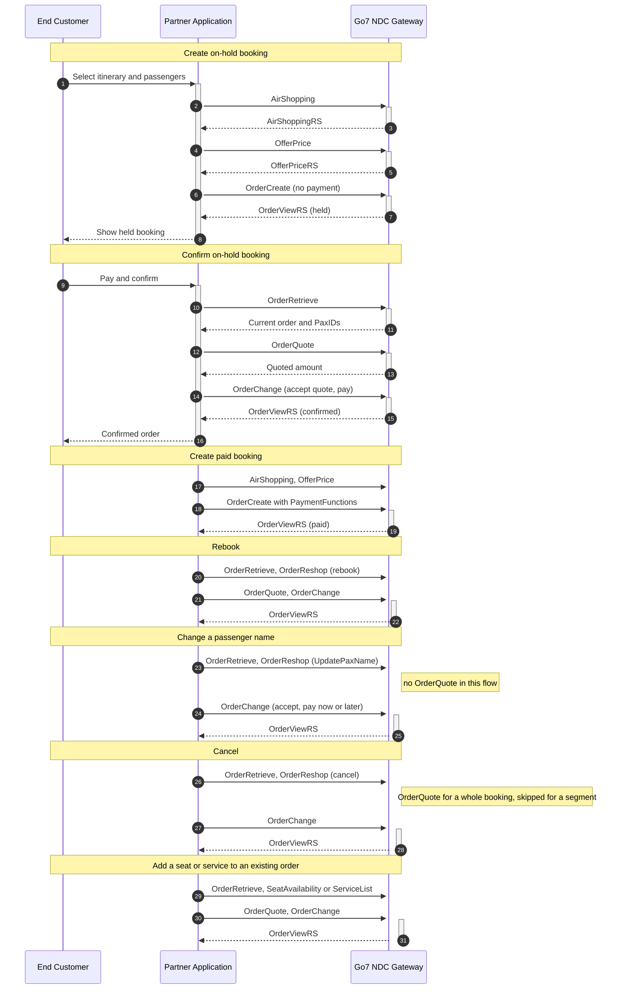

# NDC Partner Guide

This guide is written for partners integrating with the Go7 **NDC Gateway**. It answers two questions:

1. **What can I do with the NDC API?** See [Capabilities](#capabilities).
2. **How does a complete flow run, message by message?** See [Worked Examples](#worked-examples).

Everything the NDC API supports is presented here as **one set**: shopping, ordering, payment, servicing and ancillaries, in the order you would use them.

## Table of Contents

- [How to read this guide](#how-to-read-this-guide)
- [Before you start](#before-you-start)
- [Capabilities](#capabilities)
- [Worked Examples](#worked-examples)
- [Rules that apply to every flow](#rules-that-apply-to-every-flow)
- [Availability by PSS](#availability-by-pss)
- [Reference](#reference)

## How to read this guide

| Document | Use it for |
|---|---|
| **This page** | The index. Start here. |
| [Capabilities](#capabilities) | One page per capability: what it does, what it needs, what you get back. |
| [Worked Examples](#worked-examples) | One page per end-to-end flow, message by message. |
| [NDC API Generic Integration Guide](NDC_API.md) | Base URLs, HTTP headers, code lists, error codes, XML schema, Postman downloads. |
| [Per-message references](endpoints/airshopping.md) | Full request and response XML, field by field, for every message. |

Capabilities describe *what* you can do. Worked examples show *how*, as a numbered sequence of messages. Every worked example links back to the per-message reference for the complete payload, so this page stays readable and never duplicates the XML.

## Before you start

All messages are XML, posted to one host with the message name in the path.

| Environment | Base URL |
|---|---|
| Production | `https://go7-api-gateway.prod.go7.io/ndc-gateway` |
| Test | `https://go7-api-gateway.dev.go7.io/ndc-gateway` |

Message path pattern: `…/v21.3.5/<MessageName>` — for example `POST …/v21.3.5/AirShopping`.

| Header | Purpose |
|---|---|
| `x-tenant` | Tenant identifier for the airline you are working with |
| `x-SalesChannel` | Sales channel, normally `NDC` |
| `x-api-key` | Your partner API key |
| `Content-Type` | `application/xml` |

```bash
curl -X POST "https://go7-api-gateway.prod.go7.io/ndc-gateway/v21.3.5/<MessageName>" \
  -H "x-tenant: {tenant}" \
  -H "x-SalesChannel: {salesChannel}" \
  -H "x-api-key: {x-api-key}" \
  -H "Content-Type: application/xml" \
  --data-binary @request.xml
```

[NDC API → HTTP headers and authentication](NDC_API.md#http-headers) is the authoritative version of this table.

**How your API key works.** One key represents your partnership, not a single airline. The platform resolves which airlines to search from your active agreements, so you do not put an airline on the request.

**Try it in Postman.** Download the [Postman collection](/docs/assets/resources/NDC_postman_collection.json) and [environment](/docs/assets/resources/NDC.postman_environment.json), then set `x-api-key`, `x-saleschannel`, `tenant` and `ndc-gateway-url`. Each worked example below names the `UseCase/…` folder that runs it. The collection also carries extra request variants kept for experimentation; the sequences documented in this guide are the supported ones.

## Capabilities

Each capability has its own page, written in the same shape: definition, preconditions, process, post condition, the messages involved, and where it is available.

| Capability | NDC messages | Worked example |
|---|---|---|
| [Shop for flights](capabilities/shop-for-flights.md) | `AirShopping` | [WE-1](worked-examples/we-1-create-and-confirm-an-on-hold-booking.md) |
| [Price an offer](capabilities/price-an-offer.md) | `OfferPrice` | [WE-1](worked-examples/we-1-create-and-confirm-an-on-hold-booking.md) |
| [Shop for ancillary services](capabilities/shop-for-ancillary-services.md) | `ServiceList` | [WE-8](worked-examples/we-8-add-a-seat-or-service-before-payment-by-offer.md), [WE-10](worked-examples/we-10-add-a-service-to-an-existing-order-by-order.md) |
| [Shop for seats](capabilities/shop-for-seats.md) | `SeatAvailability` | [WE-8](worked-examples/we-8-add-a-seat-or-service-before-payment-by-offer.md), [WE-9](worked-examples/we-9-add-a-seat-to-an-existing-order-by-order.md) |
| [Create an order without payment](capabilities/create-an-order-without-payment.md) | `OrderCreate` | [WE-1](worked-examples/we-1-create-and-confirm-an-on-hold-booking.md) |
| [Create an order with payment](capabilities/create-an-order-with-payment.md) | `OrderCreate` | [WE-2](worked-examples/we-2-create-a-paid-booking.md) |
| [Pay an on-hold order](capabilities/pay-an-on-hold-order.md) | `OrderQuote`, `OrderChange` | [WE-1](worked-examples/we-1-create-and-confirm-an-on-hold-booking.md) |
| [Add seats or services to an existing order](capabilities/add-seats-or-services-to-an-existing-order.md) | `SeatAvailability` / `ServiceList`, `OrderQuote`, `OrderChange` | [WE-9](worked-examples/we-9-add-a-seat-to-an-existing-order-by-order.md), [WE-10](worked-examples/we-10-add-a-service-to-an-existing-order-by-order.md) |
| [Retrieve an order](capabilities/retrieve-an-order.md) | `OrderRetrieve` | [WE-3](worked-examples/we-3-retrieve-a-booking.md) |
| [Rebook an order](capabilities/rebook-an-order.md) | `OrderReshop`, `OrderQuote`, `OrderChange` | [WE-4](worked-examples/we-4-rebook.md) |
| [Change a passenger name](capabilities/change-a-passenger-name.md) | `OrderReshop`, `OrderChange` | [WE-5](worked-examples/we-5-change-a-passenger-name.md) |
| [Cancel a whole booking](capabilities/cancel-a-whole-booking.md) | `OrderReshop`, `OrderQuote`, `OrderChange` | [WE-6](worked-examples/we-6-cancel-a-whole-booking.md) |
| [Cancel a segment](capabilities/cancel-a-segment.md) | `OrderReshop`, `OrderChange` | [WE-7](worked-examples/we-7-cancel-a-segment.md) |

## Worked Examples

Each example is a complete flow, step by step. The **Send**, **Get back** and **Carry forward** columns tell you which identifier from one response is required by the next request. Message names link to the full request and response XML.



Each worked example has its own page, with a step table giving what you send, what you get back, and which identifier to carry into the next message.

| Worked example | Sequence |
|---|---|
| [WE-1 Create and confirm an on-hold booking](worked-examples/we-1-create-and-confirm-an-on-hold-booking.md) | `AirShopping` → `OfferPrice` → `OrderCreate` (no payment) → `OrderRetrieve` → `OrderQuote` → `OrderChange` → `OrderRetrieve` |
| [WE-2 Create a paid booking](worked-examples/we-2-create-a-paid-booking.md) | `AirShopping` → `OfferPrice` → `OrderCreate` (with payment) → `OrderRetrieve` |
| [WE-3 Retrieve a booking](worked-examples/we-3-retrieve-a-booking.md) | `OrderRetrieve` |
| [WE-4 Rebook](worked-examples/we-4-rebook.md) | `OrderRetrieve` → `OrderReshop` → `OrderQuote` → `OrderChange` → `OrderRetrieve` |
| [WE-5 Change a passenger name](worked-examples/we-5-change-a-passenger-name.md) | `OrderRetrieve` → `OrderReshop` → `OrderChange` → `OrderChange` (payment, conditional) → `OrderRetrieve` |
| [WE-6 Cancel a whole booking](worked-examples/we-6-cancel-a-whole-booking.md) | `OrderRetrieve` → `OrderReshop` → `OrderQuote` → `OrderChange` → `OrderRetrieve` |
| [WE-7 Cancel a segment](worked-examples/we-7-cancel-a-segment.md) | `OrderRetrieve` → `OrderReshop` → `OrderChange` → `OrderRetrieve` |
| [WE-8 Add a seat or service before payment by offer](worked-examples/we-8-add-a-seat-or-service-before-payment-by-offer.md) | `AirShopping` → `SeatAvailability` and/or `ServiceList` → `OfferPrice` → `OrderCreate` (with payment) |
| [WE-9 Add a seat to an existing order by order](worked-examples/we-9-add-a-seat-to-an-existing-order-by-order.md) | create the order, then `SeatAvailability` (order context) → `OrderQuote` → `OrderChange` → `OrderRetrieve` |
| [WE-10 Add a service to an existing order by order](worked-examples/we-10-add-a-service-to-an-existing-order-by-order.md) | create the order, then `ServiceList` (order context) → `OrderQuote` → `OrderChange` → `OrderRetrieve` |

## Rules that apply to every flow

| Rule | Why it matters |
|---|---|
| **Refresh passenger and item references after `OrderChange`.** Before a later request reuses `PaxID` or related item references, call `OrderRetrieve` and read the current values. | These identifiers may change when an order is modified. A payment-only follow-up that uses the latest `OrderViewRS`, `OrderID` and `PaymentFunctions` does not reuse `PaxID`. |
| **Insert `OrderRetrieve` between changes that reuse passenger or item references.** For example add a service, retrieve, then start another servicing flow. | Reusing identifiers from an earlier `OrderCreateRS` or `OrderChangeRS` can make the next request fail or target the wrong item. |
| **`OrderQuote` is part of the flows that use it — it is not an optional extra step.** Rebooking, adding ancillaries by order and whole-booking cancellation all require it. Name change and segment cancellation do not use it at all. | Whole-booking cancellation is the one exception: the quote is skipped where the airline does not support refunds on that order. |
| **`PrefLevel/PrefLevelCode` is mandatory when you send `CabinType`.** | Omitting it returns error 13. `Required` keeps only matching cabins; `Preferred` does not drop other cabins. An invalid cabin code returns error 14. |
| **A seat can carry several `OfferItemRefID` values.** | Pick the one matching the passenger you are seating. |
| **The by-offer ancillary path is instant pay.** | To hold a booking and add extras later, create the order without payment and use the by-order path. |

Cabin codes, passenger type codes, document types and the full error code list are in [NDC API → Code Lists](NDC_API.md#code-lists).

## Availability by PSS

The NDC API is the same for every airline, but the passenger service system behind it is not. This table shows where each capability is available today.

| Status | Meaning |
|---|---|
| **Available** | The end-to-end NDC flow works. |
| **Available — validation in progress** | The capability exists and is being verified end to end. Plan for it, but confirm before you rely on it in production. |
| **Not available yet** | The complete NDC flow is not exposed on that system. |

| Capability | NDC messages | SMS | AeroCRS | What this means for you |
|---|---|---|---|---|
| [Shop for flights](capabilities/shop-for-flights.md) and [price an offer](capabilities/price-an-offer.md) | `AirShopping`, `OfferPrice` | Available | Available | No difference in how you shop or price. |
| [Shop for ancillary services](capabilities/shop-for-ancillary-services.md) | `ServiceList`, `OfferPrice`, `OrderCreate` or `OrderQuote` / `OrderChange` | Available | Available | Paid and zero-price services both work. |
| [Shop for seats](capabilities/shop-for-seats.md) by offer | `SeatAvailability`, `OfferPrice`, `OrderCreate` | Available | Available | Seat maps and seat prices are returned on both. |
| [Add a seat to a held order](capabilities/add-seats-or-services-to-an-existing-order.md) by order | `SeatAvailability`, `OrderQuote`, `OrderChange` | Available | Available — validation in progress | On AeroCRS, attach seats before payment with [WE-8](worked-examples/we-8-add-a-seat-or-service-before-payment-by-offer.md) while the by-order path completes validation. |
| [Create an order without payment](capabilities/create-an-order-without-payment.md) | `OrderCreate` | Available | Available | Holding a booking works on both. |
| [Create an order with payment](capabilities/create-an-order-with-payment.md) | `OrderCreate` | Available | Available | Cash and zero-amount payments are covered. |
| [Pay an on-hold order](capabilities/pay-an-on-hold-order.md) | `OrderQuote`, `OrderChange` | Available | Available | Cash payment works on both. |
| [Retrieve an order](capabilities/retrieve-an-order.md) | `OrderRetrieve` | Available | Available | Ticket numbers synchronise on both. |
| [Rebook an order](capabilities/rebook-an-order.md) | `OrderReshop`, `OrderQuote`, `OrderChange` | Available | Available | Same sequence on both. |
| [Cancel a whole booking](capabilities/cancel-a-whole-booking.md) | `OrderReshop`, `OrderQuote`, `OrderChange` | Available | **Not available yet** | On AeroCRS, handle whole-booking cancellation outside the NDC API for now. |
| [Cancel a segment](capabilities/cancel-a-segment.md) | `OrderReshop`, `OrderChange` | Available | **Not available yet** | On AeroCRS, handle segment cancellation outside the NDC API for now. |
| [Change a passenger name](capabilities/change-a-passenger-name.md) | `OrderReshop`, `OrderChange` | Available | **Not available yet** | On AeroCRS, handle name changes outside the NDC API for now. The name-change offer path is not yet exposed on that system. |

**Payment note.** The cash and zero-amount payment paths documented in this guide work on both systems. Reusing a payment you captured in your own payment service provider is available on SMS only.

**Your NDC payload does not change per PSS.** Requests stay system-neutral — differences are absorbed by platform mapping and tenant configuration, not by your integration. Routes, record locators, offer identifiers, prices and ticket numbers will differ between airlines. That is expected and is not a failure.

## Reference

| Topic | Where |
|---|---|
| Base URLs, HTTP headers, authentication | [NDC API → Introduction](NDC_API.md#introduction) |
| Passenger type, cabin and document codes | [NDC API → Code Lists](NDC_API.md#code-lists) |
| Error codes | [NDC API → Error Code](NDC_API.md#error-code) |
| IATA schema distribution 21.3 and GO7 gateway package v21.3.5 | [Download](/docs/assets/resources/NDC-xmlbeans-21.3.5.zip) |
| Postman collection | [Collection](/docs/assets/resources/NDC_postman_collection.json) · [Environment](/docs/assets/resources/NDC.postman_environment.json) |
