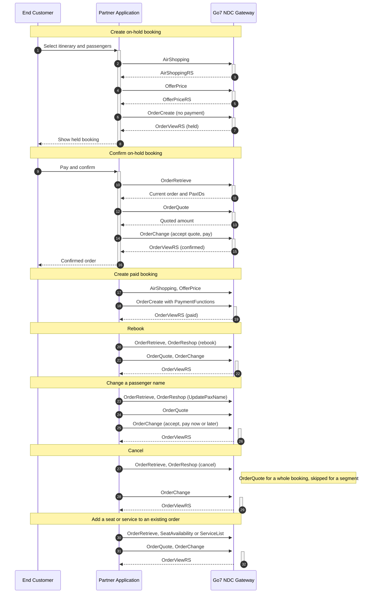
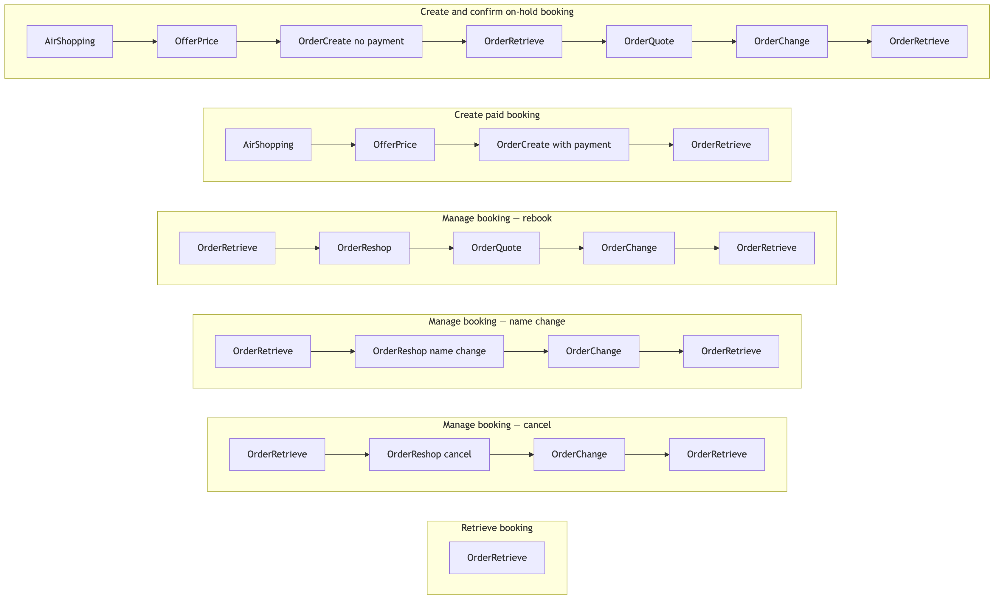
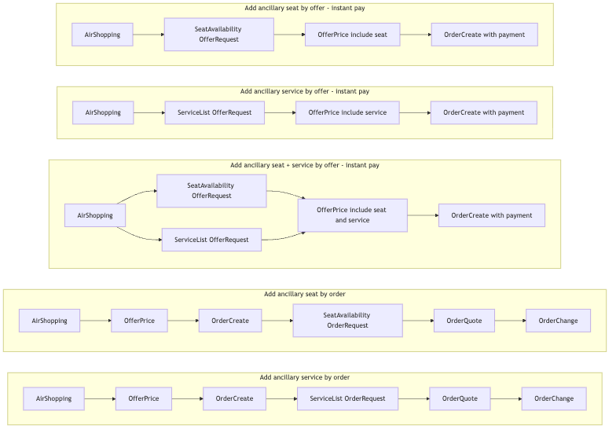

# NDC Partner Guide

This guide is written for partners integrating with the Go7 **NDC Gateway**. It answers two questions:

1. **What can I do with the NDC API?** See [Capabilities](#capabilities).
2. **How does a complete flow run, message by message?** See [Worked Examples](#worked-examples).

Phase 1 and Phase 2 are presented here as **one combined capability set**. Each capability is tagged `Phase 1` or `Phase 2` so you know what is available today and what arrives with the ancillary release.

## Table of Contents

- [How to read this guide](#how-to-read-this-guide)
- [Before you start](#before-you-start)
- [Capabilities](#capabilities)
- [Worked Examples](#worked-examples)
- [Rules that apply to every flow](#rules-that-apply-to-every-flow)
- [Availability by PSS](#availability-by-pss)
- [Reference](#reference)

## How to read this guide

| Document | Use it for |
|---|---|
| **This guide** | What the NDC API can do, and how each end-to-end flow runs. Start here. |
| [NDC API Generic Integration Guide](NDC_API.md) | Base URLs, HTTP headers, code lists, error codes, XML schema, Postman downloads. |
| [Per-message references](endpoints/airshopping.md) | Full request and response XML, field by field, for every message. |

Capabilities describe *what* you can do. Worked examples show *how*, as a numbered sequence of messages. Every worked example links back to the per-message reference for the complete payload, so this page stays readable and never duplicates the XML.

## Before you start

All messages are XML, posted to one host with the message name in the path.

| Environment | Base URL |
|---|---|
| Production | `https://go7-api-gateway.prod.go7.io/ndc-gateway` |
| Test | `https://go7-api-gateway.dev.go7.io/ndc-gateway` |

Message path pattern: `…/v21.3.5/<MessageName>` — for example `POST …/v21.3.5/AirShopping`.

| Header | Purpose |
|---|---|
| `x-tenant` | Tenant identifier for the airline you are working with |
| `x-SalesChannel` | Sales channel, normally `NDC` |
| `x-api-key` | Your partner API key |
| `Content-Type` | `application/xml` |

```bash
curl -X POST "https://go7-api-gateway.prod.go7.io/ndc-gateway/v21.3.5/<MessageName>" \
  -H "x-tenant: {tenant}" \
  -H "x-SalesChannel: {salesChannel}" \
  -H "x-api-key: {x-api-key}" \
  -H "Content-Type: application/xml" \
  -d @request.xml
```

[NDC API → HTTP Headers](NDC_API.md#http-headers) is the authoritative version of this table.

**How your API key works.** One key represents your partnership, not a single airline. The platform resolves which airlines to search from your active agreements, so you do not put an airline on the request. See [Partner X-API-Key offer search flow](partner-x-api-key-offer-search-flow.md).

**Try it in Postman.** Download the [Postman collection](/docs/assets/resources/NDC_postman_collection.json) and [environment](/docs/assets/resources/NDC.postman_environment.json), then set `x-api-key`, `x-saleschannel`, `tenant` and `ndc-gateway-url`. Each worked example below names the `UseCase/…` folder that runs it. The collection also carries extra request variants kept for experimentation; the sequences documented in this guide are the supported ones.

## Capabilities

| Capability | NDC messages | Phase | Worked example |
|---|---|---|---|
| [Shop for flights](#shop-for-flights) | `AirShopping` | 1 | [WE-1](#we-1-create-and-confirm-an-on-hold-booking) |
| [Price an offer](#price-an-offer) | `OfferPrice` | 1 | [WE-1](#we-1-create-and-confirm-an-on-hold-booking) |
| [Shop for ancillary services](#shop-for-ancillary-services) | `ServiceList` | 2 | [WE-8](#we-8-add-a-seat-or-service-before-payment-by-offer), [WE-10](#we-10-add-a-service-to-an-existing-order-by-order) |
| [Shop for seats](#shop-for-seats) | `SeatAvailability` | 2 | [WE-8](#we-8-add-a-seat-or-service-before-payment-by-offer), [WE-9](#we-9-add-a-seat-to-an-existing-order-by-order) |
| [Create an order without payment](#create-an-order-without-payment) | `OrderCreate` | 1 | [WE-1](#we-1-create-and-confirm-an-on-hold-booking) |
| [Create an order with payment](#create-an-order-with-payment) | `OrderCreate` | 1 | [WE-2](#we-2-create-a-paid-booking) |
| [Pay an on-hold order](#pay-an-on-hold-order) | `OrderQuote`, `OrderChange` | 1 | [WE-1](#we-1-create-and-confirm-an-on-hold-booking) |
| [Add seats or services to an existing order](#add-seats-or-services-to-an-existing-order) | `SeatAvailability` / `ServiceList`, `OrderQuote`, `OrderChange` | 2 | [WE-9](#we-9-add-a-seat-to-an-existing-order-by-order), [WE-10](#we-10-add-a-service-to-an-existing-order-by-order) |
| [Retrieve an order](#retrieve-an-order) | `OrderRetrieve` | 1 | [WE-3](#we-3-retrieve-a-booking) |
| [Rebook an order](#rebook-an-order) | `OrderReshop`, `OrderQuote`, `OrderChange` | 1 | [WE-4](#we-4-rebook) |
| [Change a passenger name](#change-a-passenger-name) | `OrderReshop`, `OrderQuote`, `OrderChange` | 1 | [WE-5](#we-5-change-a-passenger-name) |
| [Cancel a whole booking](#cancel-a-whole-booking) | `OrderReshop`, `OrderQuote`, `OrderChange` | 1 | [WE-6](#we-6-cancel-a-whole-booking) |
| [Cancel a segment](#cancel-a-segment) | `OrderReshop`, `OrderChange` | 1 | [WE-7](#we-7-cancel-a-segment) |

### Shop for flights

`Phase 1`

**Definition.** Search live flight offers for a journey and a passenger mix. You send the journey, the platform returns priced offers from every airline your API key is entitled to search.

**Preconditions.** A valid API key, tenant and sales channel.

**Process.** `AirShopping`

**Post condition.**
- *Success:* a list of offers, each with an `OfferID`, its `OfferItemID` values and an `OwnerCode`.
- *Failure:* a validation error. No offer matching your criteria returns an empty offer list, not an error.

**Messages.** [Air Shopping](endpoints/airshopping.md) — [one-way](endpoints/airshopping.md#airshopping-one-way-trip), [round trip](endpoints/airshopping.md#airshopping-round-trip).

**Notes.** Passenger types are `ADT`, `CHD`, `INF`. If you send a cabin filter, `PrefLevel/PrefLevelCode` is mandatory — see [Rules that apply to every flow](#rules-that-apply-to-every-flow).

**Availability.** Both PSS. See [Availability by PSS](#availability-by-pss).

### Price an offer

`Phase 1`

**Definition.** Confirm the final price and conditions of a selected offer before you create an order. This is also the message that builds a **combined offer** when you add a seat or a service before payment.

**Preconditions.** An `OfferID` and `OfferItemID` from `AirShopping`. For a combined offer, also the seat or service offer items you selected.

**Process.** `OfferPrice`

**Post condition.**
- *Success:* a priced offer with final amounts and currency, ready for `OrderCreate`.
- *Failure:* the offer expired or is no longer available — shop again.

**Messages.** [Offer Price](endpoints/offerprice.md) — [one-way](endpoints/offerprice.md#offerprice-one-way-trip), [round trip](endpoints/offerprice.md#offerprice-round-trip), [with service](endpoints/offerprice.md#offerprice-with-service), [with seat](endpoints/offerprice.md#offerprice-with-seat), [with service and seat](endpoints/offerprice.md#offerprice-with-service-and-seat).

**Notes.** When the flight was priced together with a seat or a service, echo the resulting composite offer into `OrderCreate` — see [OfferRefID shapes](endpoints/ordercreate.md#ordercreate-combined-offer) for the single-offer and multiple-offer request forms.

**Availability.** Both PSS.

### Shop for ancillary services

`Phase 2`

**Definition.** List the ancillary services (bags, meals and other SSRs) available either for an offer you have not yet ordered, or for an order that already exists.

**Preconditions.** *By offer:* an `OfferID` from `AirShopping`. *By order:* an existing `OrderID`.

**Process.** `ServiceList`

**Post condition.**
- *Success:* service offers with their `OfferItemRefID` values and prices.
- *Failure:* no services configured for the flight returns an empty list.

**Messages.** [Service List](endpoints/servicelist.md) — [by offer](endpoints/servicelist.md#servicelist-by-offer), [by order](endpoints/servicelist.md#servicelist-by-order).

**Notes.** Zero-price services are returned as normal offers with an amount of zero, and still follow the full add-and-confirm sequence.

**Availability.** Both PSS.

### Shop for seats

`Phase 2`

**Definition.** Retrieve the seat map and seat prices, either for an offer you have not yet ordered or for an existing order.

**Preconditions.** *By offer:* an `OfferID` from `AirShopping`. *By order:* an existing `OrderID`.

**Process.** `SeatAvailability`

**Post condition.**
- *Success:* a seat map with per-seat offer items and prices.
- *Failure:* a requested seat that is no longer free returns error 486 when you try to take it.

**Messages.** [Seat Availability](endpoints/seatavailability.md) — [by offer](endpoints/seatavailability.md#seatavailability-by-offer), [by order](endpoints/seatavailability.md#seatavailability-by-order).

**Notes.** A single seat may return **several** `OfferItemRefID` values, for example one per eligible passenger. Pick the one that matches the passenger you are seating.

**Availability.** By offer on both PSS. By order, see [Availability by PSS](#availability-by-pss).

### Create an order without payment

`Phase 1`

**Definition.** Create an order that is held without payment, so the customer can pay later within the airline's time limit.

**Preconditions.** A priced offer from `OfferPrice`, and complete passenger data — names, dates of birth for children and infants, contact email and phone, and travel documents where required.

**Process.** `OrderCreate` with no `PaymentFunctions`

**Post condition.**
- *Success:* an order is created in a held state with an `OrderID` and a booking reference.
- *Failure:* a validation error on passenger or offer data. Check the [error codes](NDC_API.md#error-code).

**Messages.** [Order Create → Pay later](endpoints/ordercreate.md#ordercreate-pay-later).

**Notes.** A contact email is required, and dates of birth must be supplied for children and infants.

**Availability.** Both PSS.

### Create an order with payment

`Phase 1`

**Definition.** Create and pay for an order in one message, so the booking is confirmed and ticketed immediately.

**Preconditions.** A priced offer from `OfferPrice`, complete passenger data, and a payment method.

**Process.** `OrderCreate` with `PaymentFunctions`

**Post condition.**
- *Success:* the order is created, paid and ticketed. E-ticket numbers appear on the order once ticketing completes.
- *Failure:* payment declined or offer expired.

**Messages.** [Order Create → Instant pay](endpoints/ordercreate.md#ordercreate-instant-pay), [combined offer](endpoints/ordercreate.md#ordercreate-combined-offer).

**Notes.** This is the only way to buy seats or services **before** the order exists. That by-offer path is instant pay only — to hold a booking and add extras later, create the order without payment and use the by-order path.

**Availability.** Both PSS.

### Pay an on-hold order

`Phase 1`

**Definition.** Settle a held order so it is confirmed and ticketed.

**Preconditions.** An existing held order, and the current `PaxID` values read from `OrderRetrieve`.

**Process.** `OrderRetrieve` → `OrderQuote` → `OrderChange`

**Post condition.**
- *Success:* the order is confirmed and ticketed.
- *Failure:* payment declined, or the hold expired before payment.

**Messages.** [Order Quote → Booking](endpoints/orderquote.md#orderquote-booking), [Order Change → Payment on hold booking](endpoints/orderchange.md#orderchange-payment-on-hold).

**Payment methods.** [Cash](endpoints/orderchange.md#orderchange-payment-on-hold), [debit](endpoints/orderchange.md#orderchange-payment-debit), [credit](endpoints/orderchange.md#orderchange-payment-credit), [debit or credit account](endpoints/orderchange.md#orderchange-payment-debit-credit-account), and [credit card via PCI Proxy](endpoints/orderchange.md#orderchange-payment-credit-card) — the card path **requires a 3DS authenticate result** (`SecurePaymentVersion2`).

**Availability.** Cash and zero-amount payments on both PSS. Reuse of a payment captured in your own payment service provider is available on one PSS only — see [Availability by PSS](#availability-by-pss).

### Add seats or services to an existing order

`Phase 2`

**Definition.** Add a seat or an ancillary service to an order that already exists, and pay for it.

**Preconditions.** An existing order, and the current `PaxID` values read from `OrderRetrieve`.

**Process.** `SeatAvailability` or `ServiceList` (order context) → `OrderQuote` → `OrderChange` → `OrderRetrieve`

**Post condition.**
- *Success:* the seat or service is attached to the order and paid.
- *Failure:* the seat was taken in the meantime (error 486), or the selected offer item no longer applies to that passenger.

**Messages.** [Seat Availability → by order](endpoints/seatavailability.md#seatavailability-by-order), [Service List → by order](endpoints/servicelist.md#servicelist-by-order), [Order Quote](endpoints/orderquote.md), [Order Change](endpoints/orderchange.md).

**Notes.** Refresh `PaxID` with `OrderRetrieve` before every step in this sequence.

**Availability.** Services on both PSS. Seats by order, see [Availability by PSS](#availability-by-pss).

### Retrieve an order

`Phase 1`

**Definition.** Read the current state of an order: itinerary, passengers, services, payments and ticket numbers.

**Preconditions.** An `OrderID`, or a booking reference with a traveller name.

**Process.** `OrderRetrieve`

**Post condition.**
- *Success:* the current order view, including the current `PaxID` values.
- *Failure:* 404 when the order or the reference and name combination does not match.

**Messages.** [Order Retrieve](endpoints/orderretrieve.md) — [by order ID](endpoints/orderretrieve.md#orderretrieve-by-order-id), [by booking reference](endpoints/orderretrieve.md#orderretrieve-by-booking-reference).

**Notes.** This is not only a read. It is how you refresh `PaxID` values, which change across order modifications. Call it before every step that follows an `OrderChange`.

**Availability.** Both PSS.

### Rebook an order

`Phase 1`

**Definition.** Move passengers to different flights or dates on an existing order, and settle any difference in fare.

**Preconditions.** An existing order and current `PaxID` values.

**Process.** `OrderRetrieve` → `OrderReshop` → `OrderQuote` → `OrderChange` → `OrderRetrieve`

**Post condition.**
- *Success:* the order carries the new flights, and the fare difference is settled.
- *Failure:* no rebook offer is available for the requested change, or the quoted offer expired before acceptance.

**Messages.** [Order Reshop → Rebook](endpoints/orderreshop.md#orderreshop-rebook), [Order Quote → Rebook quote](endpoints/orderquote.md#orderquote-rebook), [Order Change → Rebook with new offers](endpoints/orderchange.md#orderchange-rebook).

**Availability.** Both PSS.

### Change a passenger name

`Phase 1`

**Definition.** Correct or change a passenger's name on an existing order. The airline returns the change as an offer, which is quoted and may carry a fee.

**Preconditions.** An existing order, and the current `PaxID` values read from `OrderRetrieve`. Each passenger whose name changes needs its own reshop request.

**Process.** `OrderRetrieve` → `OrderReshop` → `OrderQuote` → `OrderChange` (with or without payment) → `OrderChange` (payment, only if the previous step was pay later) → `OrderRetrieve`

**Post condition.**
- *Success:* the order shows the new names, and any name-change fee is settled.
- *Failure:* the airline does not allow a name change on that order or fare, or the quoted offer expired.

**Messages.** [Order Reshop → Name change offer](endpoints/orderreshop.md#orderreshop-name-change), [Order Quote](endpoints/orderquote.md), [Order Change](endpoints/orderchange.md).

**Request shape.** The change is carried on `OrderReshop` as `UpdateOrder/ReshopOrder/ReshopOrderChoice/UpdatePaxName`, with `GivenName`, `Surname`, `TitleName` and the `PaxRefID` of the passenger being changed. Change an adult and an infant with **separate** reshop requests.

**Paying the fee.** You can settle the name-change fee in the same `OrderChange` that accepts the quoted offer, or accept it first and pay in a following `OrderChange`.

**Availability.** Not available on every PSS — see [Availability by PSS](#availability-by-pss).

### Cancel a whole booking

`Phase 1`

**Definition.** Cancel every flight on an order and settle the result.

**Preconditions.** An existing order and current `PaxID` values.

**Process.** `OrderRetrieve` → `OrderReshop` → `OrderQuote` → `OrderChange` → `OrderRetrieve`

**Post condition.**
- *Success:* the order is cancelled.
- *Failure:* the fare does not permit cancellation, or the order is already cancelled.

**Messages.** [Order Reshop → Cancel order](endpoints/orderreshop.md#orderreshop-cancel-order), [Order Quote → Cancel quote](endpoints/orderquote.md#orderquote-cancel), [Order Change](endpoints/orderchange.md).

**Notes.** `OrderQuote` is skipped where the airline does not support refunds on that order. In that case go straight from `OrderReshop` to `OrderChange`.

**Availability.** Not available on every PSS — see [Availability by PSS](#availability-by-pss).

### Cancel a segment

`Phase 1`

**Definition.** Cancel part of an order, leaving the remaining flights intact.

**Preconditions.** An existing order with more than one flight, and the `OrderItemRefID` of the part to remove, read from `OrderRetrieve`.

**Process.** `OrderRetrieve` → `OrderReshop` → `OrderChange` → `OrderRetrieve`

**Post condition.**
- *Success:* the selected segment is removed and the rest of the order is untouched.
- *Failure:* the fare does not permit partial cancellation.

**Messages.** [Order Reshop → Cancel order](endpoints/orderreshop.md#orderreshop-cancel-order), [Order Change](endpoints/orderchange.md).

**Notes.** Unlike a whole-booking cancellation, the segment cancel selects the `OrderItemRefID` to remove on the reshop request and does not go through `OrderQuote`.

**Availability.** Not available on every PSS — see [Availability by PSS](#availability-by-pss).

## Worked Examples

Each example is a complete flow, step by step. The **Send**, **Get back** and **Carry forward** columns tell you which identifier from one response is required by the next request. Message names link to the full request and response XML.



### Phase 1 and Phase 2 at a glance





### WE-1 Create and confirm an on-hold booking

`Phase 1` · Postman: `UseCase/Create & confirm on-hold booking`

**Capabilities.** [Shop for flights](#shop-for-flights), [Price an offer](#price-an-offer), [Create an order without payment](#create-an-order-without-payment), [Retrieve an order](#retrieve-an-order), [Pay an on-hold order](#pay-an-on-hold-order)

**Sequence.** `AirShopping` → `OfferPrice` → `OrderCreate` (no payment) → `OrderRetrieve` → `OrderQuote` → `OrderChange` → `OrderRetrieve`

**Preconditions.** API key issued; tenant and sales channel known.

| Step | Message | Send | Get back | Carry forward |
|---|---|---|---|---|
| 1 | [AirShopping](endpoints/airshopping.md#airshopping-one-way-trip) | Origin, destination, dates, passengers (`ADT` / `CHD` / `INF`), optional cabin | Offer list | `OfferID`, `OfferItemID`, `OwnerCode` |
| 2 | [OfferPrice](endpoints/offerprice.md#offerprice-one-way-trip) | Selected `OfferID` and `OfferItemID` | Priced offer with final amount and currency | Priced `OfferID` |
| 3 | [OrderCreate](endpoints/ordercreate.md#ordercreate-pay-later) | Priced `OfferID`, passenger list, contact email and phone | `OrderID`, booking reference, order held | `OrderID` |
| 4 | [OrderRetrieve](endpoints/orderretrieve.md#orderretrieve-by-order-id) | `OrderID`, `OwnerCode` | Current order view | `PaxID` values, amount due |
| 5 | [OrderQuote](endpoints/orderquote.md#orderquote-booking) | `ExistingOrder` with `OrderID` | Amount to settle | Quoted `OfferRefID`, `OfferItemRefID` |
| 6 | [OrderChange](endpoints/orderchange.md#orderchange-payment-on-hold) | `OrderID`, accepted quote, `PaymentFunctions` | Confirmed order | `OrderID` |
| 7 | [OrderRetrieve](endpoints/orderretrieve.md#orderretrieve-by-order-id) | `OrderID` | Final order with ticket numbers | — |

**Outcome.** A confirmed, paid and ticketed order.

**Watch out for.** Step 4 is not optional — the `PaxID` values it returns are the ones step 6 must use. Do not reuse `PaxID` values from the step 3 response.

### WE-2 Create a paid booking

`Phase 1` · Postman: `UseCase/Create paid booking`

**Capabilities.** [Shop for flights](#shop-for-flights), [Price an offer](#price-an-offer), [Create an order with payment](#create-an-order-with-payment)

**Sequence.** `AirShopping` → `OfferPrice` → `OrderCreate` (with payment) → `OrderRetrieve`

**Preconditions.** API key issued; a payment method available.

| Step | Message | Send | Get back | Carry forward |
|---|---|---|---|---|
| 1 | [AirShopping](endpoints/airshopping.md#airshopping-round-trip) | Journey and passengers | Offer list | `OfferID`, `OfferItemID` |
| 2 | [OfferPrice](endpoints/offerprice.md#offerprice-round-trip) | Selected offer | Priced offer | Priced `OfferID`, amount, currency |
| 3 | [OrderCreate](endpoints/ordercreate.md#ordercreate-instant-pay) | Priced `OfferID`, passenger list, `PaymentFunctions` | Paid order with `OrderID` and booking reference | `OrderID` |
| 4 | [OrderRetrieve](endpoints/orderretrieve.md#orderretrieve-by-order-id) | `OrderID` | Order with ticket numbers | — |

**Outcome.** A paid and ticketed order in one round trip.

**Watch out for.** The payment amount and currency must match the priced offer from step 2 exactly.

### WE-3 Retrieve a booking

`Phase 1` · Postman: `UseCase/Retrieve booking`

**Capabilities.** [Retrieve an order](#retrieve-an-order)

**Sequence.** `OrderRetrieve`

**Preconditions.** An `OrderID`, or a booking reference and a traveller name.

| Step | Message | Send | Get back | Carry forward |
|---|---|---|---|---|
| 1a | [OrderRetrieve by order ID](endpoints/orderretrieve.md#orderretrieve-by-order-id) | `OrderID`, `OwnerCode` | Full order view | `PaxID`, `OrderItemRefID` |
| 1b | [OrderRetrieve by booking reference](endpoints/orderretrieve.md#orderretrieve-by-booking-reference) | Booking reference and traveller name | Full order view | `OrderID`, `PaxID` |

**Outcome.** The current itinerary, passengers, services, payments and ticket numbers.

**Watch out for.** Use this message before every step that follows an `OrderChange`, and read the `PaxID` values from its response.

### WE-4 Rebook

`Phase 1` · Postman: `UseCase/Manage booking - Rebook`

**Capabilities.** [Rebook an order](#rebook-an-order)

**Sequence.** `OrderRetrieve` → `OrderReshop` → `OrderQuote` → `OrderChange` → `OrderRetrieve`

**Preconditions.** An existing order.

| Step | Message | Send | Get back | Carry forward |
|---|---|---|---|---|
| 1 | [OrderRetrieve](endpoints/orderretrieve.md#orderretrieve-by-order-id) | `OrderID` | Current order | `PaxID`, `OrderItemRefID` |
| 2 | [OrderReshop](endpoints/orderreshop.md#orderreshop-rebook) | `OrderID` and the new travel date or flights | Rebook offers with the fare difference | `OfferRefID`, `OfferItemRefID` |
| 3 | [OrderQuote](endpoints/orderquote.md#orderquote-rebook) | `ExistingOrder` and the selected rebook offer | Quoted amount | Quoted offer references |
| 4 | [OrderChange](endpoints/orderchange.md#orderchange-rebook) | Accepted quoted offer and `PaymentFunctions` | Rebooked order | `OrderID` |
| 5 | [OrderRetrieve](endpoints/orderretrieve.md#orderretrieve-by-order-id) | `OrderID` | New itinerary and tickets | — |

**Outcome.** The order carries the new flights and the fare difference is settled.

**Watch out for.** Rebook offers expire. If step 4 fails because the offer is stale, repeat from step 2.

### WE-5 Change a passenger name

`Phase 1` · Postman: `UseCase/Manage booking - NameChange`

**Capabilities.** [Change a passenger name](#change-a-passenger-name)

**Sequence.** `OrderRetrieve` → `OrderReshop` → `OrderQuote` → `OrderChange` → `OrderChange` (payment, conditional) → `OrderRetrieve`

**Preconditions.** An existing order. Each passenger whose name changes needs its own `OrderReshop` request.

| Step | Message | Send | Get back | Carry forward |
|---|---|---|---|---|
| 1 | [OrderRetrieve](endpoints/orderretrieve.md#orderretrieve-by-order-id) | `OrderID`, `OwnerCode` | Current order | **`PaxID` per passenger** |
| 2 | [OrderReshop](endpoints/orderreshop.md#orderreshop-name-change) | `OrderRefID` and `UpdatePaxName` with `GivenName`, `Surname`, `TitleName`, `PaxRefID` | Name-change offer | `OfferRefID`, `OfferItemRefID`, amount, currency |
| 3 | [OrderQuote](endpoints/orderquote.md) | `ExistingOrder` and the selected offer item, with quantity | Quoted name-change price | Quoted offer references |
| 4a | [OrderChange](endpoints/orderchange.md) — pay later | `OrderID` and the accepted quoted offer, **no** `PaymentFunctions` | Order with the new name, fee outstanding | `OrderID` |
| 4b | [OrderChange](endpoints/orderchange.md) — pay now | The same, **plus** `PaymentFunctions` | Order with the new name, fee settled | `OrderID` |
| 5 | [OrderChange](endpoints/orderchange.md#orderchange-payment-on-hold) | `OrderID` and `PaymentFunctions` | Fee settled | `OrderID` |
| 6 | [OrderRetrieve](endpoints/orderretrieve.md#orderretrieve-by-order-id) | `OrderID` | Order showing the new names | — |

Steps 4a and 4b are alternatives. **Step 5 runs only when you chose 4a.**

**Outcome.** The order shows the new passenger names and any name-change fee is settled.

**Watch out for.**
- `PaxRefID` in step 2 must come from the step 1 response, not from the original `OrderCreate`.
- Change an adult and an infant with separate step 2 requests; do not combine them.
- Call `OrderRetrieve` again between steps 4a and 5 if you chose the pay-later route, so step 5 uses current identifiers.

### WE-6 Cancel a whole booking

`Phase 1` · Postman: `UseCase/Manage booking - Cancel/Cancel Booking`

**Capabilities.** [Cancel a whole booking](#cancel-a-whole-booking)

**Sequence.** `OrderRetrieve` → `OrderReshop` → `OrderQuote` → `OrderChange` → `OrderRetrieve`

**Preconditions.** An existing order that the fare permits cancelling.

| Step | Message | Send | Get back | Carry forward |
|---|---|---|---|---|
| 1 | [OrderRetrieve](endpoints/orderretrieve.md#orderretrieve-by-order-id) | `OrderID` | Current order | `PaxID`, `OrderItemRefID` |
| 2 | [OrderReshop](endpoints/orderreshop.md#orderreshop-cancel-order) | `OrderID` and the cancel request | Cancel offer | `OfferRefID`, `OfferItemRefID` |
| 3 | [OrderQuote](endpoints/orderquote.md#orderquote-cancel) | `ExistingOrder` and the selected cancel offer | Quoted cancellation result | Quoted offer references |
| 4 | [OrderChange](endpoints/orderchange.md) | The accepted cancel offer | Cancelled order | `OrderID` |
| 5 | [OrderRetrieve](endpoints/orderretrieve.md#orderretrieve-by-order-id) | `OrderID` | Cancelled order view | — |

**Outcome.** Every flight on the order is cancelled.

**Watch out for.** Step 3 is skipped where the airline does not support refunds on that order — go straight from step 2 to step 4.

### WE-7 Cancel a segment

`Phase 1` · Postman: `UseCase/Manage booking - Cancel/Cancel Segment`

**Capabilities.** [Cancel a segment](#cancel-a-segment)

**Sequence.** `OrderRetrieve` → `OrderReshop` → `OrderChange` → `OrderRetrieve`

**Preconditions.** An order with more than one flight.

| Step | Message | Send | Get back | Carry forward |
|---|---|---|---|---|
| 1 | [OrderRetrieve](endpoints/orderretrieve.md#orderretrieve-by-order-id) | `OrderID` | Current order | **`OrderItemRefID` of the part to remove** |
| 2 | [OrderReshop](endpoints/orderreshop.md#orderreshop-cancel-order) | `OrderID` and the `OrderItemRefID` to cancel | Cancel offer for that item | `OfferRefID`, `OfferItemRefID` |
| 3 | [OrderChange](endpoints/orderchange.md) | The accepted cancel offer | Order with the segment removed | `OrderID` |
| 4 | [OrderRetrieve](endpoints/orderretrieve.md#orderretrieve-by-order-id) | `OrderID` | Remaining itinerary | — |

**Outcome.** The selected segment is removed and the rest of the order is untouched.

**Watch out for.** This flow has no quote step. Selecting the right `OrderItemRefID` in step 2 is what limits the cancellation to one part of the order.

### WE-8 Add a seat or service before payment by offer

`Phase 2` · Postman: `UseCase/Ancillary Offer - Seats`, `UseCase/Ancillary Offer - Services`

**Capabilities.** [Shop for seats](#shop-for-seats), [Shop for ancillary services](#shop-for-ancillary-services), [Price an offer](#price-an-offer), [Create an order with payment](#create-an-order-with-payment)

**Sequence.** `AirShopping` → `SeatAvailability` and/or `ServiceList` → `OfferPrice` → `OrderCreate` (with payment)

**Preconditions.** None beyond a valid API key. **This path is instant pay.** To hold a booking and add extras afterwards, use [WE-1](#we-1-create-and-confirm-an-on-hold-booking) followed by [WE-9](#we-9-add-a-seat-to-an-existing-order-by-order) or [WE-10](#we-10-add-a-service-to-an-existing-order-by-order).

| Step | Message | Send | Get back | Carry forward |
|---|---|---|---|---|
| 1 | [AirShopping](endpoints/airshopping.md#airshopping-one-way-trip) | Journey and passengers | Offer list | `OfferID`, `OfferItemID` |
| 2a | [SeatAvailability by offer](endpoints/seatavailability.md#seatavailability-by-offer) | The `OfferID` from step 1 | Seat map with seat offer items | Seat `OfferItemRefID` |
| 2b | [ServiceList by offer](endpoints/servicelist.md#servicelist-by-offer) | The `OfferID` from step 1 | Service offers | Service `OfferItemRefID` |
| 3 | [OfferPrice with seat and service](endpoints/offerprice.md#offerprice-with-service-and-seat) | The flight offer plus the selected seat and service items | One combined priced offer | Combined `OfferID`, total amount |
| 4 | [OrderCreate combined offer](endpoints/ordercreate.md#ordercreate-combined-offer) | The combined `OfferID`, passenger list, `PaymentFunctions` | Paid order including the seat and service | `OrderID` |

You can run step 2a alone, step 2b alone, or both. Price only what you selected: [with seat](endpoints/offerprice.md#offerprice-with-seat), [with service](endpoints/offerprice.md#offerprice-with-service), or [with both](endpoints/offerprice.md#offerprice-with-service-and-seat).

**Outcome.** A paid order that already carries the seat and the service.

**Watch out for.** A seat can return several `OfferItemRefID` values. Pick the one belonging to the passenger you are seating, or the combined pricing in step 3 will not match.

### WE-9 Add a seat to an existing order by order

`Phase 2` · Postman: `UseCase/Ancillary Order - Seats`

**Capabilities.** [Shop for seats](#shop-for-seats), [Add seats or services to an existing order](#add-seats-or-services-to-an-existing-order)

**Sequence.** create the order, then `SeatAvailability` (order context) → `OrderQuote` → `OrderChange` → `OrderRetrieve`

**Preconditions.** An existing order — create it with [WE-1](#we-1-create-and-confirm-an-on-hold-booking) or [WE-2](#we-2-create-a-paid-booking).

| Step | Message | Send | Get back | Carry forward |
|---|---|---|---|---|
| 1 | [OrderRetrieve](endpoints/orderretrieve.md#orderretrieve-by-order-id) | `OrderID` | Current order | `PaxID`, `OrderItemRefID` |
| 2 | [SeatAvailability by order](endpoints/seatavailability.md#seatavailability-by-order) | `OrderID` and the flight to seat | Seat map with seat offer items | Seat `OfferRefID`, `OfferItemRefID` |
| 3 | [OrderQuote](endpoints/orderquote.md) | `ExistingOrder` and the selected seat offer item | Quoted seat price | Quoted offer references |
| 4 | [OrderChange](endpoints/orderchange.md) | The accepted quoted offer and `PaymentFunctions` | Order with the seat attached and paid | `OrderID` |
| 5 | [OrderRetrieve](endpoints/orderretrieve.md#orderretrieve-by-order-id) | `OrderID` | Order showing the seat | — |

**Outcome.** The seat is attached to the order and paid.

**Watch out for.** A seat taken between steps 2 and 4 returns error 486 — re-read the seat map and pick another.

### WE-10 Add a service to an existing order by order

`Phase 2` · Postman: `UseCase/Ancillary Order - Services`

**Capabilities.** [Shop for ancillary services](#shop-for-ancillary-services), [Add seats or services to an existing order](#add-seats-or-services-to-an-existing-order)

**Sequence.** create the order, then `ServiceList` (order context) → `OrderQuote` → `OrderChange` → `OrderRetrieve`

**Preconditions.** An existing order — create it with [WE-1](#we-1-create-and-confirm-an-on-hold-booking) or [WE-2](#we-2-create-a-paid-booking).

| Step | Message | Send | Get back | Carry forward |
|---|---|---|---|---|
| 1 | [OrderRetrieve](endpoints/orderretrieve.md#orderretrieve-by-order-id) | `OrderID` | Current order | `PaxID`, `OrderItemRefID` |
| 2 | [ServiceList by order](endpoints/servicelist.md#servicelist-by-order) | `OrderID`, optionally narrowed to one order item | Service offers with prices | Service `OfferRefID`, `OfferItemRefID` |
| 3 | [OrderQuote](endpoints/orderquote.md) | `ExistingOrder` and the selected service offer item | Quoted service price | Quoted offer references |
| 4 | [OrderChange](endpoints/orderchange.md) | The accepted quoted offer and `PaymentFunctions` | Order with the service attached and paid | `OrderID` |
| 5 | [OrderRetrieve](endpoints/orderretrieve.md#orderretrieve-by-order-id) | `OrderID` | Order showing the service | — |

**Outcome.** The service is attached to the order and paid.

**Watch out for.** Zero-price services still follow all five steps. Do not skip the quote because the amount is zero.

## Rules that apply to every flow

| Rule | Why it matters |
|---|---|
| **Refresh `PaxID` after every `OrderChange`.** Call `OrderRetrieve` and read `PaxList/Pax/PaxID` before the next request. | `PaxID` values change when an order is modified. Reusing an ID from an earlier `OrderCreateRS` or `OrderChangeRS` makes the next request fail or apply to the wrong passenger. |
| **Insert `OrderRetrieve` between chained changes.** For example add a service, retrieve, then pay. | Two `OrderChange` calls in a row without a retrieve use stale identifiers. |
| **A reshop offer must be quoted before it is accepted.** Applies to rebook, name change and whole-booking cancellation. | The quote fixes the price you accept. Segment cancellation is the one exception. |
| **`PrefLevel/PrefLevelCode` is mandatory when you send `CabinType`.** | Omitting it returns error 13. `Required` keeps only matching cabins; `Preferred` does not drop other cabins. An invalid cabin code returns error 14. |
| **A seat can carry several `OfferItemRefID` values.** | Pick the one matching the passenger you are seating. |
| **The by-offer ancillary path is instant pay.** | To hold a booking and add extras later, create the order without payment and use the by-order path. |

Cabin codes, passenger type codes, document types and the full error code list are in [NDC API → Code Lists](NDC_API.md#code-lists).

## Availability by PSS

The NDC API is the same for every airline, but the passenger service system behind it is not. This table shows where each capability is available today.

| Status | Meaning |
|---|---|
| **Available** | The end-to-end NDC flow works. |
| **Available — validation in progress** | The capability exists and is being verified end to end. Plan for it, but confirm before you rely on it in production. |
| **Not available yet** | The complete NDC flow is not exposed on that system. |

| Capability | NDC messages | SMS | AeroCRS | What this means for you |
|---|---|---|---|---|
| [Shop for flights](#shop-for-flights) and [price an offer](#price-an-offer) | `AirShopping`, `OfferPrice` | Available | Available | No difference in how you shop or price. |
| [Shop for ancillary services](#shop-for-ancillary-services) | `ServiceList`, `OfferPrice`, `OrderCreate` or `OrderQuote` / `OrderChange` | Available | Available | Paid and zero-price services both work. |
| [Shop for seats](#shop-for-seats) by offer | `SeatAvailability`, `OfferPrice`, `OrderCreate` | Available | Available | Seat maps and seat prices are returned on both. |
| [Add a seat to a held order](#add-seats-or-services-to-an-existing-order) by order | `SeatAvailability`, `OrderQuote`, `OrderChange` | Available | Available — validation in progress | On AeroCRS, attach seats before payment with [WE-8](#we-8-add-a-seat-or-service-before-payment-by-offer) while the by-order path completes validation. |
| [Create an order without payment](#create-an-order-without-payment) | `OrderCreate` | Available | Available | Holding a booking works on both. |
| [Create an order with payment](#create-an-order-with-payment) | `OrderCreate` | Available | Available | Cash and zero-amount payments are covered. |
| [Pay an on-hold order](#pay-an-on-hold-order) | `OrderQuote`, `OrderChange` | Available | Available | Cash payment works on both. |
| [Retrieve an order](#retrieve-an-order) | `OrderRetrieve` | Available | Available | Ticket numbers synchronise on both. |
| [Rebook an order](#rebook-an-order) | `OrderReshop`, `OrderQuote`, `OrderChange` | Available | Available | Same sequence on both. |
| [Cancel a whole booking](#cancel-a-whole-booking) or [a segment](#cancel-a-segment) | `OrderReshop`, optional `OrderQuote`, `OrderChange` | Available | **Not available yet** | On AeroCRS, handle cancellation outside the NDC API for now. The offer-based cancel path is not yet exposed on that system. |
| [Change a passenger name](#change-a-passenger-name) | `OrderReshop`, `OrderQuote`, `OrderChange` | Available | **Not available yet** | On AeroCRS, handle name changes outside the NDC API for now. The name-change offer path is not yet exposed on that system. |

**Payment note.** The cash and zero-amount payment paths documented in this guide work on both systems. Reusing a payment you captured in your own payment service provider is available on SMS only.

**Your NDC payload does not change per PSS.** Requests stay system-neutral — differences are absorbed by platform mapping and tenant configuration, not by your integration. Routes, record locators, offer identifiers, prices and ticket numbers will differ between airlines. That is expected and is not a failure.

The internal engineering analysis behind this table, including the connector-level detail, is kept in the [NDC on AeroCRS vs SMS feature gap analysis](GH-7729-ndc-aerocrs-vs-sms-feature-gap-analysis.md).

## Reference

| Topic | Where |
|---|---|
| Base URLs, HTTP headers, authentication | [NDC API → Introduction](NDC_API.md#introduction) |
| Passenger type, cabin and document codes | [NDC API → Code Lists](NDC_API.md#code-lists) |
| Error codes | [NDC API → Error Code](NDC_API.md#error-code) |
| XML schema 21.3.5 | [Download](/docs/assets/resources/NDC-xmlbeans-21.3.5.zip) |
| Postman collection | [Collection](/docs/assets/resources/NDC_postman_collection.json) · [Environment](/docs/assets/resources/NDC.postman_environment.json) |
| Per-message field reference | [`endpoints/`](endpoints/airshopping.md) |
| How your API key resolves airlines | [Partner X-API-Key offer search flow](partner-x-api-key-offer-search-flow.md) |
