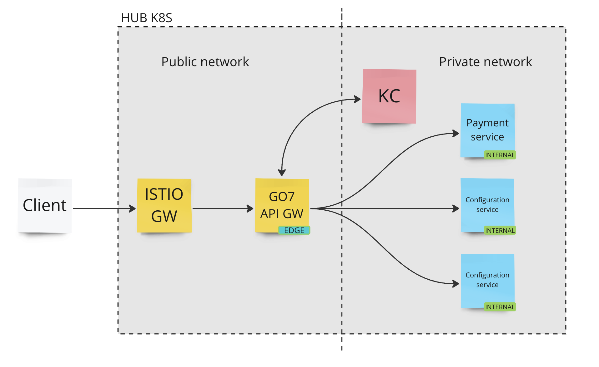

# Order Management API Request and Response for third party integration

## Table of Contents

- [Introduction](#introduction)
- [Business Flow](#business-flow)
- [Authentication](#authentication)
  - [JWT](#jwt)
  - [API Key](#api-key)
- [OTA XML Schema 2015](#ota-xml-schema-2015)
- [Postman Collection](#postman-collection)
- [Code Lists](#code-lists)
  - [Booking Class](#booking-class)
  - [Passenger Type](#passengers-type)
  - [Document Type](#document-type)
- [Available Routes and Flights](#available-routes-and-flights-calendar)
- [OTA for Reservation workflow](#ota-for-reservation-workflow)

## Change Log

| Change Description                                   | Changed By              | Change Date |
|------------------------------------------------------|-------------------------|-------------|
| Initial creation of the document                     | Vitalii Gorbatiuk       | 2025-03-03  |

<br />

# Introduction

This document outlines the integration of the Order Management API with HUB system.

## Endpoints

### Test Endpoints

|             | Test                                            |
|-------------|-------------------------------------------------|
| GraphQL API | https://go7-gateway.dev.go7.io/graphql          |


### Production Endpoints

|              | Production                                       |
|--------------|--------------------------------------------------|
| GraphQL API  | https://go7-gateway.dev.go7.io/graphql           |
| 

# Business Flow

This diagram illustrates the GraphQL API call through Gateway (with public access).
Any requests for Order modification must be Authorised. Order read requests don't need any Auth.


This diagram illustrates the API call sequence for creating order, creating a reservation, and the intermediate steps required to issue tickets.
```
@startuml firstDiagram

Alice -> Bob: Hello
Bob -> Alice: Hi!
		
@enduml
```

# Authentication

This section provides the procedures necessary for authorized access. Refer to this section for credentials information and endpoints for the authentication.

There are two authentication types:

- [API Key](#api-key)
- [JWT](#jwt)

## API KEY

The API key should be attached to the HTTP request as `X-API-Key` HTTP header.

`Never deploy your key in client-side like browsers or mobile apps as it allows malicious users to take that key and make requests on your behalf.`

| API KEY                        |
| ------------------------------ |
| 8cee91a8-4d2c-47e5-b174-xxxxxx |

#### Request

```
curl -X POST \
    {base_url} \
    -H 'x-api-key: {api_key}' \
    -H 'local-name: {local_name}' \
```

## JWT

|                   | Production                             | Test                                   |
| ----------------- | -------------------------------------- | -------------------------------------- |
| Identity Provider | https://api.sar.worldticket.cloud/auth | https://test-auth.worldticket.net/auth |

Before calling any OTA method it's mandatory to get access and refresh tokens from the Identity Provider.

Replace all variables in curly braces with the actual values.

| Variable      | Description                         | Example                                |
| ------------- | ----------------------------------- | -------------------------------------- |
| base_url      | Identity provider URL               | https://test-auth.worldticket.net/auth |
| tenant        | Short airline name stands for realm | test-rs3                               |
| client_id     | Application ID                      | sms4                                   |
| client_secret | Application secret                  | 33357c21-3233-4eb3-a420-**\*\*\*\***   |
| username      | User login                          | username                               |
| password      | User password                       | **\*\*\*\***                           |

<details>
  <summary><b>Authentication Request and Response</b></summary>
  <h4>Request</h4>
  <pre>
    curl -X POST \
    {base_url}/realms/{tenant}/protocol/openid-connect/token \
    -H 'Content-Type: application/x-www-form-urlencoded' \
    -d 'grant_type=password&client_id=sms4&client_secret={client_secret}&username={username}&password={password}'
  </pre>

  <h4>Response</h4>
  <pre>
    {
      "access_token": "eyJhbGciOiJSU...",
      "expires_in": 7200,
      "refresh_expires_in": 14400,
      "refresh_token": "eyJhbGciOiJ...",
      "token_type": "bearer",
      "id_token": "eyJhbGciOiJ...",
      "not-before-policy": 1565113348,
      "session_state": "89fde8f3-39ff-436e-9dce-99387c591fda"
    }
  </pre>
</details>
<br /><br />

# Create Initial Order Request
<details>
  <summary>Expand</summary>

  ```graphql
  mutation createOrder($offerId: String!) {
  order: createOrder(createOrderRequest: { offerId: $offerId }) {
    orderId
    orderStatus
    tenant
    items {
      guarantee {
        externalOrderId
        recordLocator
        guarantee {
          guaranteeId
          status
          paymentTimeLimit
          ticketingTimeLimit
        }
      }
    }
    pendingPurchase {
      purchaseId
      timeToLive
    }
  }
}
  ```
</details>
