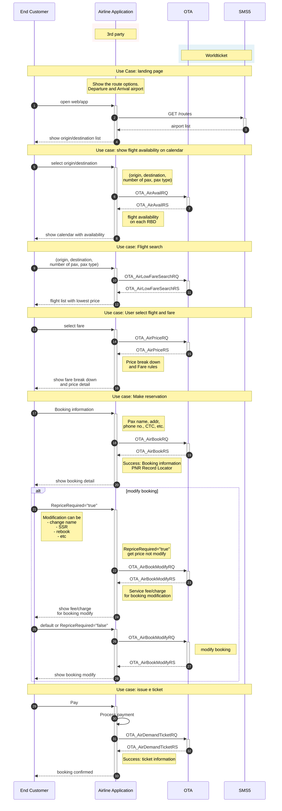

# OTA API Generic Integration Guide

## Table of Contents

- [OTA API Generic Integration Guide](#ota-api-generic-integration-guide)
  - [Table of Contents](#table-of-contents)
  - [Change Log](#change-log)
- [Introduction](#introduction)
  - [Base URLs](#base-urls)
  - [HTTP Headers](#http-headers)
- [Business Flow](#business-flow)
- [OTA XML Schema 2015](#ota-xml-schema-2015)
- [Postman Collection](#postman-collection)
- [Code Lists](#code-lists)
  - [Booking Class](#booking-class)
  - [Passenger Type](#passenger-type)
  - [Document Type](#document-type)
- [OTA for Reservation workflow](#ota-for-reservation-workflow)

## Change Log

| Change Description                                                         | Changed By             | Change Date |
|----------------------------------------------------------------------------|------------------------|-------------|
| Update request/response for all endpoints, postman collection for download | Thotsaphorn Phonlabutr | 2025-11-21  |
| Initial creation of generic OTA documentation                              | Sittiwet Mahapratoom   | 2025-01-15  |

For detailed changelog see: [Generic Changelog](generic-changelog.md)

# Introduction

This document outlines the generic integration of Booking API with airline systems, leveraging OTA API standards. This guide provides airline-agnostic documentation that can be adapted for any airline implementation.

## Base URLs

Use these hosts with the OTA paths documented per endpoint (for example `/ota/v2015b/AirLowFareSearch`).

| Environment | Base URL                      |
|-------------|-------------------------------|
| Production  | https://api.worldticket.net   |
| Test        | https://test-api.worldticket.net |

## HTTP Headers

Attach the following headers to OTA requests.

| Header        | Description                         | Example                   |
|---------------|-------------------------------------|---------------------------|
| Authorization | Bearer token for JWT authentication | Bearer {access_token}     |
| X-API-Key     | API key for key-based authentication| {api_key}                 |
| Content-Type  | Request content type                | application/json          |

Note: Use either `Authorization` (JWT) OR `X-API-Key` (API key), not both.

# Business Flow

This diagram illustrates the API call sequence for searching available flights, creating a reservation, and the intermediate steps required to issue tickets.

# OTA XML Schema 2015
[Download OTA XML Schema 2015](/docs/assets/resources/ota-xmlbeans-2015B.zip)

# Postman Collection
[Download Postman Collection](/docs/assets/resources/OTA_postman_collection.json)
Please update the variables in collection such as apiKey, agent_id, agent_name and tenant.

# Code Lists

## Booking Class

| Class | Description    |
| ----- | -------------- |
| Y     | Economy class  |
| C     | Business class |

## Passenger Type

| Code   | Description |
| ------ | ----------- |
| ADULT  | Adult       |
| CHILD  | Child       |
| INFANT | Infant      |

## Document Type

| Code | Description |
| ---- | ----------- |
| 2    | Passport    |
| 5    | National ID |

# OTA for Reservation workflow

|         | Production                                     | Test                                           |
| ------- | ---------------------------------------------- | ---------------------------------------------- |
| OTA API | https://api.worldticket.net/ota/v2015b/OTA     | https://test-api.worldticket.net/ota/v2015b/OTA |

- [Flight Availability](generic/flight-availability)
- [Flight Search](generic/flight-search)
  - [One-way trip](generic/flight-search#airlowfaresearchrq-for-one-way-trip)
  - [Round trip](generic/flight-search#airlowfaresearchrq-for-round-trip)
- [Price Check](generic/price-check.md)
- [Regular Booking](generic/booking-regular)
  - [Regular booking for One-way trip](generic/booking-regular#airbookrq-for-one-way-trip)
  - [Regular booking for Round trip](generic/booking-regular#airbookrq-for-round-trip)
- [Read Booking](generic/read-booking.md)
- [Modify Booking](generic/booking-modification)
  - [Change Name](generic/booking-modification#change-name)
  - [Change Date](generic/booking-modification#change-date)
- [Payment and Ticketing](generic/payment-ticketing)
  - [Base URLs](generic/payment-ticketing#base-urls)
  - [Endpoints](generic/payment-ticketing#endpoints)
  - [Supported Payment Types](generic/payment-ticketing#supported-payment-types)
  - [Make Payment for Issuing a Ticket](generic/payment-ticketing#make-payment-for-issuing-a-ticket)
  - [Payment with Cash](generic/payment-ticketing#payment-with-cash)
  - [Payment with Debit-Credit Account](generic/payment-ticketing#payment-with-debit-credit-account)
- [Cancel Booking](generic/booking-cancellation#cancel-booking)
  - [Full Booking Cancellation](generic/booking-cancellation#full-booking-cancellation)
  - [Cancel Specific Passengers](generic/booking-cancellation#cancel-specific-passengers)
  - [Cancel Specific Segments](generic/booking-cancellation#cancel-specific-segments)

[//]: # (  - [Payment with Redirect]&#40;generic/payment-ticketing#payment-with-redirect&#41;)

[//]: # (  - [Issue EMDs for Ancillaries]&#40;generic/payment-ticketing#issue-emds-for-ancillaries&#41;)

[//]: # (  - [Currency Conversion]&#40;generic/payment-ticketing#currency-conversion&#41;)

[//]: # (  - [Error Responses]&#40;generic/payment-ticketing#error-responses&#41;)

[//]: # (- [Booking Cancellation]&#40;generic/booking-cancellation&#41;)

[//]: # (  - [Base URLs]&#40;generic/booking-cancellation#base-urls&#41;)

[//]: # (  - [Endpoints]&#40;generic/booking-cancellation#endpoints&#41;)

[//]: # (  - [Basic Request Format]&#40;generic/booking-cancellation#basic-request-format&#41;)

