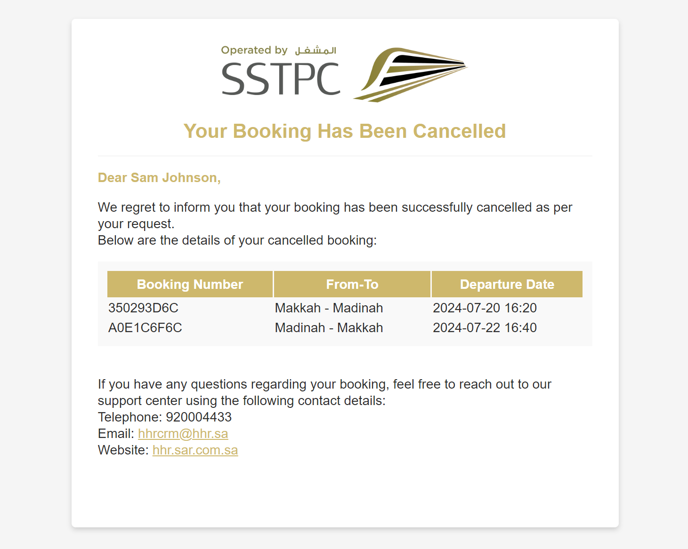

## Cancel Booking

This method cancels entire booking. In case you need to cancel individual passenger or segment use `OTA_AirBookingModifyRQ` and not `OTA_CancelRQ` message. 

#### Request Parameters

| Parameter    | Type    | Description        | Example                  |
|--------------|---------|--------------------|--------------------------|
| x-api-key    | Header  | Access Token       | [Access token](#api-key) |
| local-name   | Header  | Custom HTTP header | OTA_CancelRQ             |
| agentId      | Payload |                    | ota                      |
| agencyId     | Payload |                    | ota                      |

  
<b>Request Payload</b>

  <pre>
{
  "version": "2.001",
  "cancelType": "Commit",
  "pos": {
    "source": [
      {
        "isoCurrency": "SAR",
        "requestorID": {
          "type": "5",
          "id": "<ins>agentId</ins>",
          "name": "<ins>agencyId</ins>"
        },
        "bookingChannel": {
          "type": "OTA"
        }
      }
    ]
  },
  "uniqueID": [
    {
      "id": "6ZEFCG",
      "type": "14"
    }
  ]
}
  </pre>

  
<b>Response Payload</b>

  <pre>
{
  "success": {},
  "uniqueID": [
    {
      "type": "14",
      "id": "6ZEFCG"
    }
  ],
  "segment": [],
  "status": "CANCELLED",
  "timeStamp": "2024-05-15T05:56:22.041Z",
  "version": 2.001
}
  </pre>

### Cancellation and Refund Penalty Policy
This policy sets the rules for handling cancellations and refund penalties as per the commercial agreements between SAR and the OTA. The different terms and conditions will apply based on the fare class, booking channel, and specific contractual agreements.
The system will automatically verify the cancellation and refund rules for each OTA based on their agreement and provide the appropriate result. Once the cancellation is successful, a cancelation email will be sent automatically.

### Cancellation email
Support sending cancellation email automatically after HHR success cancelled the booking or segment

#### Configuration
Required configuration to process sending cancellation email.

- reservation-service
    

    <pre>
    reservation.tenants.${tenant_name}:
        send-cancelled-email-enabled: true
    reservation.providers.configurable.hhr.additional-supported-change-operation:
        - add_remark
        - add_ssrs </pre>
    

- order-management-service
    

    <pre>
    order-management.tenants.${tenant_name}:
        send-cancelled-email-enabled: true
        sender-email: example@email.com
        default-language: en
    order-management.events.out.send-mail: activemq:send-mail</pre>
    

#### Email template
The email template is stored in localization database and can amend via SMS5-UI by searching keyword below.
- Mail subject: "mail.hhr.cancellation.subject"
- Mail body: "mail.hhr.cancellation.body"