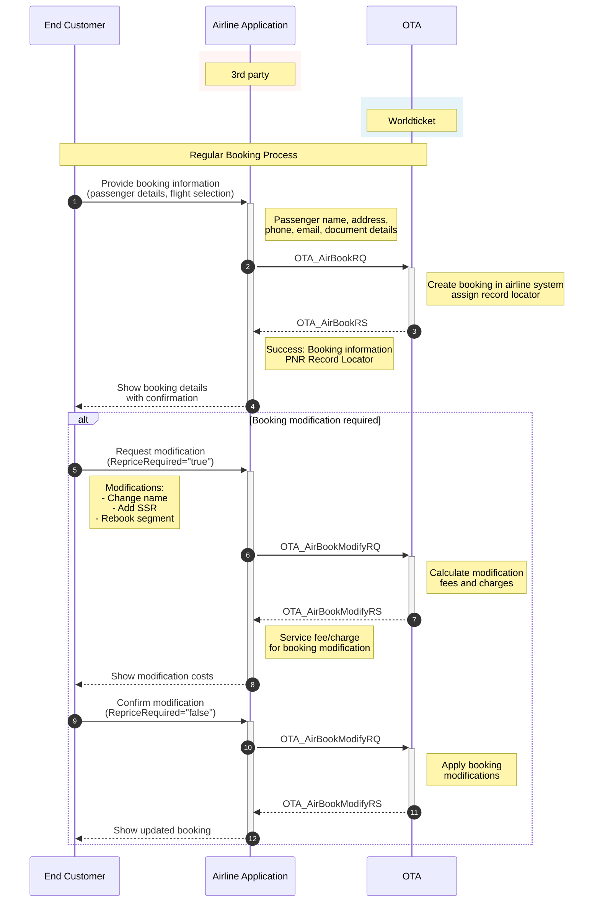

# Create a Regular Booking (AirBookRQ)

The purpose is to create the booking in the airline system by providing a specific flight and fare in the request.

## Table of Contents

- [Endpoints](#endpoints)
- [Regular Booking Workflow](#regular-booking-workflow)
- [Basic Request Format](#basic-request-format)
- [AirBookRQ for One-way Trip](#airbookrq-for-one-way-trip)
- [AirBookRQ for Round Trip](#airbookrq-for-round-trip)
- [Special Service Requests (SSR)](#special-service-requests-ssr)
- [Payment Details](#payment-details)
- [Payment Types](#payment-types)
- [Response Structure](#response-structure)
- [Booking Status Codes](#booking-status-codes)
- [Error Responses](#error-responses)

## Base URLs

| Environment | URL |
|-------------|-----|
| Production | https://api.worldticket.net |
| Test | https://test-api.worldticket.net |

## Endpoint

- Method: `POST`
- Path: `/ota/v2015b/OTA_AirBookRQ`
- Full URL: `{base_url}/ota/v2015b/OTA_AirBookRQ` (choose base URL per environment above)

## HTTP Headers

| Header | Description | Example |
|--------|-------------|---------|
| Authorization | Bearer token for JWT authentication | Bearer {access_token} |
| X-API-Key | API key for key-based authentication | {api_key} |
| X-Realm | Airline realm identifier | {tenant-name} |

**Note:** Use either `Authorization` (for JWT) OR `X-API-Key` (for API key authentication), not both.

## Regular Booking Workflow



## Basic Request Format

### With JWT Authentication
```bash
curl -X POST \
    https://test-api.worldticket.net/ota/v2015b/OTA_AirBookRQ \
    -H 'Authorization: Bearer {access_token}' \
    -H 'Content-Type: application/json' \
    -d @AirBookRQ.json
```

### With API Key Authentication
```bash
curl -X POST \
    https://test-api.worldticket.net/ota/v2015b/OTA_AirBookRQ \
    -H 'X-API-Key: {api_key}' \
    -H 'Content-Type: application/json' \
    -d @AirBookRQ.json
```

## AirBookRQ for One-way Trip

In AirBookRQ request, an itinerary and passenger names are mandatory.

Some details can be provided optionally:
- Special Service Requests (SSR)
- Payment details

<!-- XML request removed to keep JSON-only documentation -->

<details>
<summary><strong>📋 JSON Request Template</strong></summary>
<div markdown="1">

```json
{
  "version": "2.001",
  "pos": {
    "source": [
      {
        "isoCurrency": "{currency_code}",
        "requestorID": {
          "type": "5",
          "id": "{agent_id}",
          "name": "{agency_id}"
        },
        "bookingChannel": {
          "type": "OTA"
        }
      }
    ]
  },
  "airItinerary": {
    "originDestinationOptions": [
      {
        "flightSegment": {
          "departureDateTime": "{departure_datetime}",
          "arrivalDateTime": "{arrival_datetime}",
          "flightNumber": "{flight_number}",
          "resBookDesigCode": "{booking_class}",
          "numberInParty": "{total_passengers}",
          "departureAirport": {
            "locationCode": "{origin_code}"
          },
          "arrivalAirport": {
            "locationCode": "{destination_code}"
          },
          "marketingAirline": {
            "code": "{airline_code}"
          }
        }
      }
    ]
  },
  "travelerInfo": [
    {
      "airTraveler": {
        "personName": {
          "givenName": "{first_name}",
          "surname": "{last_name}"
        },
        "telephone": [
          {
            "phoneNumber": "{phone_number}",
            "phoneTechType": "Voice"
          }
        ],
        "email": [
          {
            "emailAddress": "{email_address}"
          }
        ],
        "document": {
          "docType": "{document_type}",
          "docID": "{document_number}",
          "expireDate": "{expiry_date}"
        },
        "travelerRefNumber": {
          "rph": "1"
        }
      }
    }
  ]
}
```

</div>

</details>

<details>
<summary><strong>✅ Example</strong></summary>
<div markdown="1">

```json
{
  "version": "2.001",
  "pos": {
    "source": [
      {
        "isoCurrency": "USD",
        "requestorID": { "type": "5", "id": "AGENT123", "name": "AGENCY1" },
        "bookingChannel": { "type": "OTA" }
      }
    ]
  },
  "airItinerary": {
    "originDestinationOptions": [
      {
        "flightSegment": {
          "departureDateTime": "2024-12-25T08:00:00",
          "arrivalDateTime": "2024-12-25T11:30:00",
          "flightNumber": "WT100",
          "resBookDesigCode": "Y",
          "numberInParty": "1",
          "departureAirport": { "locationCode": "JED" },
          "arrivalAirport": { "locationCode": "XMK" },
          "marketingAirline": { "code": "WT" }
        }
      }
    ]
  },
  "travelerInfo": [
    {
      "airTraveler": {
        "personName": { "givenName": "JOHN", "surname": "DOE" },
        "telephone": [ { "phoneNumber": "+15551234567", "phoneTechType": "Voice" } ],
        "email": [ { "emailAddress": "john.doe@example.com" } ],
        "document": { "docType": "P", "docID": "X1234567", "expireDate": "2030-12-31" },
        "travelerRefNumber": { "rph": "1" }
      }
    }
  ]
}
```

</div>

</details>

## AirBookRQ for Round Trip

<!-- XML request removed to keep JSON-only documentation -->

<details>
<summary><strong>📋 JSON Request Template</strong></summary>
<div markdown="1">

```json
{
  "version": "2.001",
  "pos": {
    "source": [
      {
        "isoCurrency": "{currency_code}",
        "requestorID": {
          "type": "5",
          "id": "{agent_id}",
          "name": "{agency_id}"
        },
        "bookingChannel": {
          "type": "OTA"
        }
      }
    ]
  },
  "airItinerary": {
    "originDestinationOptions": [
      {
        "flightSegment": {
          "departureDateTime": "{outbound_departure_datetime}",
          "arrivalDateTime": "{outbound_arrival_datetime}",
          "flightNumber": "{outbound_flight_number}",
          "resBookDesigCode": "{booking_class}",
          "numberInParty": "{total_passengers}",
          "departureAirport": {
            "locationCode": "{origin_code}"
          },
          "arrivalAirport": {
            "locationCode": "{destination_code}"
          },
          "marketingAirline": {
            "code": "{airline_code}"
          }
        }
      },
      {
        "flightSegment": {
          "departureDateTime": "{inbound_departure_datetime}",
          "arrivalDateTime": "{inbound_arrival_datetime}",
          "flightNumber": "{inbound_flight_number}",
          "resBookDesigCode": "{booking_class}",
          "numberInParty": "{total_passengers}",
          "departureAirport": {
            "locationCode": "{destination_code}"
          },
          "arrivalAirport": {
            "locationCode": "{origin_code}"
          },
          "marketingAirline": {
            "code": "{airline_code}"
          }
        }
      }
    ]
  },
  "travelerInfo": [
    {
      "airTraveler": {
        "personName": {
          "givenName": "{first_name}",
          "surname": "{last_name}"
        },
        "document": {
          "docType": "{document_type}",
          "docID": "{document_number}",
          "expireDate": "{expiry_date}"
        },
        "travelerRefNumber": {
          "rph": "1"
        }
      }
    }
  ]
}
```

</div>

</details>

<details>
<summary><strong>✅ Example</strong></summary>
<div markdown="1">

```json
{
  "version": "2.001",
  "pos": {
    "source": [
      {
        "isoCurrency": "USD",
        "requestorID": { "type": "5", "id": "AGENT123", "name": "AGENCY1" },
        "bookingChannel": { "type": "OTA" }
      }
    ]
  },
  "airItinerary": {
    "originDestinationOptions": [
      {
        "flightSegment": {
          "departureDateTime": "2024-12-25T08:00:00",
          "arrivalDateTime": "2024-12-25T11:30:00",
          "flightNumber": "WT100",
          "resBookDesigCode": "Y",
          "numberInParty": "1",
          "departureAirport": { "locationCode": "JED" },
          "arrivalAirport": { "locationCode": "XMK" },
          "marketingAirline": { "code": "WT" }
        }
      },
      {
        "flightSegment": {
          "departureDateTime": "2025-01-02T16:00:00",
          "arrivalDateTime": "2025-01-02T19:30:00",
          "flightNumber": "WT101",
          "resBookDesigCode": "Y",
          "numberInParty": "1",
          "departureAirport": { "locationCode": "XMK" },
          "arrivalAirport": { "locationCode": "JED" },
          "marketingAirline": { "code": "WT" }
        }
      }
    ]
  },
  "travelerInfo": [
    {
      "airTraveler": {
        "personName": { "givenName": "JOHN", "surname": "DOE" },
        "document": { "docType": "P", "docID": "X1234567", "expireDate": "2030-12-31" },
        "travelerRefNumber": { "rph": "1" }
      }
    }
  ]
}
```

</div>

</details>

## Special Service Requests (SSR)

### Adding SSR to Booking Request

```json
{
  "travelerInfo": [
    {
      "airTraveler": {
        "personName": {
          "givenName": "{first_name}",
          "surname": "{last_name}"
        },
        "document": {
          "docType": "{document_type}",
          "docID": "{document_number}",
          "expireDate": "{expiry_date}"
        },
        "travelerRefNumber": {
          "rph": "1"
        },
        "specialServiceRequests": [
          {
            "ssrCode": "MEAL",
            "serviceQuantity": 1,
            "status": "Requested",
            "text": "Vegetarian meal"
          },
          {
            "ssrCode": "SEAT",
            "serviceQuantity": 1,
            "status": "Requested",
            "text": "Aisle seat preference"
          }
        ]
      }
    }
  ]
}
```

## Payment Details

### Including Payment Information

```json
{
  "fulfillment": {
    "paymentDetails": {
      "paymentDetail": {
        "paymentType": "1",
        "directBill": {
          "directBillID": "{account_id}"
        }
      }
    }
  }
}
```

### Payment Types

| Code | Payment Type |
|------|--------------|
| 1 | Cash |
| 4 | Debit Credit Account |
| 5 | Credit Card |
| 32 | External Payment |
| 40 | Invoice |

## Response Structure

<!-- XML response removed to keep JSON-only documentation -->

### JSON Response

```json
{
  "version": "2.001",
  "success": {},
  "airReservation": {
    "bookingReferenceID": {
      "id": "{record_locator}",
      "type": "14",
      "companyName": {
        "code": "{airline_code}"
      }
    },
    "airItinerary": {
      "originDestinationOptions": [
        {
          "flightSegment": {
            "departureDateTime": "{departure_datetime}",
            "arrivalDateTime": "{arrival_datetime}",
            "flightNumber": "{flight_number}",
            "resBookDesigCode": "{booking_class}",
            "status": "HK",
            "departureAirport": {
              "locationCode": "{origin_code}"
            },
            "arrivalAirport": {
              "locationCode": "{destination_code}"
            },
            "marketingAirline": {
              "code": "{airline_code}"
            }
          }
        }
      ]
    },
    "travelerInfo": [
      {
        "airTraveler": {
          "personName": {
            "givenName": "{first_name}",
            "surname": "{last_name}"
          },
          "travelerRefNumber": {
            "rph": "1"
          }
        }
      }
    ],
    "priceInfo": {
      "itinTotalFare": {
        "baseFare": {
          "amount": "{base_fare}",
          "currencyCode": "{currency_code}"
        },
        "taxes": [
          {
            "amount": "{tax_amount}",
            "currencyCode": "{currency_code}"
          }
        ],
        "totalFare": {
          "amount": "{total_fare}",
          "currencyCode": "{currency_code}"
        }
      }
    },
    "ticketingInfo": {
      "ticketTimeLimit": "{ticket_time_limit}"
    }
  }
}
```

## Booking Status Codes

| Status Code | Description |
|-------------|-------------|
| HK | Booking confirmed |
| UC | Unable to confirm |
| UN | Unable - need |
| WL | Waitlisted |

## Error Responses

### Seat Not Available

```json
{
  "errors": [
    {
      "code": "SEAT_NOT_AVAILABLE",
      "message": "Seat not available",
      "details": "The requested seat is no longer available for booking."
    }
  ]
}
```

### Invalid Passenger Data

```json
{
  "errors": [
    {
      "code": "INVALID_PASSENGER_DATA",
      "message": "Document expiry date must be in the future",
      "field": "document.expireDate"
    }
  ]
}
```
