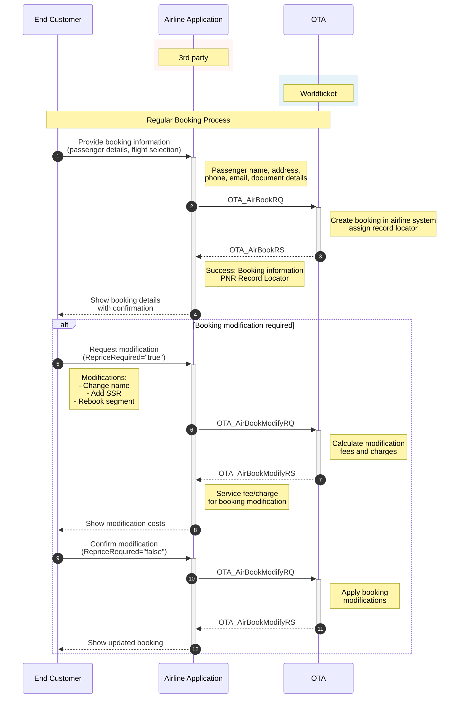

# Create a Regular Booking (AirBookRQ)

The purpose is to create the booking in the airline system by providing a specific flight and fare in the request.

## Base URLs

| Environment | URL |
|-------------|-----|
| Production | https://api.worldticket.net/ota/v2015b/OTA |
| Test | https://test-api.worldticket.net/ota/v2015b/OTA |

## Request Parameters in the Header (All Required)

| Parameter  | Type    | Description        | Example                  |
| ---------- | ------- | ------------------ | ------------------------ |
| x-api-key  | Header  | Access Token       | {api-key} |
| local-name | Header  | Custom HTTP header | OTA_AirBookRQ            |
| agentId    | Payload | Agent identifier   | {agent_id}               |
| agencyId   | Payload | Agency identifier  | {agency_id}              |

## Regular Booking Workflow



## Request Format

```bash
curl -X POST \
    {base_url} \
    -H 'x-api-key: {api-key}' \
    -H 'local-name: OTA_AirBookRQ' \
    -H 'Content-Type: application/xml' \
    -d @AirBookRQ.xml
```

## AirBookRQ for One-way Trip

In AirBookRQ request, an itinerary and passenger names are mandatory.

Some details can be provided optionally:
- Special Service Requests (SSR)
- Payment details

### XML Request Example

```xml
<?xml version="1.0" encoding="UTF-8"?>
<OTA_AirBookRQ xmlns="http://www.opentravel.org/OTA/2003/05" Version="2.001">
    <POS>
        <Source>
            <RequestorID Type="5" ID="{agent_id}" ID_Context="{agency_id}"/>
        </Source>
    </POS>
    <AirItinerary>
        <OriginDestinationOptions>
            <OriginDestinationOption>
                <FlightSegment DepartureDateTime="{departure_datetime}" 
                              ArrivalDateTime="{arrival_datetime}"
                              FlightNumber="{flight_number}"
                              ResBookDesigCode="{booking_class}"
                              NumberInParty="{total_passengers}">
                    <DepartureAirport LocationCode="{origin_code}"/>
                    <ArrivalAirport LocationCode="{destination_code}"/>
                    <MarketingAirline Code="{airline_code}"/>
                </FlightSegment>
            </OriginDestinationOption>
        </OriginDestinationOptions>
    </AirItinerary>
    <TravelerInfo>
        <AirTraveler>
            <PersonName>
                <GivenName>{first_name}</GivenName>
                <Surname>{last_name}</Surname>
            </PersonName>
            <Document DocType="{document_type}" DocID="{document_number}" ExpireDate="{expiry_date}"/>
            <TravelerRefNumber RPH="1"/>
        </AirTraveler>
    </TravelerInfo>
    <Fulfillment>
        <PaymentDetails>
            <PaymentDetail PaymentType="{payment_type}">
                <DirectBill DirectBillID="{account_id}"/>
            </PaymentDetail>
        </PaymentDetails>
    </Fulfillment>
</OTA_AirBookRQ>
```

### JSON Request Example

```json
{
  "version": "2.001",
  "pos": {
    "source": [
      {
        "isoCurrency": "{currency_code}",
        "requestorID": {
          "type": "5",
          "id": "{agent_id}",
          "name": "{agency_id}"
        },
        "bookingChannel": {
          "type": "OTA"
        }
      }
    ]
  },
  "airItinerary": {
    "originDestinationOptions": [
      {
        "flightSegment": {
          "departureDateTime": "{departure_datetime}",
          "arrivalDateTime": "{arrival_datetime}",
          "flightNumber": "{flight_number}",
          "resBookDesigCode": "{booking_class}",
          "numberInParty": "{total_passengers}",
          "departureAirport": {
            "locationCode": "{origin_code}"
          },
          "arrivalAirport": {
            "locationCode": "{destination_code}"
          },
          "marketingAirline": {
            "code": "{airline_code}"
          }
        }
      }
    ]
  },
  "travelerInfo": [
    {
      "airTraveler": {
        "personName": {
          "givenName": "{first_name}",
          "surname": "{last_name}"
        },
        "telephone": [
          {
            "phoneNumber": "{phone_number}",
            "phoneTechType": "Voice"
          }
        ],
        "email": [
          {
            "emailAddress": "{email_address}"
          }
        ],
        "document": {
          "docType": "{document_type}",
          "docID": "{document_number}",
          "expireDate": "{expiry_date}"
        },
        "travelerRefNumber": {
          "rph": "1"
        }
      }
    }
  ]
}
```

## AirBookRQ for Round Trip

### XML Request Example

```xml
<?xml version="1.0" encoding="UTF-8"?>
<OTA_AirBookRQ xmlns="http://www.opentravel.org/OTA/2003/05" Version="2.001">
    <POS>
        <Source>
            <RequestorID Type="5" ID="{agent_id}" ID_Context="{agency_id}"/>
        </Source>
    </POS>
    <AirItinerary>
        <OriginDestinationOptions>
            <!-- Outbound Flight -->
            <OriginDestinationOption>
                <FlightSegment DepartureDateTime="{outbound_departure_datetime}" 
                              ArrivalDateTime="{outbound_arrival_datetime}"
                              FlightNumber="{outbound_flight_number}"
                              ResBookDesigCode="{booking_class}"
                              NumberInParty="{total_passengers}">
                    <DepartureAirport LocationCode="{origin_code}"/>
                    <ArrivalAirport LocationCode="{destination_code}"/>
                    <MarketingAirline Code="{airline_code}"/>
                </FlightSegment>
            </OriginDestinationOption>
            <!-- Inbound Flight -->
            <OriginDestinationOption>
                <FlightSegment DepartureDateTime="{inbound_departure_datetime}" 
                              ArrivalDateTime="{inbound_arrival_datetime}"
                              FlightNumber="{inbound_flight_number}"
                              ResBookDesigCode="{booking_class}"
                              NumberInParty="{total_passengers}">
                    <DepartureAirport LocationCode="{destination_code}"/>
                    <ArrivalAirport LocationCode="{origin_code}"/>
                    <MarketingAirline Code="{airline_code}"/>
                </FlightSegment>
            </OriginDestinationOption>
        </OriginDestinationOptions>
    </AirItinerary>
    <TravelerInfo>
        <AirTraveler>
            <PersonName>
                <GivenName>{first_name}</GivenName>
                <Surname>{last_name}</Surname>
            </PersonName>
            <Document DocType="{document_type}" DocID="{document_number}" ExpireDate="{expiry_date}"/>
            <TravelerRefNumber RPH="1"/>
        </AirTraveler>
    </TravelerInfo>
</OTA_AirBookRQ>
```

### JSON Request Example

```json
{
  "version": "2.001",
  "pos": {
    "source": [
      {
        "isoCurrency": "{currency_code}",
        "requestorID": {
          "type": "5",
          "id": "{agent_id}",
          "name": "{agency_id}"
        },
        "bookingChannel": {
          "type": "OTA"
        }
      }
    ]
  },
  "airItinerary": {
    "originDestinationOptions": [
      {
        "flightSegment": {
          "departureDateTime": "{outbound_departure_datetime}",
          "arrivalDateTime": "{outbound_arrival_datetime}",
          "flightNumber": "{outbound_flight_number}",
          "resBookDesigCode": "{booking_class}",
          "numberInParty": "{total_passengers}",
          "departureAirport": {
            "locationCode": "{origin_code}"
          },
          "arrivalAirport": {
            "locationCode": "{destination_code}"
          },
          "marketingAirline": {
            "code": "{airline_code}"
          }
        }
      },
      {
        "flightSegment": {
          "departureDateTime": "{inbound_departure_datetime}",
          "arrivalDateTime": "{inbound_arrival_datetime}",
          "flightNumber": "{inbound_flight_number}",
          "resBookDesigCode": "{booking_class}",
          "numberInParty": "{total_passengers}",
          "departureAirport": {
            "locationCode": "{destination_code}"
          },
          "arrivalAirport": {
            "locationCode": "{origin_code}"
          },
          "marketingAirline": {
            "code": "{airline_code}"
          }
        }
      }
    ]
  },
  "travelerInfo": [
    {
      "airTraveler": {
        "personName": {
          "givenName": "{first_name}",
          "surname": "{last_name}"
        },
        "document": {
          "docType": "{document_type}",
          "docID": "{document_number}",
          "expireDate": "{expiry_date}"
        },
        "travelerRefNumber": {
          "rph": "1"
        }
      }
    }
  ]
}
```

## Required Fields Summary

| Field | Required | Description |
|-------|----------|-------------|
| `personName.givenName` | ✅ | Passenger first name |
| `personName.surname` | ✅ | Passenger last name |
| `document.docType` | ✅ | Type of document (e.g., "2" for passport) |
| `document.docID` | ✅ | Document number |
| `document.expireDate` | ✅ | Document expiry date |
| `telephone.phoneNumber` | ✅ | Contact phone number |
| `email.emailAddress` | ✅ | Contact email address |
| `flightSegment.departureDateTime` | ✅ | Flight departure date and time |
| `flightSegment.flightNumber` | ✅ | Flight number |
| `flightSegment.resBookDesigCode` | ✅ | Booking class code |

## Special Service Requests (SSR)

### Adding SSR to Booking Request

```xml
<TravelerInfo>
    <AirTraveler>
        <PersonName>
            <GivenName>{first_name}</GivenName>
            <Surname>{last_name}</Surname>
        </PersonName>
        <Document DocType="{document_type}" DocID="{document_number}" ExpireDate="{expiry_date}"/>
        <TravelerRefNumber RPH="1"/>
        <SpecialServiceRequests>
            <SpecialServiceRequest SSRCode="MEAL" ServiceQuantity="1" Status="Requested">
                <Text>Vegetarian meal</Text>
            </SpecialServiceRequest>
            <SpecialServiceRequest SSRCode="SEAT" ServiceQuantity="1" Status="Requested">
                <Text>Aisle seat preference</Text>
            </SpecialServiceRequest>
        </SpecialServiceRequests>
    </AirTraveler>
</TravelerInfo>
```

## Payment Details

### Including Payment Information

```xml
<Fulfillment>
    <PaymentDetails>
        <PaymentDetail PaymentType="1">
            <DirectBill DirectBillID="{account_id}"/>
        </PaymentDetail>
    </Fulfillment>
```

### Payment Types

| Code | Payment Type |
|------|--------------|
| 1 | Cash |
| 4 | Debit Credit Account |
| 5 | Credit Card |
| 32 | External Payment |
| 40 | Invoice |

## Response Structure

### XML Response

```xml
<?xml version="1.0" encoding="UTF-8"?>
<OTA_AirBookRS xmlns="http://www.opentravel.org/OTA/2003/05" Version="2.001">
    <Success/>
    <AirReservation>
        <BookingReferenceID ID="{record_locator}" Type="14">
            <CompanyName Code="{airline_code}"/>
        </BookingReferenceID>
        <AirItinerary>
            <OriginDestinationOptions>
                <OriginDestinationOption>
                    <FlightSegment DepartureDateTime="{departure_datetime}" 
                                  ArrivalDateTime="{arrival_datetime}"
                                  FlightNumber="{flight_number}"
                                  ResBookDesigCode="{booking_class}"
                                  Status="HK">
                        <DepartureAirport LocationCode="{origin_code}"/>
                        <ArrivalAirport LocationCode="{destination_code}"/>
                        <MarketingAirline Code="{airline_code}"/>
                        <BookingClassAvails>
                            <BookingClassAvail ResBookDesigCode="{booking_class}"/>
                        </BookingClassAvails>
                    </FlightSegment>
                </OriginDestinationOption>
            </OriginDestinationOptions>
        </AirItinerary>
        <TravelerInfo>
            <AirTraveler>
                <PersonName>
                    <GivenName>{first_name}</GivenName>
                    <Surname>{last_name}</Surname>
                </PersonName>
                <TravelerRefNumber RPH="1"/>
            </AirTraveler>
        </TravelerInfo>
        <PriceInfo>
            <ItinTotalFare>
                <BaseFare Amount="{base_fare}" CurrencyCode="{currency_code}"/>
                <Taxes>
                    <Tax Amount="{tax_amount}" CurrencyCode="{currency_code}"/>
                </Taxes>
                <TotalFare Amount="{total_fare}" CurrencyCode="{currency_code}"/>
            </ItinTotalFare>
        </PriceInfo>
        <TicketingInfo TicketTimeLimit="{ticket_time_limit}"/>
    </AirReservation>
</OTA_AirBookRS>
```

### JSON Response

```json
{
  "version": "2.001",
  "success": {},
  "airReservation": {
    "bookingReferenceID": {
      "id": "{record_locator}",
      "type": "14",
      "companyName": {
        "code": "{airline_code}"
      }
    },
    "airItinerary": {
      "originDestinationOptions": [
        {
          "flightSegment": {
            "departureDateTime": "{departure_datetime}",
            "arrivalDateTime": "{arrival_datetime}",
            "flightNumber": "{flight_number}",
            "resBookDesigCode": "{booking_class}",
            "status": "HK",
            "departureAirport": {
              "locationCode": "{origin_code}"
            },
            "arrivalAirport": {
              "locationCode": "{destination_code}"
            },
            "marketingAirline": {
              "code": "{airline_code}"
            }
          }
        }
      ]
    },
    "travelerInfo": [
      {
        "airTraveler": {
          "personName": {
            "givenName": "{first_name}",
            "surname": "{last_name}"
          },
          "travelerRefNumber": {
            "rph": "1"
          }
        }
      }
    ],
    "priceInfo": {
      "itinTotalFare": {
        "baseFare": {
          "amount": "{base_fare}",
          "currencyCode": "{currency_code}"
        },
        "taxes": [
          {
            "amount": "{tax_amount}",
            "currencyCode": "{currency_code}"
          }
        ],
        "totalFare": {
          "amount": "{total_fare}",
          "currencyCode": "{currency_code}"
        }
      }
    },
    "ticketingInfo": {
      "ticketTimeLimit": "{ticket_time_limit}"
    }
  }
}
```

## Booking Status Codes

| Status Code | Description |
|-------------|-------------|
| HK | Booking confirmed |
| UC | Unable to confirm |
| UN | Unable - need |
| WL | Waitlisted |

## Error Responses

### Seat Not Available

```xml
<OTA_AirBookRS>
    <Errors>
        <Error Code="SEAT_NOT_AVAILABLE" ShortText="Seat not available">
            The requested seat is no longer available for booking.
        </Error>
    </Errors>
</OTA_AirBookRS>
```

### Invalid Passenger Data

```json
{
  "errors": [
    {
      "code": "INVALID_PASSENGER_DATA",
      "message": "Document expiry date must be in the future",
      "field": "document.expireDate"
    }
  ]
}
```