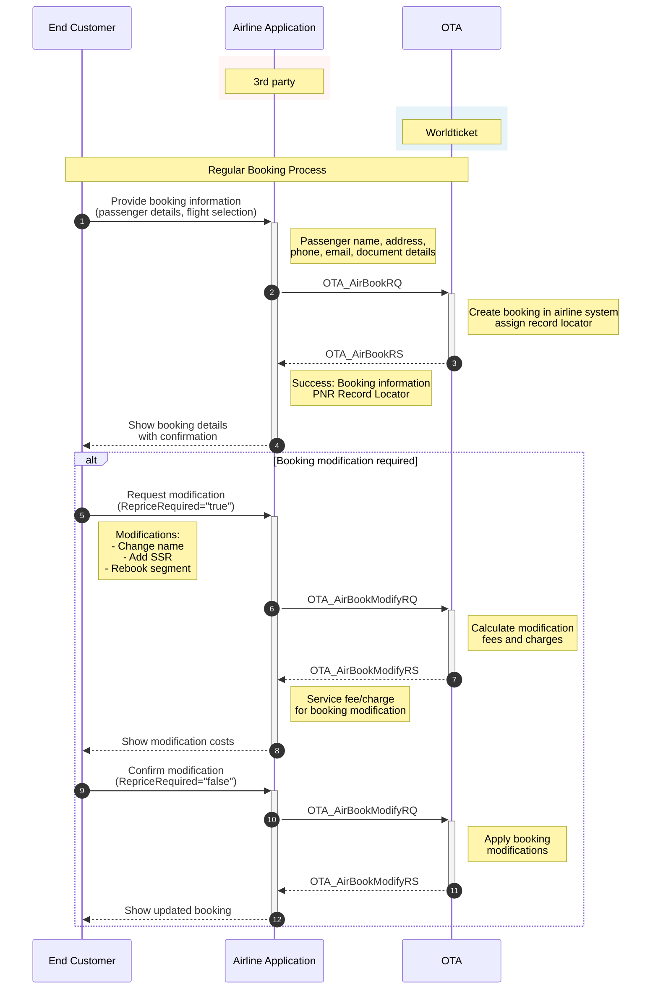

# Create a Regular Booking (AirBookRQ)

The purpose is to create the booking in the airline system by providing a specific flight and fare in the request.

## Table of Contents

- [Create a Regular Booking (AirBookRQ)](#create-a-regular-booking-airbookrq)
  - [Table of Contents](#table-of-contents)
  - [Base URLs](#base-urls)
  - [Endpoint](#endpoint)
  - [HTTP Headers](#http-headers)
  - [Regular Booking Workflow](#regular-booking-workflow)
  - [Basic Request Format](#basic-request-format)
    - [With JWT Authentication](#with-jwt-authentication)
    - [With API Key Authentication](#with-api-key-authentication)
  - [AirBookRQ for One-way Trip](#airbookrq-for-one-way-trip)
  - [AirBookRQ for Round Trip](#airbookrq-for-round-trip)
  - [Response Structure](#response-structure)
    - [JSON Response](#json-response)
  - [Booking Status Codes](#booking-status-codes)

## Base URLs

| Environment | URL |
|-------------|-----|
| Production | https://api.worldticket.net |
| Test | https://test-api.worldticket.net |

## Endpoint

- Method: `POST`
- Path: `/ota/v2015b/OTA_AirBookRQ`
- Full URL: `{base_url}/ota/v2015b/OTA_AirBookRQ` (choose base URL per environment above)

## HTTP Headers

| Header | Description | Example |
|--------|-------------|---------|
| Authorization | Bearer token for JWT authentication | Bearer {access_token} |
| X-API-Key | API key for key-based authentication | {api_key} |
| X-Realm | Airline realm identifier | {tenant-name} |

**Note:** Use either `Authorization` (for JWT) OR `X-API-Key` (for API key authentication), not both.

## Regular Booking Workflow



## Basic Request Format

### With JWT Authentication
```bash
curl -X POST \
    https://test-api.worldticket.net/ota/v2015b/OTA_AirBookRQ \
    -H 'Authorization: Bearer {access_token}' \
    -H 'Content-Type: application/json' \
    -d @AirBookRQ.json
```

### With API Key Authentication
```bash
curl -X POST \
    https://test-api.worldticket.net/ota/v2015b/OTA_AirBookRQ \
    -H 'X-API-Key: {api_key}' \
    -H 'Content-Type: application/json' \
    -d @AirBookRQ.json
```

## AirBookRQ for One-way Trip

In AirBookRQ request, an itinerary and passenger names are mandatory.

<details>
<summary><strong>📋 JSON Request Template</strong></summary>
<div markdown="1">

```json
{
  "version": "2.001",
  "pos": {
    "source": [
      {
        "isoCurrency": "{currency_code}",
        "requestorID": {
          "type": "5",
          "id": "{agent_id}",
          "name": "{agency_id}"
        },
        "bookingChannel": {
          "type": "OTA"
        }
      }
    ]
  },
  "airItinerary": {
    "originDestinationOptions": {
      "originDestinationOption": [
        {
          "flightSegment": [
            {
              "departureDateTime": "{departure_datetime}",
              "arrivalDateTime": "{arrival_datetime}",
              "flightNumber": "{flight_number}",
              "resBookDesigCode": "{booking_class}",
              "numberInParty": "{total_passengers}",
              "departureAirport": {
                "locationCode": "{origin_code}"
              },
              "arrivalAirport": {
                "locationCode": "{destination_code}"
              },
              "marketingAirline": {
                "code": "{airline_code}"
              }
            }
          ]
        }
      ]
    }
  },
  "travelerInfo": {
    "airTraveler": [
      {
        "passengerTypeCode": "CTC",
        "personName": {
          "givenName": [
            "{first_name}"
          ],
          "middleName": [
            "{middle_name}"
          ],
          "surname": "{last_name}"
        },
        "email": [
          {
            "value": "{email_address}"
          }
        ],
        "telephone": [
          {
            "countryAccessCode": "{country_code}",
            "phoneNumber": "{phone_number}"
          }
        ],
        "address": [
          {
            "cityName": "{city_name}",
            "countryName": {
              "value": "{country_name}",
              "code": "{country_code}"
            }
          }
        ]
      },
      {
        "passengerTypeCode": "ADT",
        "personName": {
          "namePrefix": [
            "{name_prefix}"
          ],
          "givenName": [
            "{first_name}"
          ],
          "surname": "{last_name}"
        },
        "telephone": [
          {
            "countryAccessCode": "{country_code}",
            "phoneNumber": "{phone_number}"
          }
        ],
        "email": [
          {
            "value": "{email_address}"
          }
        ],
        "document": [
          {
            "docID": "{document_number}",
            "docType": "{document_type}",
            "docHolderNationality": "{nationality_code}",
            "expireDate": "{expiry_date}",
            "birthDate": "{birth_date}"
          }
        ],
        "travelerRefNumber": {
          "rph": "{passenger_reference}"
        },
        "flightSegmentRPHs": {
          "flightSegmentRPH": [
            "{segment_reference}"
          ]
        },
        "gender": "{gender}"
      }
    ]
  }
}
```

</div>

</details>

<details>
<summary><strong>✅ Example</strong></summary>
<div markdown="1">

```json
{
  "version": "2.001",
  "pos": {
    "source": [
      {
        "isoCurrency": "USD",
        "bookingChannel": {
          "type": "OTA"
        }
      }
    ]
  },
  "airItinerary": {
    "originDestinationOptions": {
      "originDestinationOption": [
        {
          "flightSegment": [
            {
              "departureAirport": {
                "locationCode": "AAC"
              },
              "arrivalAirport": {
                "locationCode": "AAL"
              },
              "departureDateTime": "2025-12-29T10:00:00.000+02:00",
              "arrivalDateTime": "2025-12-29T12:00:00.000+01:00",
              "stopQuantity": 0,
              "rph": "1",
              "marketingAirline": {
                "value": "",
                "code": "DX"
              },
              "flightNumber": "7878",
              "resBookDesigCode": "Y"
            }
          ]
        }
      ]
    }
  },
  "travelerInfo": {
    "airTraveler": [
      {
        "passengerTypeCode": "CTC",
        "personName": {
          "givenName": [
            "QA"
          ],
          "middleName": [
            "TEST"
          ],
          "surname": "TESTER"
        },
        "email": [
          {
            "value": "qa@example.com"
          }
        ],
        "telephone": [
          {
            "countryAccessCode": "66",
            "phoneNumber": "78945612"
          }
        ],
        "address": [
          {
            "cityName": "Bangkok",
            "countryName": {
              "value": "Thailand",
              "code": "TH"
            }
          }
        ]
      },
      {
        "passengerTypeCode": "ADT",
        "personName": {
          "namePrefix": [
            "MR"
          ],
          "givenName": [
            "QA"
          ],
          "surname": "TESTER"
        },
        "telephone": [
          {
            "countryAccessCode": "66",
            "phoneNumber": "78945612"
          }
        ],
        "email": [
          {
            "value": "qa@example.com"
          }
        ],
        "document": [
          {
            "docID": "741852369",
            "docType": "2",
            "docHolderNationality": "TH",
            "expireDate": "2025-12-31",
            "birthDate": "1990-01-15"
          }
        ],
        "travelerRefNumber": {
          "rph": "1"
        },
        "flightSegmentRPHs": {
          "flightSegmentRPH": [
            "1"
          ]
        },
        "gender": "Male"
      }
    ]
  }
}
```

</div>

</details>

## AirBookRQ for Round Trip

<!-- XML request removed to keep JSON-only documentation -->

<details>
<summary><strong>📋 JSON Request Template</strong></summary>
<div markdown="1">

```json
{
  "version": "2.001",
  "pos": {
    "source": [
      {
        "isoCurrency": "{currency_code}",
        "requestorID": {
          "type": "5",
          "id": "{agent_id}",
          "name": "{agency_id}"
        },
        "bookingChannel": {
          "type": "OTA"
        }
      }
    ]
  },
  "airItinerary": {
    "originDestinationOptions": {
      "originDestinationOption": [
        {
          "flightSegment": [
            {
              "departureDateTime": "{outbound_departure_datetime}",
              "arrivalDateTime": "{outbound_arrival_datetime}",
              "flightNumber": "{outbound_flight_number}",
              "resBookDesigCode": "{booking_class}",
              "numberInParty": "{total_passengers}",
              "departureAirport": {
                "locationCode": "{origin_code}"
              },
              "arrivalAirport": {
                "locationCode": "{destination_code}"
              },
              "marketingAirline": {
                "code": "{airline_code}"
              }
            }
          ]
        },
        {
          "flightSegment": [
            {
              "departureDateTime": "{inbound_departure_datetime}",
              "arrivalDateTime": "{inbound_arrival_datetime}",
              "flightNumber": "{inbound_flight_number}",
              "resBookDesigCode": "{booking_class}",
              "numberInParty": "{total_passengers}",
              "departureAirport": {
                "locationCode": "{destination_code}"
              },
              "arrivalAirport": {
                "locationCode": "{origin_code}"
              },
              "marketingAirline": {
                "code": "{airline_code}"
              }
            }
          ]
        }
      ]
    }
  },
  "travelerInfo": [
    {
      "airTraveler": {
        "personName": {
          "givenName": "{first_name}",
          "surname": "{last_name}"
        },
        "document": {
          "docType": "{document_type}",
          "docID": "{document_number}",
          "expireDate": "{expiry_date}"
        },
        "travelerRefNumber": {
          "rph": "1"
        }
      }
    }
  ]
}
```

</div>

</details>

<details>
<summary><strong>✅ Example</strong></summary>
<div markdown="1">

```json
{
  "version": "2.001",
  "pos": {
    "source": [
      {
        "isoCurrency": "USD",
        "bookingChannel": {
          "type": "OTA"
        }
      }
    ]
  },
  "airItinerary": {
    "originDestinationOptions": {
      "originDestinationOption": [
        {
          "flightSegment": [
            {
              "departureAirport": {
                "locationCode": "AAC"
              },
              "arrivalAirport": {
                "locationCode": "AAL"
              },
              "departureDateTime": "2025-12-29T10:00:00.000+02:00",
              "arrivalDateTime": "2025-12-29T12:00:00.000+01:00",
              "rph": "1",
              "marketingAirline": {
                "code": "DX"
              },
              "flightNumber": "7878",
              "resBookDesigCode": "Y"
            }
          ]
        },
        {
          "flightSegment": [
            {
              "departureAirport": {
                "locationCode": "AAL"
              },
              "arrivalAirport": {
                "locationCode": "AAC"
              },
              "departureDateTime": "2025-12-31T12:30:00.000+01:00",
              "arrivalDateTime": "2025-12-31T14:30:00.000+02:00",
              "rph": "2",
              "marketingAirline": {
                "code": "DX"
              },
              "flightNumber": "7879",
              "resBookDesigCode": "Y"
            }
          ]
        }
      ]
    }
  },
  "travelerInfo": {
    "airTraveler": [
      {
        "passengerTypeCode": "CTC",
        "personName": {
          "givenName": [
            "QA"
          ],
          "middleName": [
            "TEST"
          ],
          "surname": "TESTER"
        },
        "email": [
          {
            "value": "kmuangsamai@go7.io"
          }
        ],
        "telephone": [
          {
            "countryAccessCode": "66",
            "phoneNumber": "78945612"
          }
        ],
        "address": [
          {
            "cityName": "Bangkok",
            "countryName": {
              "value": "Thailand",
              "code": "TH"
            }
          }
        ]
      },
      {
        "passengerTypeCode": "ADT",
        "personName": {
          "namePrefix": [
            "MR"
          ],
          "givenName": [
            "QA"
          ],
          "surname": "TESTER"
        },
        "telephone": [
          {
            "countryAccessCode": "66",
            "phoneNumber": "78945612"
          }
        ],
        "email": [
          {
            "value": "kmuangsamai@go7.io"
          }
        ],
        "document": [
          {
            "docID": "741852369",
            "docType": "2",
            "docHolderNationality": "TH",
            "expireDate": "2025-12-31",
            "birthDate": "1990-01-15"
          }
        ],
        "travelerRefNumber": {
          "rph": "1"
        },
        "flightSegmentRPHs": {
          "flightSegmentRPH": [
            "1"
          ]
        },
        "gender": "Male",
        "specialServiceRequests": [
          {
            "ssrCode": "VGML",
            "serviceQuantity": 1,
            "status": "Requested",
            "text": "VEGITARIAN MEAL"
          }
        ]
      }
    ]
  }
}
```

</div>

</details>

## JSON Response

<details>
<summary><strong>✅ Example</strong></summary>
<div markdown="1">

```json
{
  "airReservation": {
    "airItinerary": {
      "originDestinationOptions": {
        "originDestinationOption": [
          {
            "flightSegment": [
              {
                "departureAirport": {
                  "locationCode": "AAC",
                  "terminal": "1A"
                },
                "arrivalAirport": {
                  "locationCode": "AAL",
                  "terminal": "2B"
                },
                "operatingAirline": {
                  "value": "",
                  "code": "DX",
                  "flightNumber": "7878"
                },
                "equipment": [],
                "departureDateTime": "2025-12-29T10:00:00.000+02:00",
                "arrivalDateTime": "2025-12-29T12:00:00.000+01:00",
                "stopQuantity": 0,
                "rph": "1",
                "marketingAirline": {
                  "value": "",
                  "code": "DX"
                },
                "flightNumber": "7878",
                "resBookDesigCode": "Y",
                "bookingClassAvails": [],
                "comment": [],
                "stopLocation": [],
                "status": "30",
                "tpaextensions": {
                  "fareBasis": "YID",
                  "fareRule": {
                    "code": "ID",
                    "name": "${[en]:pricing.farerules.general.name.ID}",
                    "value": "Test ID fare"
                  },
                  "operations": [
                    {
                      "modificationType": "10",
                      "name": "CANCEL"
                    },
                    {
                      "modificationType": "30",
                      "name": "REBOOK"
                    },
                    {
                      "modificationType": "3",
                      "name": "CHANGE_NAME"
                    }
                  ]
                }
              }
            ]
          },
          {
            "flightSegment": [
              {
                "departureAirport": {
                  "locationCode": "AAL",
                  "terminal": "2B"
                },
                "arrivalAirport": {
                  "locationCode": "AAC",
                  "terminal": "1A"
                },
                "operatingAirline": {
                  "value": "",
                  "code": "DX",
                  "flightNumber": "7879"
                },
                "equipment": [],
                "departureDateTime": "2025-12-31T12:30:00.000+01:00",
                "arrivalDateTime": "2025-12-31T14:30:00.000+02:00",
                "stopQuantity": 0,
                "rph": "2",
                "marketingAirline": {
                  "value": "",
                  "code": "DX"
                },
                "flightNumber": "7879",
                "resBookDesigCode": "Y",
                "bookingClassAvails": [],
                "comment": [],
                "stopLocation": [],
                "status": "30",
                "tpaextensions": {
                  "fareBasis": "ECOMSenior",
                  "priceGroup": "Senior",
                  "fareRule": {
                    "code": "ESPERSENSENIOR",
                    "name": "GOD",
                    "value": "Discretions/Seniors\nValid for discretions/Seniors at the age of  60 (Denmark). Tickets will be charged upon ordering, alterations are permitted and refunds offered up to 30 days after scheduled departure date. An administration fee of DKK 95 per flight is charged for processing a refund. Checked baggage is limited to one piece of max 23 kgs and hand luggage one piece, max 8 kgs"
                  },
                  "operations": [
                    {
                      "modificationType": "10",
                      "name": "CANCEL"
                    },
                    {
                      "modificationType": "30",
                      "name": "REBOOK"
                    },
                    {
                      "modificationType": "3",
                      "name": "CHANGE_NAME"
                    }
                  ]
                }
              }
            ]
          }
        ]
      }
    },
    "priceInfo": {
      "itinTotalFare": [
        {
          "baseFare": {
            "currencyCode": "USD",
            "amount": 5.60
          },
          "equivFare": [],
          "taxes": {
            "tax": [
              {
                "value": "",
                "taxCode": "MI",
                "currencyCode": "USD",
                "decimalPlaces": 2,
                "amount": 0.76
              }
            ]
          },
          "fees": {
            "fee": [
              {
                "value": "",
                "feeCode": "VAT_MI",
                "currencyCode": "USD",
                "decimalPlaces": 2,
                "amount": 0.00
              },
              {
                "value": "",
                "feeCode": "VAT_reservation",
                "currencyCode": "USD",
                "decimalPlaces": 2,
                "amount": 0.00
              },
              {
                "value": "",
                "feeCode": "reservation",
                "currencyCode": "USD",
                "decimalPlaces": 2,
                "amount": 4.48
              }
            ]
          },
          "totalFare": {
            "currencyCode": "USD",
            "amount": 10.84
          },
          "fareBaggageAllowance": [],
          "remark": []
        }
      ],
      "ptcfareBreakdowns": {
        "ptcfareBreakdown": [
          {
            "passengerTypeQuantity": {
              "code": "ADT",
              "quantity": 1
            },
            "fareBasisCodes": {
              "fareBasisCode": [
                {
                  "value": "YID"
                }
              ]
            },
            "passengerFare": [
              {
                "baseFare": {
                  "currencyCode": "USD",
                  "decimalPlaces": 2,
                  "amount": 0.00
                },
                "equivFare": [],
                "taxes": {
                  "tax": [
                    {
                      "value": "",
                      "taxCode": "MI",
                      "currencyCode": "USD",
                      "decimalPlaces": 2,
                      "amount": 0.76
                    }
                  ]
                },
                "fees": {
                  "fee": [
                    {
                      "value": "",
                      "feeCode": "VAT_MI",
                      "currencyCode": "USD",
                      "decimalPlaces": 2,
                      "amount": 0.00
                    },
                    {
                      "value": "",
                      "feeCode": "VAT_reservation",
                      "currencyCode": "USD",
                      "decimalPlaces": 2,
                      "amount": 0.00
                    },
                    {
                      "value": "",
                      "feeCode": "reservation",
                      "currencyCode": "USD",
                      "decimalPlaces": 2,
                      "amount": 4.48
                    }
                  ]
                },
                "totalFare": {
                  "currencyCode": "USD",
                  "decimalPlaces": 2,
                  "amount": 5.24
                },
                "fareBaggageAllowance": [],
                "remark": []
              }
            ],
            "travelerRefNumber": [
              {
                "rph": "1"
              }
            ],
            "ticketDesignators": {
              "ticketDesignator": [
                {
                  "flightRefRPH": "1"
                }
              ]
            },
            "fareInfo": [],
            "pricingUnit": [],
            "flightRefNumberRPHList": [
              "1"
            ]
          },
          {
            "passengerTypeQuantity": {
              "code": "ADT",
              "quantity": 1
            },
            "fareBasisCodes": {
              "fareBasisCode": [
                {
                  "value": "ECOMSenior"
                }
              ]
            },
            "passengerFare": [
              {
                "baseFare": {
                  "currencyCode": "USD",
                  "decimalPlaces": 2,
                  "amount": 5.60
                },
                "equivFare": [],
                "totalFare": {
                  "currencyCode": "USD",
                  "decimalPlaces": 2,
                  "amount": 5.60
                },
                "fareBaggageAllowance": [],
                "remark": []
              }
            ],
            "travelerRefNumber": [
              {
                "rph": "1"
              }
            ],
            "ticketDesignators": {
              "ticketDesignator": [
                {
                  "flightRefRPH": "2"
                }
              ]
            },
            "fareInfo": [],
            "pricingUnit": [],
            "flightRefNumberRPHList": [
              "2"
            ]
          }
        ]
      }
    },
    "travelerInfo": {
      "airTraveler": [
        {
          "personName": {
            "namePrefix": [
              "MR"
            ],
            "givenName": [
              "QA"
            ],
            "middleName": [],
            "surname": "TESTER",
            "nameSuffix": [],
            "nameTitle": []
          },
          "telephone": [
            {
              "countryAccessCode": "66",
              "phoneNumber": "78945612"
            }
          ],
          "email": [
            {
              "value": "kmuangsamai@go7.io"
            }
          ],
          "address": [],
          "custLoyalty": [],
          "document": [
            {
              "docLimitations": [],
              "docID": "741852369",
              "docType": "2",
              "docHolderNationality": "TH",
              "expireDate": "2025-12-31"
            }
          ],
          "travelerRefNumber": {
            "rph": "1"
          },
          "flightSegmentRPHs": {
            "flightSegmentRPH": [
              "1",
              "2"
            ]
          },
          "socialMediaInfo": [],
          "passengerTypeCode": "ADT",
          "gender": "Male",
          "comment": []
        }
      ],
      "specialReqDetails": [
        {
          "specialServiceRequests": {
            "specialServiceRequest": [
              {
                "text": "PP 741852369",
                "serviceQuantity": 1,
                "status": "30",
                "number": 1,
                "travelerRefNumberRPHList": [
                  "1"
                ],
                "flightRefNumberRPHList": [
                  "1"
                ],
                "ssrcode": "FOID"
              },
              {
                "text": "PP 741852369",
                "serviceQuantity": 1,
                "status": "30",
                "number": 2,
                "travelerRefNumberRPHList": [
                  "1"
                ],
                "flightRefNumberRPHList": [
                  "2"
                ],
                "ssrcode": "FOID"
              }
            ]
          },
          "specialRemarks": {
            "specialRemark": [
              {
                "travelerRefNumber": [
                  {
                    "rph": "1"
                  }
                ],
                "flightRefNumber": [],
                "text": "PREPAID",
                "airline": [],
                "remarkType": "9",
                "id": "XBAG"
              }
            ]
          }
        }
      ]
    },
    "ticketing": [
      {
        "ticketAdvisory": [],
        "ticketTimeLimit": "2025-11-27T07:39:53.952Z",
        "ticketType": "E_TICKET",
        "flightSegmentRefNumber": [],
        "travelerRefNumber": [],
        "miscTicketingCode": []
      }
    ],
    "bookingReferenceID": [
      {
        "companyName": {
          "value": "",
          "code": "DX"
        },
        "type": "14",
        "id": "LARU3C",
        "flightRefNumberRPHList": []
      }
    ],
    "offer": {
      "summary": [],
      "priced": [
        {
          "shortDescription": [],
          "longDescription": [],
          "originDestination": [],
          "otherServices": [],
          "restriction": [],
          "termsAndConditions": [],
          "commission": [],
          "multimedia": [],
          "bookingReferenceID": [],
          "id": "2169490",
          "tpaextensions": {
            "orderInfo": {
              "action": "CREATE_BOOKING",
              "currencyCode": "USD",
              "direction": "PAYMENT",
              "orderType": "BOOKING",
              "status": "PENDING",
              "totalAmount": "10.84"
            }
          }
        }
      ],
      "purchased": []
    },
    "createDateTime": "2025-11-27T07:09:53.000Z",
    "emdinfo": []
  },
  "success": {},
  "timeStamp": "2025-11-27T07:09:54.795Z",
  "version": 2.001,
  "retransmissionIndicator": false
}
```

</div>

</details>

## Booking Status Codes

| Status Code | Description |
|-------------|-------------|
| 30 | Confirmed/successful segment |
| 16 | Cancelled segment |
| 31 | Have cancelled |