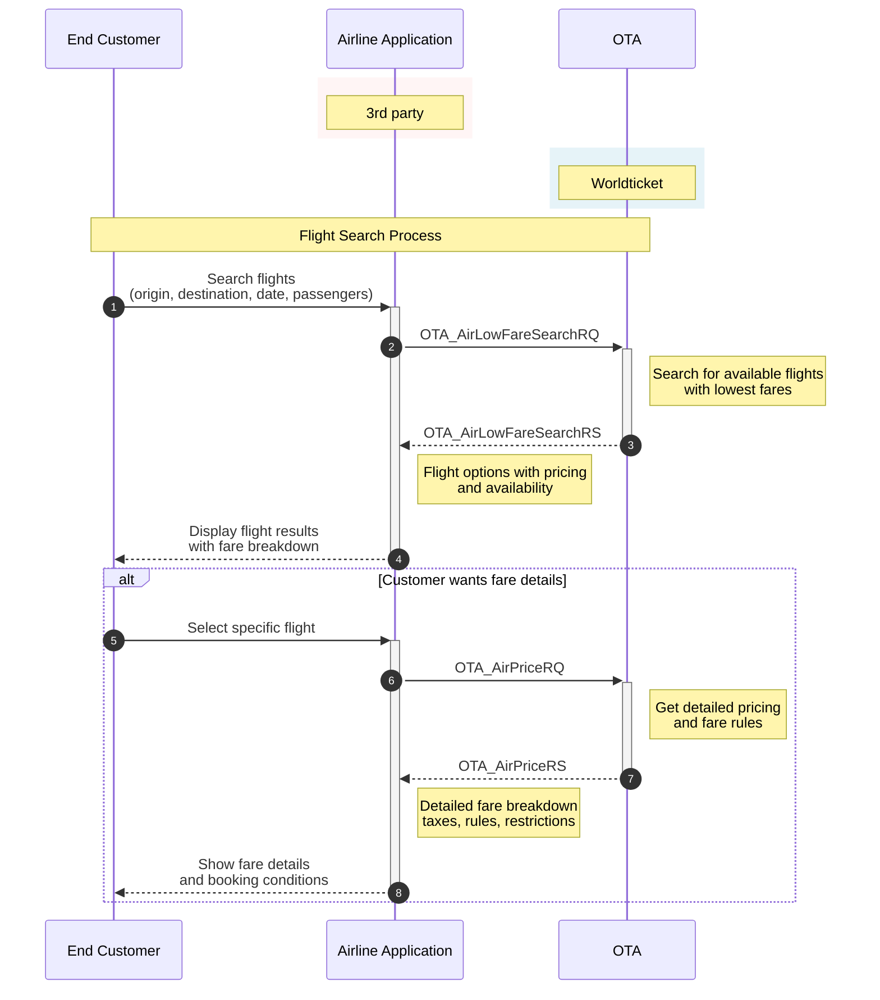

# Low Fare Search (AirLowFareSearchRQ)

The purpose is to list all the fares and display them to the user. AirLowFareSearch is used to get flight availability with the lowest fare options for the whole journey, or separately per direction (outbound or inbound).

## Table of Contents

- [Low Fare Search (AirLowFareSearchRQ)](#low-fare-search-airlowfaresearchrq)
  - [Table of Contents](#table-of-contents)
  - [Endpoint](#endpoint)
  - [Flight Search Workflow](#flight-search-workflow)
  - [Basic Request Format](#basic-request-format)
    - [With JWT Authentication](#with-jwt-authentication)
    - [With API Key Authentication](#with-api-key-authentication)
    - [HTTP Headers](#http-headers)
  - [AirLowFareSearchRQ for One-way Trip](#airlowfaresearchrq-for-one-way-trip)
  - [AirLowFareSearchRQ for Round Trip](#airlowfaresearchrq-for-round-trip)
  - [AirLowFareSearchRQ for Round Trip with Fare Restriction](#airlowfaresearchrq-for-round-trip-with-fare-restriction)
  - [Response Structure](#response-structure)
    - [JSON Response](#json-response)

## Endpoint

- Method: `POST`
- Path: `/ota/v2015b/OTA_AirLowFareSearchRQ`
- Full URL: `{base_url}/ota/v2015b/OTA_AirLowFareSearchRQ` (choose base URL per environment above)

## Flight Search Workflow



## Basic Request Format

### With JWT Authentication
```bash
curl -X POST \
    https://test-api.worldticket.net/ota/v2015b/OTA_AirLowFareSearchRQ \
    -H 'Authorization: Bearer {access_token}' \
    -H 'Content-Type: application/json' \
    -d @AirLowFareSearchRQ.json
```

### With API Key Authentication
```bash
curl -X POST \
    https://test-api.worldticket.net/ota/v2015b/OTA_AirLowFareSearchRQ \
    -H 'X-API-Key: {api_key}' \
    -H 'Content-Type: application/json' \
    -d @AirLowFareSearchRQ.json
```

### HTTP Headers

| Header | Description | Example |
|--------|-------------|---------|
| Authorization | Bearer token for JWT authentication | Bearer {access_token} |
| X-API-Key | API key for key-based authentication | {api_key} |
| X-Realm | Airline realm identifier | {tenant-name} |

**Note:** Use either `Authorization` (for JWT) OR `X-API-Key` (for API key authentication), not both.


## AirLowFareSearchRQ for One-way Trip

<details>
<summary><strong>📋 Request Template</strong></summary>
<div markdown="1">

```json
{
  "target": "Production",
  "version": "2.001",
  "pos": {
    "source": [
      {
        "isocurrency": "USD"
      }
    ]
  },
  "processingInfo": {
    "displayOrder": "BY_PRICE_LOW_TO_HIGH",
    "availabilityIndicator": true
  },
  "originDestinationInformation": [
    {
      "originLocation": {
        "locationCode": "{origin_code}"
      },
      "destinationLocation": {
        "locationCode": "{destination_code}"
      },
      "departureDateTime": {
        "value": "{departure_date}",
        "windowBefore": "P0D",
        "windowAfter": "P0D"
      }
    }
  ],
  "travelerInfoSummary": {
    "airTravelerAvail": [
      {
        "passengerTypeQuantity": [
          {
            "code": "ADT",
            "quantity": "{adult_count}"
          },
          {
            "code": "CHD",
            "quantity": "{child_count}"
          },
          {
            "code": "INF",
            "quantity": "{infant_count}"
          }
        ]
      }
    ]
  }
}
```

</div>

</details>

<details>
<summary><strong>✅ Example</strong></summary>
<div markdown="1">

```json
{
  "target": "Production",
  "version": "2.001",
  "pos": {
    "source": [
      {
        "isocurrency": "USD"
      }
    ]
  },
  "processingInfo": {
    "displayOrder": "BY_PRICE_LOW_TO_HIGH",
    "availabilityIndicator": true
  },
  "originDestinationInformation": [
    {
      "originLocation": {
        "locationCode": "KRP"
      },
      "destinationLocation": {
        "locationCode": "CPH"
      },
      "departureDateTime": {
        "value": "2025-12-19",
        "windowBefore": "P0D",
        "windowAfter": "P0D"
      }
    }
  ],
  "travelerInfoSummary": {
    "airTravelerAvail": [
      {
        "passengerTypeQuantity": [
          {
            "code": "ADT",
            "quantity": "1"
          },
          {
            "code": "CHD",
            "quantity": "1"
          },
          {
            "code": "INF",
            "quantity": "0"
          }
        ]
      }
    ]
  }
}
```

</div>

</details>

## AirLowFareSearchRQ for Round Trip

<details>
<summary><strong>📋 Request Template</strong></summary>
<div markdown="1">

```json
{
  "target": "Production",
  "version": "2.001",
  "pos": {
    "source": [
      {
        "isocurrency": "USD"
      }
    ]
  },
  "processingInfo": {
    "displayOrder": "BY_PRICE_LOW_TO_HIGH",
    "availabilityIndicator": true
  },
  "originDestinationInformation": [
    {
      "originLocation": {
        "locationCode": "{origin_code}"
      },
      "destinationLocation": {
        "locationCode": "{destination_code}"
      },
      "departureDateTime": {
        "value": "{outbound_date}",
        "windowBefore": "P0D",
        "windowAfter": "P0D"
      }
    },
    {
      "originLocation": {
        "locationCode": "{destination_code}"
      },
      "destinationLocation": {
        "locationCode": "{origin_code}"
      },
      "departureDateTime": {
        "value": "{inbound_date}",
        "windowBefore": "P0D",
        "windowAfter": "P0D"
      }
    }
  ],
  "travelerInfoSummary": {
    "airTravelerAvail": [
      {
        "passengerTypeQuantity": [
          {
            "code": "ADT",
            "quantity": "{adult_count}"
          },
          {
            "code": "CHD",
            "quantity": "{child_count}"
          },
          {
            "code": "INF",
            "quantity": "{infant_count}"
          }
        ]
      }
    ]
  }
}
```

</div>

</details>

<details>
<summary><strong>✅ Example</strong></summary>
<div markdown="1">

```json
{
  "target": "Production",
  "version": "2.001",
  "pos": {
    "source": [
      {
        "isocurrency": "USD"
      }
    ]
  },
  "processingInfo": {
    "displayOrder": "BY_PRICE_LOW_TO_HIGH",
    "availabilityIndicator": true
  },
  "originDestinationInformation": [
    {
      "originLocation": {
        "locationCode": "AAC"
      },
      "destinationLocation": {
        "locationCode": "AAL"
      },
      "departureDateTime": {
        "value": "2025-12-16",
        "windowBefore": "P0D",
        "windowAfter": "P0D"
      }
    },
    {
      "originLocation": {
        "locationCode": "AAL"
      },
      "destinationLocation": {
        "locationCode": "AAC"
      },
      "departureDateTime": {
        "value": "2025-12-17",
        "windowBefore": "P0D",
        "windowAfter": "P0D"
      }
    }
  ],
  "travelerInfoSummary": {
    "airTravelerAvail": [
      {
        "passengerTypeQuantity": [
          {
            "code": "ADT",
            "quantity": "1"
          },
          {
            "code": "CHD",
            "quantity": "1"
          },
          {
            "code": "INF",
            "quantity": "0"
          }
        ]
      }
    ]
  }
}
```

</div>

</details>

## AirLowFareSearchRQ for Round Trip with Fare Restriction

To receive outbound and inbound fares separately, specify FareRestriction `OUT` or `IN` in the travelPreferences section before TravelerInfoSummary element.

<details>
<summary><strong>✅ Outbound Fare Restriction (OUT)</strong></summary>
<div markdown="1">

```json
{
  "target": "Production",
  "version": "2.001",
  "pos": {
    "source": [
      {
        "isocurrency": "USD"
      }
    ]
  },
  "processingInfo": {
    "displayOrder": "BY_PRICE_LOW_TO_HIGH",
    "availabilityIndicator": true
  },
  "originDestinationInformation": [
    {
      "originLocation": {
        "locationCode": "AAC"
      },
      "destinationLocation": {
        "locationCode": "AAL"
      },
      "departureDateTime": {
        "value": "2025-12-16",
        "windowBefore": "P0D",
        "windowAfter": "P0D"
      }
    },
    {
      "originLocation": {
        "locationCode": "AAL"
      },
      "destinationLocation": {
        "locationCode": "AAC"
      },
      "departureDateTime": {
        "value": "2025-12-17",
        "windowBefore": "P0D",
        "windowAfter": "P0D"
      }
    }
  ],
  "travelPreferences": [
    {
      "fareRestrictPref": {
        "fareRestriction": "OUT"
      }
    }
  ],
  "travelerInfoSummary": {
    "airTravelerAvail": [
      {
        "passengerTypeQuantity": [
          {
            "code": "ADT",
            "quantity": "1"
          },
          {
            "code": "CHD",
            "quantity": "1"
          },
          {
            "code": "INF",
            "quantity": "0"
          }
        ]
      }
    ]
  }
}
```

</div>

</details>

<details>
<summary><strong>✅ Inbound Fare Restriction (IN)</strong></summary>
<div markdown="1">

```json
{
  "target": "Production",
  "version": "2.001",
  "pos": {
    "source": [
      {
        "isocurrency": "USD"
      }
    ]
  },
  "processingInfo": {
    "displayOrder": "BY_PRICE_LOW_TO_HIGH",
    "availabilityIndicator": true
  },
  "originDestinationInformation": [
    {
      "originLocation": {
        "locationCode": "AAC"
      },
      "destinationLocation": {
        "locationCode": "AAL"
      },
      "departureDateTime": {
        "value": "2025-12-16",
        "windowBefore": "P0D",
        "windowAfter": "P0D"
      }
    },
    {
      "originLocation": {
        "locationCode": "AAL"
      },
      "destinationLocation": {
        "locationCode": "AAC"
      },
      "departureDateTime": {
        "value": "2025-12-17",
        "windowBefore": "P0D",
        "windowAfter": "P0D"
      }
    }
  ],
  "travelPreferences": [
    {
      "fareRestrictPref": {
        "fareRestriction": "IN"
      }
    }
  ],
  "travelerInfoSummary": {
    "airTravelerAvail": [
      {
        "passengerTypeQuantity": [
          {
            "code": "ADT",
            "quantity": "1"
          },
          {
            "code": "CHD",
            "quantity": "1"
          },
          {
            "code": "INF",
            "quantity": "0"
          }
        ]
      }
    ]
  }
}
```

</div>

</details>

## Response Structure

### JSON Response

```json
{
  "success": {},
  "pricedItineraries": {
    "pricedItinerary": [
      {
        "airItinerary": {
          "originDestinationOptions": {
            "originDestinationOption": [
              {
                "flightSegment": [
                  {
                    "departureAirport": {
                      "locationCode": "AAC"
                    },
                    "arrivalAirport": {
                      "locationCode": "AAL"
                    },
                    "operatingAirline": {
                      "value": "",
                      "code": "DX",
                      "flightNumber": "7878"
                    },
                    "equipment": [],
                    "departureDateTime": "2025-12-16T10:00:00.000+02:00",
                    "arrivalDateTime": "2025-12-16T12:00:00.000+01:00",
                    "stopQuantity": 0,
                    "rph": "1",
                    "marketingAirline": {
                      "value": "",
                      "code": "DX"
                    },
                    "flightNumber": "7878",
                    "resBookDesigCode": "Y",
                    "bookingClassAvails": [
                      {
                        "bookingClassAvail": [
                          {
                            "resBookDesigCode": "Y",
                            "resBookDesigQuantity": "42"
                          }
                        ],
                        "cabinType": "ECONOMY"
                      }
                    ],
                    "comment": [],
                    "stopLocation": [],
                    "status": "34",
                    "tpaextensions": {
                      "airEquipType": "AT4"
                    }
                  }
                ]
              },
              {
                "flightSegment": [
                  {
                    "departureAirport": {
                      "locationCode": "AAL"
                    },
                    "arrivalAirport": {
                      "locationCode": "AAC"
                    },
                    "operatingAirline": {
                      "value": "",
                      "code": "DX",
                      "flightNumber": "7879"
                    },
                    "equipment": [],
                    "departureDateTime": "2025-12-17T12:30:00.000+01:00",
                    "arrivalDateTime": "2025-12-17T14:30:00.000+02:00",
                    "stopQuantity": 0,
                    "rph": "2",
                    "marketingAirline": {
                      "value": "",
                      "code": "DX"
                    },
                    "flightNumber": "7879",
                    "resBookDesigCode": "Y",
                    "bookingClassAvails": [
                      {
                        "bookingClassAvail": [
                          {
                            "resBookDesigCode": "Y",
                            "resBookDesigQuantity": "40"
                          }
                        ],
                        "cabinType": "ECONOMY"
                      }
                    ],
                    "comment": [],
                    "stopLocation": [],
                    "status": "34",
                    "tpaextensions": {
                      "airEquipType": "AT4"
                    }
                  }
                ]
              }
            ]
          }
        },
        "airItineraryPricingInfo": {
          "itinTotalFare": [
            {
              "baseFare": {
                "currencyCode": "USD",
                "amount": 119.27
              },
              "equivFare": [],
              "taxes": {
                "tax": [
                  {
                    "value": "",
                    "taxCode": "ZO",
                    "taxName": "tax",
                    "currencyCode": "USD",
                    "amount": 14.05
                  }
                ]
              },
              "totalFare": {
                "currencyCode": "USD",
                "amount": 133.32
              },
              "fareBaggageAllowance": [],
              "remark": []
            }
          ],
          "fareInfos": {
            "fareInfo": [
              {
                "fareReference": [
                  {
                    "value": "YECOM"
                  }
                ],
                "filingAirline": {
                  "value": "DX"
                },
                "marketingAirline": [],
                "departureAirport": {
                  "value": "",
                  "locationCode": "AAC"
                },
                "arrivalAirport": {
                  "value": "",
                  "locationCode": "AAL"
                },
                "date": [],
                "fareInfo": [],
                "city": [],
                "airport": [],
                "tpaextensions": {
                  "priceGroup": "Economy"
                }
              },
              {
                "fareReference": [
                  {
                    "value": "YECOM"
                  }
                ],
                "filingAirline": {
                  "value": "DX"
                },
                "marketingAirline": [],
                "departureAirport": {
                  "value": "",
                  "locationCode": "AAL"
                },
                "arrivalAirport": {
                  "value": "",
                  "locationCode": "AAC"
                },
                "date": [],
                "fareInfo": [],
                "city": [],
                "airport": [],
                "tpaextensions": {
                  "priceGroup": "Economy"
                }
              }
            ]
          },
          "ptcfareBreakdowns": {
            "ptcfareBreakdown": [
              {
                "passengerTypeQuantity": {
                  "code": "ADT",
                  "quantity": 1
                },
                "fareBasisCodes": {
                  "fareBasisCode": [
                    {
                      "value": "YECOM"
                    }
                  ]
                },
                "passengerFare": [
                  {
                    "baseFare": {
                      "currencyCode": "USD",
                      "decimalPlaces": 2,
                      "amount": 33.33
                    },
                    "equivFare": [],
                    "totalFare": {
                      "currencyCode": "USD",
                      "decimalPlaces": 2,
                      "amount": 33.33
                    },
                    "fareBaggageAllowance": [],
                    "remark": []
                  }
                ],
                "travelerRefNumber": [
                  {
                    "rph": "1"
                  }
                ],
                "ticketDesignators": {
                  "ticketDesignator": [
                    {
                      "flightRefRPH": "1"
                    }
                  ]
                },
                "fareInfo": [],
                "pricingUnit": [],
                "flightRefNumberRPHList": [
                  "1"
                ]
              },
              {
                "passengerTypeQuantity": {
                  "code": "ADT",
                  "quantity": 1
                },
                "fareBasisCodes": {
                  "fareBasisCode": [
                    {
                      "value": "YECOM"
                    }
                  ]
                },
                "passengerFare": [
                  {
                    "baseFare": {
                      "currencyCode": "USD",
                      "decimalPlaces": 2,
                      "amount": 33.33
                    },
                    "equivFare": [],
                    "totalFare": {
                      "currencyCode": "USD",
                      "decimalPlaces": 2,
                      "amount": 33.33
                    },
                    "fareBaggageAllowance": [],
                    "remark": []
                  }
                ],
                "travelerRefNumber": [
                  {
                    "rph": "1"
                  }
                ],
                "ticketDesignators": {
                  "ticketDesignator": [
                    {
                      "flightRefRPH": "2"
                    }
                  ]
                },
                "fareInfo": [],
                "pricingUnit": [],
                "flightRefNumberRPHList": [
                  "2"
                ]
              },
              {
                "passengerTypeQuantity": {
                  "code": "CHD",
                  "quantity": 1
                },
                "fareBasisCodes": {
                  "fareBasisCode": [
                    {
                      "value": "YECOM"
                    }
                  ]
                },
                "passengerFare": [
                  {
                    "baseFare": {
                      "currencyCode": "USD",
                      "decimalPlaces": 2,
                      "amount": 33.33
                    },
                    "equivFare": [],
                    "totalFare": {
                      "currencyCode": "USD",
                      "decimalPlaces": 2,
                      "amount": 33.33
                    },
                    "fareBaggageAllowance": [],
                    "remark": []
                  }
                ],
                "travelerRefNumber": [
                  {
                    "rph": "2"
                  }
                ],
                "ticketDesignators": {
                  "ticketDesignator": [
                    {
                      "flightRefRPH": "1"
                    }
                  ]
                },
                "fareInfo": [],
                "pricingUnit": [],
                "flightRefNumberRPHList": [
                  "1"
                ]
              },
              {
                "passengerTypeQuantity": {
                  "code": "CHD",
                  "quantity": 1
                },
                "fareBasisCodes": {
                  "fareBasisCode": [
                    {
                      "value": "YECOM"
                    }
                  ]
                },
                "passengerFare": [
                  {
                    "baseFare": {
                      "currencyCode": "USD",
                      "decimalPlaces": 2,
                      "amount": 19.28
                    },
                    "equivFare": [],
                    "taxes": {
                      "tax": [
                        {
                          "value": "",
                          "taxCode": "ZO",
                          "currencyCode": "USD",
                          "decimalPlaces": 2,
                          "amount": 14.05
                        }
                      ]
                    },
                    "totalFare": {
                      "currencyCode": "USD",
                      "decimalPlaces": 2,
                      "amount": 33.33
                    },
                    "fareBaggageAllowance": [],
                    "remark": []
                  }
                ],
                "travelerRefNumber": [
                  {
                    "rph": "2"
                  }
                ],
                "ticketDesignators": {
                  "ticketDesignator": [
                    {
                      "flightRefRPH": "2"
                    }
                  ]
                },
                "fareInfo": [],
                "pricingUnit": [],
                "flightRefNumberRPHList": [
                  "2"
                ]
              }
            ]
          }
        },
        "notes": [],
        "sequenceNumber": 1
      }
    ]
  },
  "timeStamp": "2025-11-19T07:41:38.207Z",
  "target": "Production",
  "version": 2.001,
  "retransmissionIndicator": false
}
```
