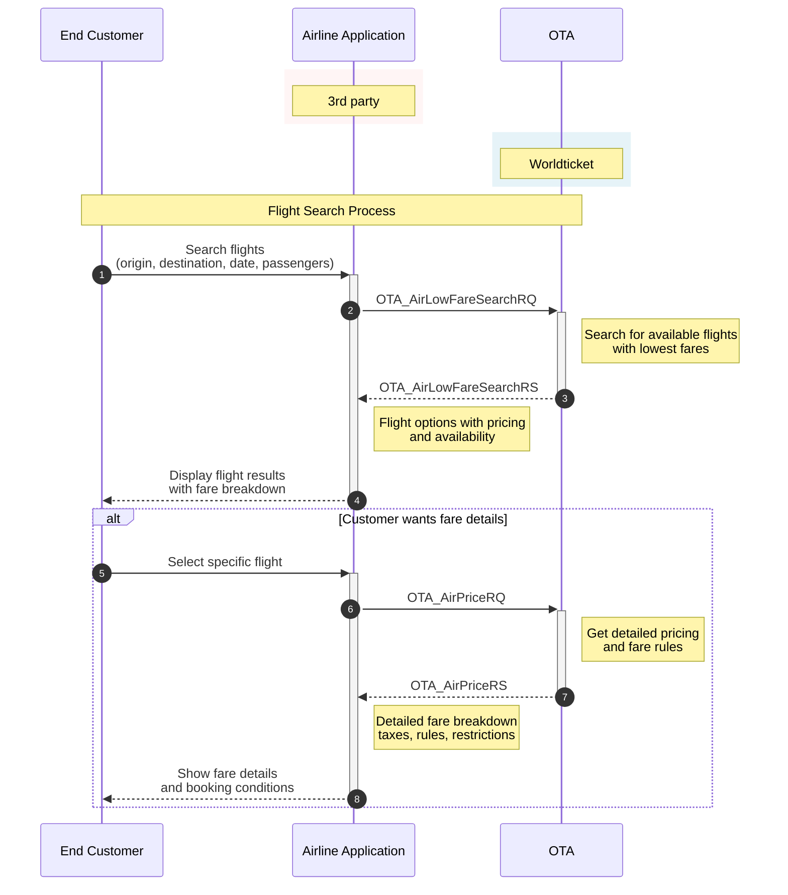

# Low Fare Search (AirLowFareSearchRQ)

The purpose is to list all the fares and display them to the user. AirLowFareSearch is used to get flight availability with the lowest fare options for the whole journey, or separately per direction (outbound or inbound).

## Table of Contents

- [Low Fare Search (AirLowFareSearchRQ)](#low-fare-search-airlowfaresearchrq)
  - [Table of Contents](#table-of-contents)
  - [Endpoint](#endpoint)
  - [Flight Search Workflow](#flight-search-workflow)
  - [Basic Request Format](#basic-request-format)
    - [With JWT Authentication](#with-jwt-authentication)
    - [With API Key Authentication](#with-api-key-authentication)
    - [HTTP Headers](#http-headers)
  - [AirLowFareSearchRQ for One-way Trip](#airlowfaresearchrq-for-one-way-trip)
  - [AirLowFareSearchRQ for Round Trip](#airlowfaresearchrq-for-round-trip)
  - [AirLowFareSearchRQ for Round Trip with Fare Restriction](#airlowfaresearchrq-for-round-trip-with-fare-restriction)
  - [Response Structure](#response-structure)
    - [JSON Response](#json-response)

## Endpoint

- Method: `POST`
- Path: `/ota/v2015b/OTA_AirLowFareSearchRQ`
- Full URL: `{base_url}/ota/v2015b/OTA_AirLowFareSearchRQ` (choose base URL per environment above)

## Flight Search Workflow



## Basic Request Format

### With JWT Authentication
```bash
curl -X POST \
    https://test-api.worldticket.net/ota/v2015b/OTA_AirLowFareSearchRQ \
    -H 'Authorization: Bearer {access_token}' \
    -H 'Content-Type: application/json' \
    -d @AirLowFareSearchRQ.json
```

### With API Key Authentication
```bash
curl -X POST \
    https://test-api.worldticket.net/ota/v2015b/OTA_AirLowFareSearchRQ \
    -H 'X-API-Key: {api_key}' \
    -H 'Content-Type: application/json' \
    -d @AirLowFareSearchRQ.json
```

### HTTP Headers

| Header | Description | Example |
|--------|-------------|---------|
| Authorization | Bearer token for JWT authentication | Bearer {access_token} |
| X-API-Key | API key for key-based authentication | {api_key} |
| X-Realm | Airline realm identifier | {tenant-name} |

**Note:** Use either `Authorization` (for JWT) OR `X-API-Key` (for API key authentication), not both.


## AirLowFareSearchRQ for One-way Trip

<details>
<summary><strong>📋 Request Template</strong></summary>
<div markdown="1">

```json
{
  "target": "Production",
  "version": "2.001",
  "pos": {
    "source": [
      {
        "isocurrency": "USD"
      }
    ]
  },
  "processingInfo": {
    "displayOrder": "BY_PRICE_LOW_TO_HIGH",
    "availabilityIndicator": true
  },
  "originDestinationInformation": [
    {
      "originLocation": {
        "locationCode": "{origin_code}"
      },
      "destinationLocation": {
        "locationCode": "{destination_code}"
      },
      "departureDateTime": {
        "value": "{departure_date}",
        "windowBefore": "P0D",
        "windowAfter": "P0D"
      }
    }
  ],
  "travelerInfoSummary": {
    "airTravelerAvail": [
      {
        "passengerTypeQuantity": [
          {
            "code": "ADT",
            "quantity": "{adult_count}"
          },
          {
            "code": "CHD",
            "quantity": "{child_count}"
          },
          {
            "code": "INF",
            "quantity": "{infant_count}"
          }
        ]
      }
    ]
  }
}
```

</div>

</details>

<details>
<summary><strong>✅ Example</strong></summary>
<div markdown="1">

```json
{
  "target": "Production",
  "version": "2.001",
  "pos": {
    "source": [
      {
        "isocurrency": "USD"
      }
    ]
  },
  "processingInfo": {
    "displayOrder": "BY_PRICE_LOW_TO_HIGH",
    "availabilityIndicator": true
  },
  "originDestinationInformation": [
    {
      "originLocation": {
        "locationCode": "JED"
      },
      "destinationLocation": {
        "locationCode": "XMK"
      },
      "departureDateTime": {
        "value": "2024-12-25",
        "windowBefore": "P0D",
        "windowAfter": "P0D"
      }
    }
  ],
  "travelerInfoSummary": {
    "airTravelerAvail": [
      {
        "passengerTypeQuantity": [
          {
            "code": "ADT",
            "quantity": 2
          },
          {
            "code": "CHD",
            "quantity": 1
          },
          {
            "code": "INF",
            "quantity": 0
          }
        ]
      }
    ]
  }
}
```

</div>

</details>

## AirLowFareSearchRQ for Round Trip

<details>
<summary><strong>📋 Request Template</strong></summary>
<div markdown="1">

```json
{
  "target": "Production",
  "version": "2.001",
  "pos": {
    "source": [
      {
        "isocurrency": "USD"
      }
    ]
  },
  "processingInfo": {
    "displayOrder": "BY_PRICE_LOW_TO_HIGH",
    "availabilityIndicator": true
  },
  "originDestinationInformation": [
    {
      "originLocation": {
        "locationCode": "{origin_code}"
      },
      "destinationLocation": {
        "locationCode": "{destination_code}"
      },
      "departureDateTime": {
        "value": "{outbound_date}",
        "windowBefore": "P0D",
        "windowAfter": "P0D"
      }
    },
    {
      "originLocation": {
        "locationCode": "{destination_code}"
      },
      "destinationLocation": {
        "locationCode": "{origin_code}"
      },
      "departureDateTime": {
        "value": "{inbound_date}",
        "windowBefore": "P0D",
        "windowAfter": "P0D"
      }
    }
  ],
  "travelerInfoSummary": {
    "airTravelerAvail": [
      {
        "passengerTypeQuantity": [
          {
            "code": "ADT",
            "quantity": "{adult_count}"
          },
          {
            "code": "CHD",
            "quantity": "{child_count}"
          },
          {
            "code": "INF",
            "quantity": "{infant_count}"
          }
        ]
      }
    ]
  }
}
```

</div>

</details>

<details>
<summary><strong>✅ Example</strong></summary>
<div markdown="1">

```json
{
  "target": "Production",
  "version": "2.001",
  "pos": {
    "source": [
      {
        "isocurrency": "USD"
      }
    ]
  },
  "processingInfo": {
    "displayOrder": "BY_PRICE_LOW_TO_HIGH",
    "availabilityIndicator": true
  },
  "originDestinationInformation": [
    {
      "originLocation": {
        "locationCode": "JED"
      },
      "destinationLocation": {
        "locationCode": "XMK"
      },
      "departureDateTime": {
        "value": "2024-12-25",
        "windowBefore": "P0D",
        "windowAfter": "P0D"
      }
    },
    {
      "originLocation": {
        "locationCode": "XMK"
      },
      "destinationLocation": {
        "locationCode": "JED"
      },
      "departureDateTime": {
        "value": "2025-01-02",
        "windowBefore": "P0D",
        "windowAfter": "P0D"
      }
    }
  ],
  "travelerInfoSummary": {
    "airTravelerAvail": [
      {
        "passengerTypeQuantity": [
          {
            "code": "ADT",
            "quantity": 2
          },
          {
            "code": "CHD",
            "quantity": 1
          },
          {
            "code": "INF",
            "quantity": 0
          }
        ]
      }
    ]
  }
}
```

</div>

</details>

## AirLowFareSearchRQ for Round Trip with Fare Restriction

To receive outbound and inbound fares separately, specify FareRestriction `OUT` or `IN` in the travelPreferences section before TravelerInfoSummary element.

<details>
<summary><strong>✅ Outbound Fare Restriction (OUT)</strong></summary>
<div markdown="1">

```json
{
  "target": "Production",
  "version": "2.001",
  "pos": {
    "source": [
      {
        "isocurrency": "USD"
      }
    ]
  },
  "processingInfo": {
    "displayOrder": "BY_PRICE_LOW_TO_HIGH",
    "availabilityIndicator": true
  },
  "originDestinationInformation": [
    {
      "originLocation": {
        "locationCode": "JED"
      },
      "destinationLocation": {
        "locationCode": "XMK"
      },
      "departureDateTime": {
        "value": "2024-12-25",
        "windowBefore": "P0D",
        "windowAfter": "P0D"
      }
    },
    {
      "originLocation": {
        "locationCode": "XMK"
      },
      "destinationLocation": {
        "locationCode": "JED"
      },
      "departureDateTime": {
        "value": "2025-01-02",
        "windowBefore": "P0D",
        "windowAfter": "P0D"
      }
    }
  ],
  "travelPreferences": [
    {
      "fareRestrictPref": {
        "fareRestriction": "OUT"
      }
    }
  ],
  "travelerInfoSummary": {
    "airTravelerAvail": [
      {
        "passengerTypeQuantity": [
          {
            "code": "ADT",
            "quantity": 2
          }
        ]
      }
    ]
  }
}
```

</div>

</details>

<details>
<summary><strong>✅ Inbound Fare Restriction (IN)</strong></summary>
<div markdown="1">

```json
{
  "target": "Production",
  "version": "2.001",
  "pos": {
    "source": [
      {
        "isocurrency": "USD"
      }
    ]
  },
  "processingInfo": {
    "displayOrder": "BY_PRICE_LOW_TO_HIGH",
    "availabilityIndicator": true
  },
  "originDestinationInformation": [
    {
      "originLocation": {
        "locationCode": "JED"
      },
      "destinationLocation": {
        "locationCode": "XMK"
      },
      "departureDateTime": {
        "value": "2024-12-25",
        "windowBefore": "P0D",
        "windowAfter": "P0D"
      }
    },
    {
      "originLocation": {
        "locationCode": "XMK"
      },
      "destinationLocation": {
        "locationCode": "JED"
      },
      "departureDateTime": {
        "value": "2025-01-02",
        "windowBefore": "P0D",
        "windowAfter": "P0D"
      }
    }
  ],
  "travelPreferences": [
    {
      "fareRestrictPref": {
        "fareRestriction": "IN"
      }
    }
  ],
  "travelerInfoSummary": {
    "airTravelerAvail": [
      {
        "passengerTypeQuantity": [
          {
            "code": "ADT",
            "quantity": 2
          }
        ]
      }
    ]
  }
}
```

</div>

</details>

## Response Structure

### JSON Response

```json
{
  "version": "2.001",
  "success": {},
  "pricedItineraries": [
    {
      "sequenceNumber": "1",
      "airItinerary": {
        "originDestinationOptions": {
          "originDestinationOption": [
            {
              "flightSegment": [
                {
                  "departureDateTime": "{departure_datetime}",
                  "arrivalDateTime": "{arrival_datetime}",
                  "flightNumber": "{flight_number}",
                  "resBookDesigCode": "{booking_class}",
                  "departureAirport": {
                    "locationCode": "{origin_code}"
                  },
                  "arrivalAirport": {
                    "locationCode": "{destination_code}"
                  },
                  "marketingAirline": {
                    "code": "{airline_code}"
                  }
                }
              ]
            }
          ]
        }
      },
      "airItineraryPricingInfo": {
        "itinTotalFare": {
          "baseFare": {
            "amount": "{base_fare}",
            "currencyCode": "{currency_code}"
          },
          "taxes": [
            {
              "amount": "{tax_amount}",
              "currencyCode": "{currency_code}"
            }
          ],
          "totalFare": {
            "amount": "{total_fare}",
            "currencyCode": "{currency_code}"
          }
        },
        "ptc_FareBreakdowns": [
          {
            "passengerTypeQuantity": {
              "code": "ADT",
              "quantity": "{adult_count}"
            },
            "fareBasisCodes": [
              "{fare_basis_code}"
            ],
            "passengerFare": {
              "baseFare": {
                "amount": "{passenger_base_fare}",
                "currencyCode": "{currency_code}"
              },
              "taxes": [
                {
                  "amount": "{passenger_tax}",
                  "currencyCode": "{currency_code}"
                }
              ],
              "totalFare": {
                "amount": "{passenger_total_fare}",
                "currencyCode": "{currency_code}"
              }
            }
          }
        ]
      }
    }
  ]
}
```
