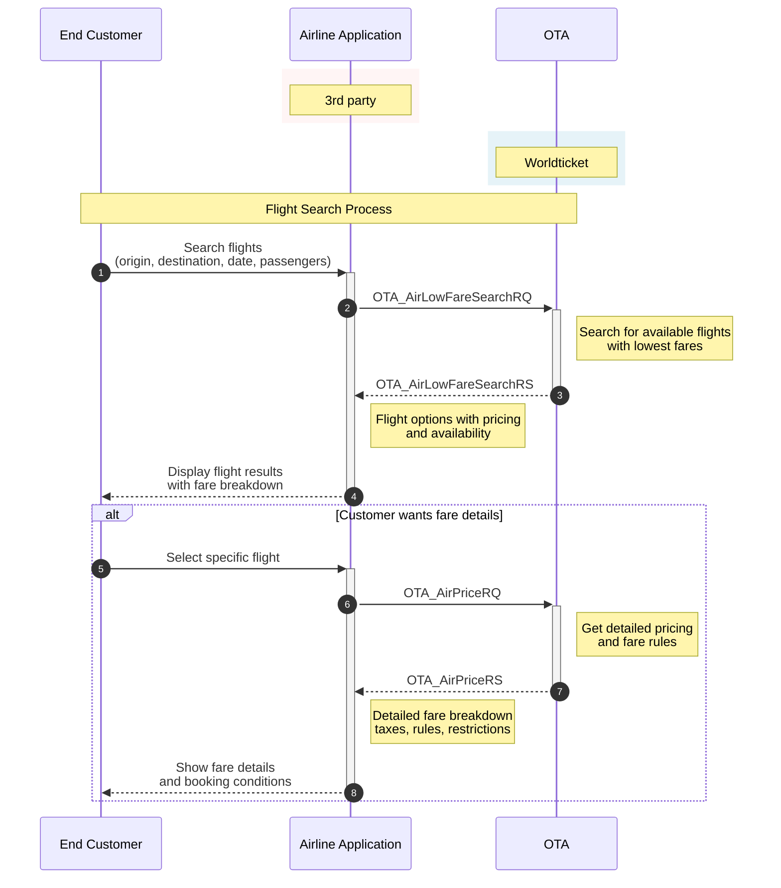

# Low Fare Search (AirLowFareSearchRQ)

The purpose is to list all the fares and display them to the user. AirLowFareSearch is used to get flight availability with the lowest fare options for the whole journey, or separately per direction (outbound or inbound).

## Base URLs

| Environment | URL |
|-------------|-----|
| Production | https://api.worldticket.net/ota/v2015b/AirLowFareSearch |
| Test | https://test-api.worldticket.net/ota/v2015b/AirLowFareSearch |

## HTTP Headers (All Required)

| Header | Description | Example |
|--------|-------------|---------|
| Authorization | Bearer token for JWT authentication | Bearer {access_token} |
| X-API-Key | API key for key-based authentication | {api_key} |
| Content-Type | Request content type | application/json |

**Note:** Use either `Authorization` (for JWT) OR `X-API-Key` (for API key authentication), not both.

## Request Parameters

| Parameter | Location | Required | Description | Example |
|-----------|----------|----------|-------------|---------|
| base_url | Endpoint | Yes | Base URL for the request | https://test-api.worldticket.net/ota/v2015b/AirLowFareSearch |

## Flight Search Workflow



## Basic Request Format

### With JWT Authentication
```bash
curl -X POST \
    https://test-api.worldticket.net/ota/v2015b/AirLowFareSearch \
    -H 'Authorization: Bearer {access_token}' \
    -H 'Content-Type: application/json' \
    -d @AirLowFareSearchRQ.json
```

### With API Key Authentication
```bash
curl -X POST \
    https://test-api.worldticket.net/ota/v2015b/AirLowFareSearch \
    -H 'X-API-Key: {api_key}' \
    -H 'Content-Type: application/json' \
    -d @AirLowFareSearchRQ.json
```

## AirLowFareSearchRQ for One-way Trip

<details open>
<summary><strong>📋 Request Template</strong></summary>
<div markdown="1">

```json
{
  "version": "2.001",
  "pos": {
    "source": [
      {
        "requestorID": {
          "type": "5",
          "id": "{agent_id}",
          "name": "{agency_id}"
        }
      }
    ]
  },
  "originDestinationInformation": [
    {
      "departureDateTime": "{departure_date}",
      "originLocation": {
        "locationCode": "{origin_code}"
      },
      "destinationLocation": {
        "locationCode": "{destination_code}"
      }
    }
  ],
  "travelPreferences": {
    "cabinPref": {
      "cabin": "{cabin_preference}"
    }
  },
  "travelerInfoSummary": {
    "airTravelerAvail": {
      "passengerTypeQuantity": [
        {
          "code": "ADT",
          "quantity": "{adult_count}"
        },
        {
          "code": "CHD",
          "quantity": "{child_count}"
        },
        {
          "code": "INF",
          "quantity": "{infant_count}"
        }
      ]
    }
  }
}
```

</div>

</details>

<details>
<summary><strong>✅ Example</strong></summary>
<div markdown="1">

```json
{
  "version": "2.001",
  "pos": {
    "source": [
      {
        "requestorID": {
          "type": "5",
          "id": "AGENT001",
          "name": "AGENCY123"
        }
      }
    ]
  },
  "originDestinationInformation": [
    {
      "departureDateTime": "2024-12-25T00:00:00",
      "originLocation": {
        "locationCode": "BKK"
      },
      "destinationLocation": {
        "locationCode": "NRT"
      }
    }
  ],
  "travelPreferences": {
    "cabinPref": {
      "cabin": "Y"
    }
  },
  "travelerInfoSummary": {
    "airTravelerAvail": {
      "passengerTypeQuantity": [
        {
          "code": "ADT",
          "quantity": "2"
        },
        {
          "code": "CHD",
          "quantity": "1"
        },
        {
          "code": "INF",
          "quantity": "0"
        }
      ]
    }
  }
}
```

</div>

</details>

## AirLowFareSearchRQ for One-way Trip with Booking Class Preference

To receive outbound and inbound fares separately, specify FareRestriction "OUT" or "IN" before TravelerInfoSummary element.

## AirLowFareSearchRQ for Round Trip

<details open>
<summary><strong>📋 Request Template</strong></summary>
<div markdown="1">

```json
{
  "version": "2.001",
  "pos": {
    "source": [
      {
        "requestorID": {
          "type": "5",
          "id": "{agent_id}",
          "name": "{agency_id}"
        }
      }
    ]
  },
  "originDestinationInformation": [
    {
      "departureDateTime": "{outbound_date}",
      "originLocation": {
        "locationCode": "{origin_code}"
      },
      "destinationLocation": {
        "locationCode": "{destination_code}"
      }
    },
    {
      "departureDateTime": "{inbound_date}",
      "originLocation": {
        "locationCode": "{destination_code}"
      },
      "destinationLocation": {
        "locationCode": "{origin_code}"
      }
    }
  ],
  "travelPreferences": {
    "cabinPref": {
      "cabin": "{cabin_preference}"
    }
  },
  "travelerInfoSummary": {
    "airTravelerAvail": {
      "passengerTypeQuantity": [
        {
          "code": "ADT",
          "quantity": "{adult_count}"
        },
        {
          "code": "CHD",
          "quantity": "{child_count}"
        },
        {
          "code": "INF",
          "quantity": "{infant_count}"
        }
      ]
    }
  }
}
```

</div>

</details>

<details>
<summary><strong>✅ Example</strong></summary>
<div markdown="1">

```json
{
  "version": "2.001",
  "pos": {
    "source": [
      {
        "requestorID": {
          "type": "5",
          "id": "AGENT001",
          "name": "AGENCY123"
        }
      }
    ]
  },
  "originDestinationInformation": [
    {
      "departureDateTime": "2024-12-25T00:00:00",
      "originLocation": {
        "locationCode": "BKK"
      },
      "destinationLocation": {
        "locationCode": "NRT"
      }
    },
    {
      "departureDateTime": "2025-01-02T00:00:00",
      "originLocation": {
        "locationCode": "NRT"
      },
      "destinationLocation": {
        "locationCode": "BKK"
      }
    }
  ],
  "travelPreferences": {
    "cabinPref": {
      "cabin": "Y"
    }
  },
  "travelerInfoSummary": {
    "airTravelerAvail": {
      "passengerTypeQuantity": [
        {
          "code": "ADT",
          "quantity": "2"
        },
        {
          "code": "CHD",
          "quantity": "1"
        },
        {
          "code": "INF",
          "quantity": "0"
        }
      ]
    }
  }
}
```

</div>

</details>

## AirLowFareSearchRQ for Round Trip with Booking Class Preference

```xml
<?xml version="1.0" encoding="UTF-8"?>
<OTA_AirLowFareSearchRQ xmlns="http://www.opentravel.org/OTA/2003/05" Version="2.001">
    <POS>
        <Source>
            <RequestorID Type="5" ID="{agent_id}" ID_Context="{agency_id}"/>
        </Source>
    </POS>
    <OriginDestinationInformation>
        <DepartureDateTime>{outbound_date}</DepartureDateTime>
        <OriginLocation LocationCode="{origin_code}"/>
        <DestinationLocation LocationCode="{destination_code}"/>
    </OriginDestinationInformation>
    <OriginDestinationInformation>
        <DepartureDateTime>{inbound_date}</DepartureDateTime>
        <OriginLocation LocationCode="{destination_code}"/>
        <DestinationLocation LocationCode="{origin_code}"/>
    </OriginDestinationInformation>
    <TravelPreferences>
        <FareRestrictPref FareRestriction="OUT"/>
        <CabinPref Cabin="{cabin_preference}"/>
    </TravelPreferences>
    <TravelerInfoSummary>
        <AirTravelerAvail>
            <PassengerTypeQuantity Code="ADT" Quantity="{adult_count}"/>
        </AirTravelerAvail>
    </TravelerInfoSummary>
</OTA_AirLowFareSearchRQ>
```

## Response Structure

### JSON Response

```json
{
  "version": "2.001",
  "success": {},
  "pricedItineraries": [
    {
      "sequenceNumber": "1",
      "airItinerary": {
        "originDestinationOptions": [
          {
            "flightSegments": [
              {
                "departureDateTime": "{departure_datetime}",
                "arrivalDateTime": "{arrival_datetime}",
                "flightNumber": "{flight_number}",
                "resBookDesigCode": "{booking_class}",
                "departureAirport": {
                  "locationCode": "{origin_code}"
                },
                "arrivalAirport": {
                  "locationCode": "{destination_code}"
                },
                "marketingAirline": {
                  "code": "{airline_code}"
                }
              }
            ]
          }
        ]
      },
      "airItineraryPricingInfo": {
        "itinTotalFare": {
          "baseFare": {
            "amount": "{base_fare}",
            "currencyCode": "{currency_code}"
          },
          "taxes": [
            {
              "amount": "{tax_amount}",
              "currencyCode": "{currency_code}"
            }
          ],
          "totalFare": {
            "amount": "{total_fare}",
            "currencyCode": "{currency_code}"
          }
        },
        "ptc_FareBreakdowns": [
          {
            "passengerTypeQuantity": {
              "code": "ADT",
              "quantity": "{adult_count}"
            },
            "fareBasisCodes": [
              "{fare_basis_code}"
            ],
            "passengerFare": {
              "baseFare": {
                "amount": "{passenger_base_fare}",
                "currencyCode": "{currency_code}"
              },
              "taxes": [
                {
                  "amount": "{passenger_tax}",
                  "currencyCode": "{currency_code}"
                }
              ],
              "totalFare": {
                "amount": "{passenger_total_fare}",
                "currencyCode": "{currency_code}"
              }
            }
          }
        ]
      }
    }
  ]
}
```

## Discount Functionality

LowFareSearch supports discount functionality. When a discount is applied, the response will include both discounted amount and original fare amount.

<details open>
<summary><strong>📋 Request Template</strong></summary>
<div markdown="1">

```json
{
  "version": "2.001",
  "pos": {
    "source": [
      {
        "requestorID": {
          "type": "5",
          "id": "{agent_id}",
          "name": "{agency_id}"
        }
      }
    ]
  },
  "originDestinationInformation": [
    {
      "departureDateTime": "{departure_date}",
      "originLocation": {
        "locationCode": "{origin_code}"
      },
      "destinationLocation": {
        "locationCode": "{destination_code}"
      }
    }
  ],
  "travelPreferences": {
    "cabinPref": {
      "cabin": "{cabin_preference}"
    }
  },
  "travelerInfoSummary": {
    "airTravelerAvail": {
      "passengerTypeQuantity": [
        {
          "code": "ADT",
          "quantity": "{adult_count}"
        }
      ]
    },
    "priceRequestInformation": {
      "tpaExtensions": {
        "discountPricing": {
          "discountCode": "{discount_code}",
          "discountPercent": "{discount_percent}"
        }
      }
    }
  }
}
```

</div>

</details>

<details>
<summary><strong>✅ Example</strong></summary>
<div markdown="1">

```json
{
  "version": "2.001",
  "pos": {
    "source": [
      {
        "requestorID": {
          "type": "5",
          "id": "AGENT001",
          "name": "AGENCY123"
        }
      }
    ]
  },
  "originDestinationInformation": [
    {
      "departureDateTime": "2024-12-25T00:00:00",
      "originLocation": {
        "locationCode": "BKK"
      },
      "destinationLocation": {
        "locationCode": "NRT"
      }
    }
  ],
  "travelPreferences": {
    "cabinPref": {
      "cabin": "Y"
    }
  },
  "travelerInfoSummary": {
    "airTravelerAvail": {
      "passengerTypeQuantity": [
        {
          "code": "ADT",
          "quantity": "1"
        }
      ]
    },
    "priceRequestInformation": {
      "tpaExtensions": {
        "discountPricing": {
          "discountCode": "SAVE10",
          "discountPercent": "10"
        }
      }
    }
  }
}
```

</div>

</details>

### Response with Discount (XML)

```xml
<PricedItinerary SequenceNumber="1">
    <AirItineraryPricingInfo>
        <ItinTotalFare>
            <BaseFare Amount="{discounted_base_fare}" CurrencyCode="{currency_code}"/>
            <TotalFare Amount="{discounted_total_fare}" CurrencyCode="{currency_code}"/>
        </ItinTotalFare>
        <ItinTotalFareOriginal>
            <BaseFare Amount="{original_base_fare}" CurrencyCode="{currency_code}"/>
            <TotalFare Amount="{original_total_fare}" CurrencyCode="{currency_code}"/>
        </ItinTotalFareOriginal>
    </AirItineraryPricingInfo>
</PricedItinerary>
```

## Low Fare Search Error Messages

### No Flights Available

```xml
<OTA_AirLowFareSearchRS>
    <Errors>
        <Error Code="NO_FLIGHTS" ShortText="No flights available">
            No flights available for the requested criteria.
        </Error>
    </Errors>
</OTA_AirLowFareSearchRS>
```

### Invalid Date Range

```json
{
  "errors": [
    {
      "code": "INVALID_DATE",
      "message": "Departure date must be in the future",
      "field": "departureDateTime"
    }
  ]
}
```

### Sold Out Segments

When flights are sold out, they may still appear in search results with appropriate indicators:

```xml
<FlightSegment DepartureDateTime="{departure_datetime}" 
               ArrivalDateTime="{arrival_datetime}"
               FlightNumber="{flight_number}"
               ResBookDesigCode="{booking_class}"
               Status="SoldOut">
    <DepartureAirport LocationCode="{origin_code}"/>
    <ArrivalAirport LocationCode="{destination_code}"/>
    <MarketingAirline Code="{airline_code}"/>
    <TPA_Extensions>
        <SoldOutIndicator>true</SoldOutIndicator>
    </TPA_Extensions>
</FlightSegment>
```
