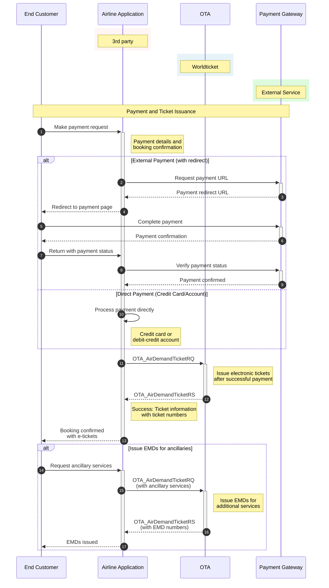
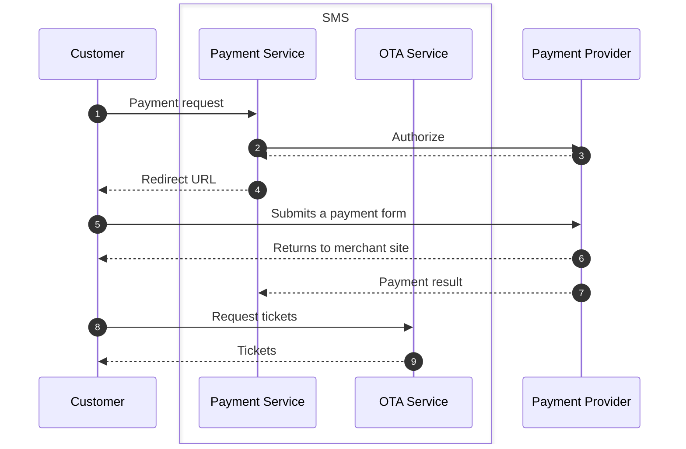

# Payment and Ticketing

The purpose is to make a payment for existing booking and issue tickets.

## Base URLs

| Environment | URL |
|-------------|-----|
| Production | https://api.worldticket.net/ota/v2015b/OTA |
| Test | https://test-api.worldticket.net/ota/v2015b/OTA |

## Supported Payment Types

| Payment Type | OTA Code | Description |
|--------------|----------|-------------|
| External payment | 32 | Third-party payment processor |
| Credit card | 5 | Direct credit card payment |
| Cash | 1 | Cash payment |
| Debit credit account | 4 | Airline account payment |
| Invoice | 40 | Invoice payment |

## Payment and Ticketing Workflow



## Make Payment for Issuing a Ticket

### HTTP Headers (All Required)

| Header        | Description | Example               |
|---------------|-------------|-----------------------|
| Authorization | Bearer token for JWT authentication | Bearer {access_token} |
| x-api-key     | API key for key-based authentication | {api_key}             |
| local-name    | OTA operation identifier | OTA_AirDemandTicketRQ |
| Content-Type  | Request content type | application/json      |

**Note:** Use either `Authorization` (for JWT) OR `X-API-Key` (for API key authentication), not both.

### Request Parameters

| Parameter | Location | Required | Description | Example |
|-----------|----------|----------|-------------|---------|
| base_url | Endpoint | Yes | Base URL for the request | https://test-api.worldticket.net/ota/v2015b/OTA |

### Request Format

#### With JWT Authentication
```bash
curl -X POST \
    https://test-api.worldticket.net/ota/v2015b/OTA \
    -H 'Authorization: Bearer {access_token}' \
    -H 'local-name: OTA_AirDemandTicketRQ' \
    -H 'Content-Type: application/json' \
    -d @AirDemandTicketRQ.json
```

#### With API Key Authentication
```bash
curl -X POST \
    https://test-api.worldticket.net/ota/v2015b/OTA \
    -H 'x-api-key: {api_key}' \
    -H 'local-name: OTA_AirDemandTicketRQ' \
    -H 'Content-Type: application/json' \
    -d @AirDemandTicketRQ.json
```

<details>
<summary><strong>✅ JSON Request Example</strong></summary>
<div markdown="1">

```json
{
  "pos": {
    "source": [
      {
        "requestorID": {
          "type": "5",
          "id": "35896241"
        },
        "bookingChannel": {
          "type": "COM"
        },
        "agentSine": "2BB",
        "pseudoCityCode": "ATL",
        "airlineVendorID": "1P",
        "isocountry": "US",
        "isocurrency": "EUR",
        "erspuserID": "1#Preved"
      }
    ]
  },
  "demandTicketDetail": {
    "messageFunction": [
      {
        "function": "ET"
      }
    ],
    "bookingReferenceID": {
      "companyName": {
        "companyShortName": "test-saudia",
        "code": "HHR"
      },
      "type": "14",
      "id": "6UETLG"
    },
    "paymentInfo": [
      {
        "passengerRPH": [
          "1",
          "2",
          "3"
        ],
        "paymentType": "32",
        "text": "2364103918",
        "currencyCode": "EUR",
        "amount": 392.64
      }
    ],
    "passengerName": [
      {
        "namePrefix": [
          "Mr."
        ],
        "givenName": [
          "First"
        ],
        "surname": "WorldTicket",
        "rph": "1"
      },
      {
        "namePrefix": [
          "Mr."
        ],
        "givenName": [
          "Second"
        ],
        "surname": "WorldTicket",
        "rph": "2"
      },
      {
        "namePrefix": [
          "Mr."
        ],
        "givenName": [
          "Third"
        ],
        "surname": "WorldTicket",
        "rph": "3"
      }
    ]
  },
  "echoToken": "456789",
  "timeStamp": 1158337833000,
  "target": "Production",
  "version": 2.001,
  "sequenceNmbr": 1
}
```
</div>
</details>

<details>
<summary><strong>✅ JSON Response Example</strong></summary>
<div markdown="1">

```json
{
  "success": {},
  "bookingReferenceID": {
    "companyName": {
      "code": "ST"
    },
    "type": "14",
    "id": "11XS47"
  },
  "ticketItemInfo": [
    {
      "passengerName": {
        "namePrefix": [
          "Mr."
        ],
        "givenName": [
          "First"
        ],
        "surname": "WorldTicket",
        "passengerTypeCode": "ADT"
      },
      "ticketNumber": "2461118401858",
      "type": "E_TICKET",
      "itemNumber": "1",
      "totalAmount": 392.64,
      "paymentType": "32",
      "netAmount": 350.56
    },
    {
      "passengerName": {
        "namePrefix": [
          "Mr."
        ],
        "givenName": [
          "Third"
        ],
        "surname": "WorldTicket",
        "passengerTypeCode": "INF"
      },
      "ticketNumber": "2461118401859",
      "type": "E_TICKET",
      "itemNumber": "2",
      "totalAmount": 392.64,
      "paymentType": "32",
      "netAmount": 350.56
    },
    {
      "passengerName": {
        "namePrefix": [
          "Mr."
        ],
        "givenName": [
          "Second"
        ],
        "surname": "WorldTicket",
        "passengerTypeCode": "CHD"
      },
      "ticketNumber": "2461118401860",
      "type": "E_TICKET",
      "itemNumber": "3",
      "totalAmount": 392.64,
      "paymentType": "32",
      "netAmount": 350.56
    }
  ],
  "echoToken": "456789",
  "timeStamp": 1549277371340,
  "target": "Production",
  "version": 2.001,
  "sequenceNmbr": 1,
  "retransmissionIndicator": false
}
```
</div>
</details>

## Payment with Debit-Credit Account

### Get Available Debit-Credit Accounts

```bash
GET https://test-api.worldticket.net/payment-service/debit-credit/accounts HTTP/1.1
Host: test-api.worldticket.net
Authorization: Bearer {access_token}
```

<details>
<summary><strong>✅ Available Debit-Credit Accounts Response Example</strong></summary>
<div markdown="1">
```json
[
  {
    "id": 3,
    "accountName": "admin-account",
    "ownerId": 10,
    "umOwnerId": 8454770,
    "umOwnerType": "UserEntity",
    "ownerName": "admin admin",
    "active": true,
    "status": "ACTIVE",
    "currencyCode": "SAR",
    "creditLimit": 999999.00000,
    "availableCredit": 997999.00000,
    "balance": -2000.00,
    "amountToBeInvoiced": 0,
    "handlers": [
      {
        "handlerId": 8454770,
        "handlerName": "admin admin",
        "handlerType": "USER"
      }
    ]
  },
  {
    "id": 5,
    "accountName": "system",
    "ownerId": 1,
    "umOwnerId": 8454770,
    "umOwnerType": "UserEntity",
    "ownerName": "",
    "active": false,
    "status": "INACTIVE",
    "currencyCode": "SAR",
    "creditLimit": 8888.00000,
    "availableCredit": 8888.00000,
    "balance": 0.00,
    "amountToBeInvoiced": 0,
    "handlers": []
  }
]
```
</div>
</details>

### Payment with Debit-Credit Account
In the message sample below PaymentType="4" stands for debit-credit payment type, CardHolderName holds debit-credit account name.

<details>
<summary><strong>✅ Payment with Debit-Credit Account JSON Request Example</strong></summary>
<div markdown="1">

```json
{
    "target": "Production",
    "version": 1.000,
    "demandTicketDetail": {
        "messageFunction": [
            {
                "function": "ET"
            }
        ],
        "bookingReferenceID": {
            "companyName": {
                "companyShortName": "test-saudia",
                "code": "DX"
            },
            "type": "14",
            "id": "000001"
        },
        "paymentInfo": [
            {
                "creditCardInfo": [
                    {
                        "cardHolderName": "admin-account"
                    }
                ],
                "passengerRPH": [
                    "1",
                    "2"
                ],
                "paymentType": "4"
            }
        ],
        "passengerName": [
            {
                "namePrefix": [
                    "Mr"
                ],
                "givenName": [
                    "HOMER"
                ],
                "surname": "SIMPSON",
                "rph": "1"
            }
        ]
    },
    "sequenceNmbr": 1,
    "echoToken": "223344",
    "timeStamp": 1158337833000
}
```
</div>
</details>

<details>
<summary><strong>✅ Payment with Debit-Credit Account JSON Response Example</strong></summary>
<div markdown="1">

```json
{
    "success": {},
    "bookingReferenceID": {
        "companyName": {
            "code": "DX"
        },
        "type": "14",
        "id": "000001"
    },
    "ticketItemInfo": [
        {
            "passengerName": {
                "givenName": [
                    "Homer"
                ],
                "surname": "Simpson"
            },
            "ticketNumber": "1252420000001",
            "type": "E_TICKET",
            "itemNumber": "1",
            "totalAmount": 3101,
            "paymentType": "4",
            "netAmount": 2819
        }
    ],
    "echoToken": "223344",
    "target": "Production",
    "version": 2.0,
    "sequenceNmbr": 1,
    "retransmissionIndicator": false
}
```
</div>
</details>
## Payment with Redirect

When asynchronous payment type is used when a customer redirected to a payment provider website, then two requests should be made:
### Payment Flow

1. **Payment Request**: Initiate payment and receive redirect URL
2. **Customer Redirect**: Customer completes payment on provider site
3. **Return to Merchant**: Customer returns with payment confirmation
4. **Ticket Demand**: Request tickets after successful payment



### Get Payment URL

#### Request

```bash
POST https://api.worldticket.net/payment-service/payments/{tenant}
```

<details>
<summary><strong>✅ Get Payment JSON Request Example</strong></summary>
<div markdown="1">

```json
{
  "tenant": "test-tenant",
  "orderId": "9KEOQC",
  "paymentInfo": {
    "paymentMethod": "credit_card",
    "psp": "d2_async",
    "providerName": "dibs"
  },
  "buyerInfo": {
    "firstName": "Victor",
    "secondName": "Doom",
    "city": "IEV",
    "country": "AU",
    "address": "chavdar 34",
    "email": "qawt@ciklum.net",
    "phone": "+49 151 20974332",
    "zipCode": "02141",
    "preferredLanguage": "en"
  },
  "amount": 123.88,
  "currency": "EUR",
  "channel": "OTA"
}
```

</div>
</details>

<details>
<summary><strong>✅ Get Payment JSON Response Example</strong></summary>
<div markdown="1">

```json
{
  "status": "NEED_REDIRECT",
  "transactionId": "1847468",
  "provider": "d2_async",
  "submitMethod": "POST",
  "asynchronousRedirectUrl": "https://payment.architrade.com/paymentweb/start.action?accepturl=https://test-api.worldticket.net/payment-service/payments/test-tenant/providers/d2_async/confirmation&amp;cancelurl=https://test-api.worldticket.net/payment-service/payments/test-tenant/providers/d2_async/confirmation?orderid=9KEOQC:398253_1847468&amp;amount=12388¤cy=EUR&amp;merchant=90233698&amp;orderid=9KEOQC:398253_1847468&amp;lang&amp;ordertext=1847468&amp;test=1&amp;md5=09c96fb98b43f06f72703bd488c45c3f&amp;md5key=09c96fb98b43f06f72703bd488c45c3f&amp;decorator=responsive&amp;capturenow=true",
  "asynchronousRequestData": {
    "accepturl": "https://test-api.worldticket.net/payment-service/payments/test-tenant/providers/d2_async/confirmation",
    "orderid": "9KEOQC:398253_1847468",
    "orderId": "9KEOQC:398253_1847468",
    "mid": "90233698",
    "ordertext": "1847468",
    "cancelUrl": "https://test-api.worldticket.net/payment-service/payments/test-tenant/providers/d2_async/confirmation?orderid=9KEOQC:398253_1847468",
    "orderText": "1847468",
    "orderAmount": "12388",
    "requestUrl": "https://payment.architrade.com/paymentweb/start.action",
    "testModeParam": "1",
    "testMode": "test",
    "currency": "EUR",
    "confirmUrl": "https://test-api.worldticket.net/payment-service/payments/test-tenant/providers/d2_async/confirmation",
    "md5key": "09c96fb98b43f06f72703bd488c45c3f",
    "lang": "en",
    "cancelurl": "https://test-api.worldticket.net/payment-service/payments/test-tenant/providers/d2_async/confirmation?orderid=9KEOQC:398253_1847468",
    "md5": "09c96fb98b43f06f72703bd488c45c3f"
  }
}
```

</div>
</details>


### Submit a payment form
A customer should open asynchronousRedirectUrl from the response above and insert Credit Card data and pay.

### Request tickets without payment info
No payment info is required because tickets have been paid already.
<details>
<summary><strong>✅ Request tickets without payment info JSON Request Example</strong></summary>
<div markdown="1">

```json
{
  "demandTicketDetail": {
    "messageFunction": [
      {
        "function": "ET"
      }
    ],
    "bookingReferenceID": {
      "companyName": {
        "code": "test-tenant"
      },
      "type": "14",
      "id": "9KEOQC"
    }
  },
  "timeStamp": 1620804633000,
  "target": "Production",
  "version": 1.000,
  "sequenceNmbr": 1,
  "correlationID": "801e6c51-95e6-41b1-8ee3-cc265f3d930z"
}
```
</div>
</details>
<details>
<summary><strong>✅ Request tickets without payment info JSON Response Example</strong></summary>
<div markdown="1">
```json
{
    "success": {},
    "bookingReferenceID": {
        "companyName": {
            "code": "DX"
        },
        "type": "14",
        "id": "9KEOQC"
    },
    "ticketItemInfo": [
        {
            "passengerName": {
                "namePrefix": [
                    "Mr"
                ],
                "givenName": [
                    "John"
                ],
                "surname": "Doe",
                "passengerTypeCode": "ADT"
            },
            "ticketNumber": "2461118530533",
            "type": "E_TICKET",
            "itemNumber": "1",
            "totalAmount": 123.88,
            "paymentType": "5",
            "netAmount": 110.72
        }
    ],
    "timeStamp": 1620807911520,
    "target": "Production",
    "version": 1.000,
    "sequenceNmbr": 1,
    "retransmissionIndicator": false
}
```
</div>
</details>


## Issue EMDs for Ancillaries
Electronic Miscellaneous Documents (EMDs) for additional services.

<details>
<summary><strong>✅ Issue EMDs for Ancillaries JSON Request Example</strong></summary>
<div markdown="1">

```json
{
    "pos": {
        "source": [
            {
                "requestorID": {
                    "type": "5",
                    "id": "35896241"
                },
                "bookingChannel": {
                    "type": "COM"
                },
                "agentSine": "2BB",
                "pseudoCityCode": "ATL",
                "airlineVendorID": "1P",
                "isocountry": "US",
                "isocurrency": "EUR",
                "erspuserID": "1#Preved"
            }
        ]
    },
    "demandTicketDetail": {
        "messageFunction": [
            {
                "function": "EMD"
            }
        ],
        "bookingReferenceID": {
            "companyName": {
                "code": "test-qa-rc"
            },
            "type": "14",
            "id": "11XS47"
        },
        "paymentInfo": [
            {
                "creditCardInfo": [
                    {
                        "amount": 140.00
                    }
                ],
                "paymentType": "1",
                "text": "100001798",
                "currencyCode": "EUR",
                "amount": 140.00
            }
        ],
        "passengerName": [
            {
                "namePrefix": [
                    "Mr."
                ],
                "givenName": [
                    "Second"
                ],
                "surname": "WorldTicket",
                "rph": "3",
                "passengerTypeCode": "CHD"
            }
        ],
        "emdinfo": {
            "baseFare": [
                {
                    "currencyCode": "EUR",
                    "amount": 140.0
                }
            ],
            "totalFare": [
                {
                    "currencyCode": "EUR",
                    "amount": 140.0
                }
            ],
            "ticketDocument": [
                {
                    "couponInfo": [
                        {
                            "reasonForIssuance": {
                                "code": "C",
                                "subCode": "0C3",
                                "description": "Extra baggage 1 piece up to 23kg"
                            },
                            "filedFeeInfo": {
                                "currencyCode": "EUR",
                                "amount": 20,
                                "bsrrate": 1
                            },
                            "number": 1,
                            "inConnectionNbr": 1,
                            "fareBasisCode": "GVDXSRP",
                            "associateInd": true,
                            "remark": "XBAG",
                            "assocFareBasisCode": "GVDXSRP",
                            "consumedAtIssuanceInd": false,
                            "unitOfMeasureQuantity": 1
                        },
                        {
                            "reasonForIssuance": {
                                "code": "C",
                                "subCode": "0PX",
                                "description": "Ski equipment up to 15kg"
                            },
                            "filedFeeInfo": {
                                "currencyCode": "EUR",
                                "amount": 50,
                                "bsrrate": 1
                            },
                            "number": 2,
                            "inConnectionNbr": 2,
                            "fareBasisCode": "LDXBED",
                            "associateInd": true,
                            "remark": "SPEQ",
                            "assocFareBasisCode": "LDXBED",
                            "consumedAtIssuanceInd": false,
                            "unitOfMeasureQuantity": 1
                        }
                    ],
                    "inConnectionDocNbr": "2461118401860"
                }
            ],
            "totalFltSegQty": 1
        }
    },
    "echoToken": "223344",
    "timeStamp": 1158337833000,
    "target": "Production",
    "version": 1.000,
    "sequenceNmbr": 1
}
```

</div>
</details>

<details>
<summary><strong>✅ Issue EMDs for Ancillaries JSON Response Example</strong></summary>
<div markdown="1">

```json
{
    "success": {},
    "bookingReferenceID": {
        "companyName": {
            "code": "test-qa-rc"
        },
        "id": "11XS47"
    },
    "ticketItemInfo": [
        {
            "passengerName": {
                "namePrefix": [
                    "Mr."
                ],
                "givenName": [
                    "Second"
                ],
                "surname": "WorldTicket"
            },
            "ticketNumber": "7776660003692",
            "type": "E_TICKET",
            "itemNumber": "1",
            "totalAmount": 50.00000,
            "paymentType": "4",
            "netAmount": 50.00000
        }
    ]
}
```
</div>
</details>

## Currency Conversion

Payment currency can be different from the order currency. If so then OTA partner would need to convert an amount to be paid in another currency.

### Get Conversion Rate

```bash
GET https://test-api.worldticket.net/payment-service/currencies/convert?currency_from={from_currency}&currency_to={to_currency}&amount={amount}
Authorization: Bearer {access_token}
```
