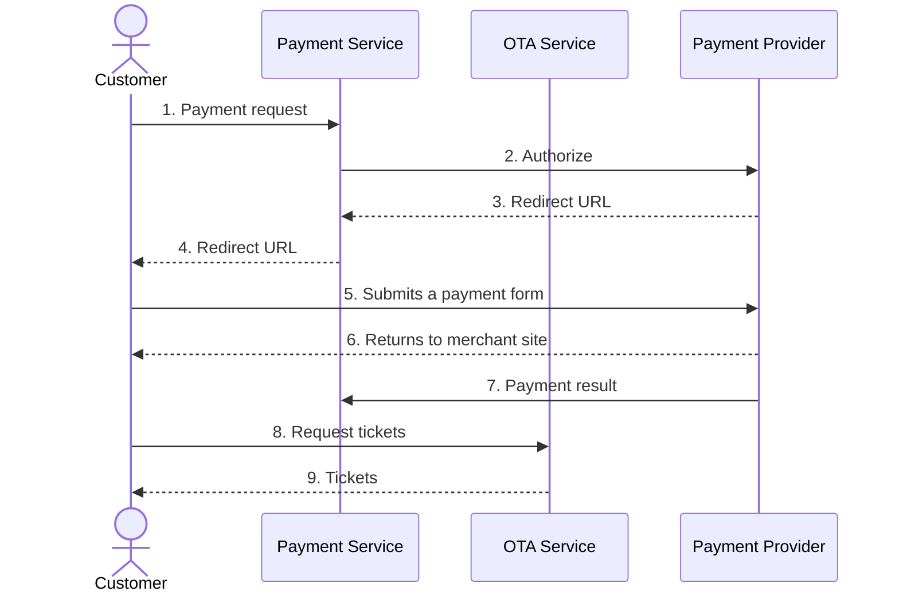

# Payment and Ticketing

The purpose is to make a payment for existing booking and issue tickets.

## Table of Contents

- [Payment and Ticketing](#payment-and-ticketing)
  - [Table of Contents](#table-of-contents)
  - [Base URLs](#base-urls)
  - [Endpoints](#endpoints)
  - [Supported Payment Types](#supported-payment-types)
  - [Make Payment for Issuing a Ticket](#make-payment-for-issuing-a-ticket)
    - [Basic Request Format](#basic-request-format)
      - [With JWT Authentication](#with-jwt-authentication)
      - [With API Key Authentication](#with-api-key-authentication)
    - [HTTP Headers](#http-headers)
    - [JSON Request](#json-request)
    - [JSON Response](#json-response)
  - [Payment with Debit-Credit Account](#payment-with-debit-credit-account)
    - [Get Available Debit-Credit Accounts](#get-available-debit-credit-accounts)
    - [Response](#response)
    - [Payment with Debit-Credit Account](#payment-with-debit-credit-account-1)
  - [Payment with Redirect](#payment-with-redirect)
    - [Payment Flow](#payment-flow)
    - [Payment with Redirect has 3 main steps:](#payment-with-redirect-has-3-main-steps)
    - [Step 1: Get Payment URL](#step-1-get-payment-url)
      - [Request Format](#request-format)
      - [JSON Request Template](#json-request-template)
      - [JSON Request Example](#json-request-example)
      - [JSON Response Example](#json-response-example)
    - [Step 2: Submit Payment Form](#step-2-submit-payment-form)
    - [Step 3: Request Tickets without payment info](#step-3-request-tickets-without-payment-info)
      - [Request Format](#request-format-1)
      - [JSON Request Example](#json-request-example-1)
      - [JSON Response Example](#json-response-example-1)
  - [Issue EMDs for Ancillaries](#issue-emds-for-ancillaries)
    - [EMD Request](#emd-request)
    - [EMD Response](#emd-response)
  - [Currency Conversion](#currency-conversion)
    - [Get Conversion Rate](#get-conversion-rate)
    - [Response](#response-1)
  - [Error Responses](#error-responses)
    - [Payment Declined](#payment-declined)
    - [Insufficient Funds](#insufficient-funds)
    - [Payment Timeout](#payment-timeout)

## Base URLs

| Environment | URL |
|-------------|-----|
| Production  | <https://api.worldticket.net> |
| Test        | <https://test-api.worldticket.net> |

## Endpoints
- Method: `POST`
- Path: `/ota/v2015b/OTA_AirDemandTicketRQ`
- Full URL: `{base_url}/ota/v2015b/OTA_AirDemandTicketRQ` (choose base URL per environment above)

## Supported Payment Types

| Payment Type | OTA Code |
|--------------|----------|
| External payment | 32 |
| Credit card | 5 |
| Cash | 1 |
| Debit credit account | 4 |
| Invoice | 40 |

## Make Payment for Issuing a Ticket

### Basic Request Format

#### With JWT Authentication
```bash
curl -X POST \
  'https://test-api.worldticket.net/ota/v2015b/OTA_AirDemandTicketRQ' \
  -H 'Authorization: Bearer {access_token}' \
  -H 'Content-Type: application/json' \
  -d @AirDemandTicketRQ.json
```

#### With API Key Authentication
```bash
curl -X POST \
  'https://test-api.worldticket.net/ota/v2015b/OTA_AirDemandTicketRQ' \
  -H 'X-API-Key: {api_key}' \
  -H 'Content-Type: application/json' \
  -d @AirDemandTicketRQ.json
```

### HTTP Headers

Attach the following headers to OTA requests.

| Header        | Description                         | Example                   |
|---------------|-------------------------------------|---------------------------|
| Authorization | Bearer token for JWT authentication | Bearer {access_token}     |
| X-API-Key     | API key for key-based authentication| {api_key}                 |
| Content-Type  | Request content type                | application/json          |

Note: Use either `Authorization` (JWT) OR `X-API-Key` (API key), not both.

### JSON Request

<details>
<summary><strong>📋 JSON Request Template</strong></summary>
<div markdown="1">

```json
{
  "version": "2.001",
  "pos": {
    "source": [
      {
        "bookingChannel": {
          "type": "OTA"
        },
        "requestorID": {
          "type": "5",
          "id": "{agent_id}",
          "name": "{agency_id}"
        },
        "isocountry": "US",
        "isoCurrency": "USD"
      }
    ]
  },
  "demandTicketDetail": {
    "messageFunction": [
      {
        "function": "ET"
      }
    ],
    "bookingReferenceID": {
      "id": "{record_locator}",
      "type": "14",
      "companyName": {
        "code": "{airline_code}",
        "companyShortName": "{tenant_name}"
      }
    },
    "paymentInfo": [
      {
        "paymentType": "5",
        "creditCardInfo": [
          {
            "cardHolderName": "{cardholder_name}"
          }
        ],
        "currencyCode": "USD",
        "amount": 100.00
      }
    ]
  }
}
```

</div>

</details>

<details>
<summary><strong>✅ Example</strong></summary>
<div markdown="1">

```json
{
  "version": "2.001",
  "pos": {
    "source": [
      {
        "bookingChannel": {
          "type": "OTA"
        },
        "requestorID": {
          "type": "5",
          "id": "AGENT123",
          "name": "AGENCY1"
        },
        "isocountry": "US",
        "isoCurrency": "USD"
      }
    ]
  },
  "demandTicketDetail": {
    "messageFunction": [
      {
        "function": "ET"
      }
    ],
    "bookingReferenceID": {
      "id": "ABC123",
      "type": "14",
      "companyName": {
        "code": "DX",
        "companyShortName": "DX"
      }
    },
    "paymentInfo": [
      {
        "paymentType": "5",
        "creditCardInfo": [
          {
            "cardHolderName": "JOHN DOE"
          }
        ],
        "currencyCode": "USD",
        "amount": 300.00
      }
    ]
  }
}
```

</div>

</details>

### JSON Response

<details>
<summary><strong>✅ Example</strong></summary>
<div markdown="1">

```json
{
  "success": {},
  "bookingReferenceID": {
    "companyName": {
      "companyShortName": "DX",
      "code": "DX"
    },
    "type": "14",
    "id": "ABC123"
  },
  "ticketItemInfo": [
    {
      "passengerName": {
        "namePrefix": ["MR"],
        "givenName": ["JOHN"],
        "middleName": [],
        "surname": "DOE",
        "nameSuffix": [],
        "nameTitle": [],
        "passengerTypeCode": "ADT"
      },
      "conjunctiveTicket": [],
      "ticketNumber": "3333330012345",
      "type": "E_TICKET",
      "itemNumber": "1",
      "totalAmount": 300.00,
      "paymentType": "5",
      "netAmount": 270.00
    }
  ],
  "timeStamp": "2024-10-30T10:00:00.000Z",
  "version": 2.001,
  "retransmissionIndicator": false
}
```

</div>

</details>

## Payment with Debit-Credit Account

### Get Available Debit-Credit Accounts

```bash
curl -X GET \
  'https://test-api.worldticket.net/payment-service/debit-credit/accounts' \
  -H 'Authorization: Bearer {access_token}' \
  -H 'Content-Type: application/json'
```

### Response

```json
{
  "accounts": [
    {
      "accountId": "{account_id}",
      "accountName": "{account_name}",
      "balance": {
        "amount": "{balance_amount}",
        "currency": "{currency_code}"
      },
      "status": "active"
    }
  ]
}
```

### Payment with Debit-Credit Account

<details>
<summary><strong>✅ Request Example</strong></summary>
<div markdown="1">

```json
{
  "version": "2.001",
  "pos": {
    "source": [
      {
        "bookingChannel": {
          "type": "OTA"
        },
        "requestorID": {
          "type": "5",
          "id": "{agent_id}",
          "name": "{agency_id}"
        },
        "isocountry": "US",
        "isoCurrency": "USD"
      }
    ]
  },
  "demandTicketDetail": {
    "messageFunction": [
      {
        "function": "ET"
      }
    ],
    "bookingReferenceID": {
      "id": "{record_locator}",
      "type": "14",
      "companyName": {
        "code": "{airline_code}",
        "companyShortName": "{airline_code}"
      }
    },
    "paymentInfo": [
      {
        "paymentType": "4",
        "creditCardInfo": [
          {
            "cardHolderName": "{account_name}"
          }
        ],
        "currencyCode": "USD",
        "amount": 100.00
      }
    ]
  }
}
```

</div>

</details>

## Payment with Redirect

For asynchronous payment processing where customers are redirected to payment provider websites.

### Payment Flow



### Payment with Redirect has 3 main steps:

### Step 1: Get Payment URL

#### Request Format

```bash
curl -X POST \
  'https://api.worldticket.net/payment-service/payments/{tenant}' \
  -H 'Authorization: Bearer {access_token}' \
  -H 'Content-Type: application/json' \
  -d @payment-request.json
```

#### JSON Request Template

<details>
<summary><strong>📋 Template</strong></summary>
<div markdown="1">

```json
{
  "tenant": "{tenant}",
  "orderId": "{record_locator}",
  "paymentInfo": {
    "paymentMethod": "credit_card",
    "psp": "d2_async",
    "providerName": "dibs"
  },
  "buyerInfo": {
    "firstName": "{first_name}",
    "lastName": "{last_name}",
    "city": "{city}",
    "country": "{country}",
    "address": "{address}",
    "email": "{email}",
    "phone": "{phone}",
    "zipCode": "{zipCode}",
    "preferredLanguage": "en"
  },
  "amount": "{total_amount}",
  "currency": "{currency_code}",
  "channel": "{channel}"
}
```

</div>

</details>

#### JSON Request Example

<details>
<summary><strong>✅ Example</strong></summary>
<div markdown="1">

```json
{
  "tenant": "test-tenant",
  "orderId": "9KEOQC",
  "paymentInfo": {
    "paymentMethod": "credit_card",
    "psp": "d2_async",
    "providerName": "dibs"
  },
  "buyerInfo": {
    "firstName": "Victor",
    "lastName": "Doom",
    "city": "IEV",
    "country": "AU",
    "address": "chavdar 34",
    "email": "qawt@ciklum.net",
    "phone": "+49 151 20974332",
    "zipCode": "02141",
    "preferredLanguage": "en"
  },
  "amount": 123.88,
  "currency": "EUR",
  "channel": "OTA"
}
```

</div>

</details>

#### JSON Response Example

<details>
<summary><strong>✅ Example</strong></summary>
<div markdown="1">

```json
{
  "status": "NEED_REDIRECT",
  "transactionId": "1847468",
  "provider": "d2_async",
  "submitMethod": "POST",
  "asynchronousRedirectUrl": "https://payment.architrade.com/paymentweb/start.action?accepturl=https://test-api.worldticket.net/payment-service/payments/test-tenant/providers/d2_async/confirmation&amp;cancelurl=https://test-api.worldticket.net/payment-service/payments/test-tenant/providers/d2_async/confirmation?orderid=9KEOQC:398253_1847468&amp;amount=12388¤cy=EUR&amp;merchant=90233698&amp;orderid=9KEOQC:398253_1847468&amp;lang&amp;ordertext=1847468&amp;test=1&amp;md5=09c96fb98b43f06f72703bd488c45c3f&amp;md5key=09c96fb98b43f06f72703bd488c45c3f&amp;decorator=responsive&amp;capturenow=true",
  "asynchronousRequestData": {
    "accepturl": "https://test-api.worldticket.net/payment-service/payments/test-tenant/providers/d2_async/confirmation",
    "orderid": "9KEOQC:398253_1847468",
    "orderId": "9KEOQC:398253_1847468",
    "mid": "90233698",
    "ordertext": "1847468",
    "cancelUrl": "https://test-api.worldticket.net/payment-service/payments/test-tenant/providers/d2_async/confirmation?orderid=9KEOQC:398253_1847468",
    "orderText": "1847468",
    "orderAmount": "12388",
    "requestUrl": "https://payment.architrade.com/paymentweb/start.action",
    "testModeParam": "1",
    "testMode": "test",
    "currency": "EUR",
    "confirmUrl": "https://test-api.worldticket.net/payment-service/payments/test-tenant/providers/d2_async/confirmation",
    "md5key": "09c96fb98b43f06f72703bd488c45c3f",
    "lang": "en",
    "cancelurl": "https://test-api.worldticket.net/payment-service/payments/test-tenant/providers/d2_async/confirmation?orderid=9KEOQC:398253_1847468",
    "md5": "09c96fb98b43f06f72703bd488c45c3f"
  }
}
```

</div>

</details>

### Step 2: Submit Payment Form

A customer should open `asynchronousRedirectUrl` from the response above and insert Credit Card data and pay.

### Step 3: Request Tickets without payment info

No payment info is required because tickets have been paid already.

#### Request Format

```bash
curl -X POST \
  'https://test-api.worldticket.net/ota/v2015b/OTA_AirDemandTicketRQ' \
  -H 'Authorization: Bearer {access_token}' \
  -H 'Content-Type: application/json' \
  -d @AirDemandTicketRQ.json
```

#### JSON Request Example

<details>
<summary><strong>✅ Example</strong></summary>
<div markdown="1">

```json
{
  "version": "2.001",
  "pos": {
    "source": [
      {
        "bookingChannel": {
          "type": "OTA"
        },
        "requestorID": {
          "type": "5",
          "id": "AGENT123",
          "name": "AGENCY1"
        },
        "isocountry": "US",
        "isoCurrency": "USD"
      }
    ]
  },
  "demandTicketDetail": {
    "messageFunction": [
      {
        "function": "ET"
      }
    ],
    "bookingReferenceID": {
      "id": "9KEOQC",
      "type": "14",
      "companyName": {
        "companyShortName": "test-tenant"
      }
    }
  }
}
```

**Note:** No `paymentInfo` is required since payment was already processed in Step 1-2.

</div>

</details>

#### JSON Response Example

<details>
<summary><strong>✅ Example</strong></summary>
<div markdown="1">

```json
{
  "success": {},
  "bookingReferenceID": {
    "companyName": {
      "code": "DX"
    },
    "type": "14",
    "id": "9KEOQC"
  },
  "ticketItemInfo": [
    {
      "passengerName": {
        "namePrefix": ["MR"],
        "givenName": ["John"],
        "middleName": [],
        "surname": "Doe",
        "nameSuffix": [],
        "nameTitle": [],
        "passengerTypeCode": "ADT"
      },
      "conjunctiveTicket": [],
      "ticketNumber": "2461118530533",
      "type": "E_TICKET",
      "itemNumber": "1",
      "totalAmount": 123.88,
      "paymentType": "5",
      "netAmount": 110.72
    }
  ],
  "timeStamp": "2024-10-30T10:30:00.000Z",
  "version": 2.001,
  "retransmissionIndicator": false
}
```

</div>

</details>

## Issue EMDs for Ancillaries

Electronic Miscellaneous Documents (EMDs) for additional services.

### EMD Request

```bash
curl -X POST \
  'https://test-api.worldticket.net/ota/v2015b/OTA_AirDemandTicketRQ' \
  -H 'Authorization: Bearer {access_token}' \
  -H 'Content-Type: application/json' \
  -d @AirDemandTicketRQ.json
```

<details>
<summary><strong>✅ Example</strong></summary>
<div markdown="1">

```json
{
  "version": "1.000",
  "echoToken": "223344",
  "timeStamp": "2006-09-15T10:30:33-06:00",
  "target": "Production",
  "sequenceNmbr": "1",
  "pos": {
    "source": [
      {
        "erSPuserID": "1#Preved",
        "agentSine": "2BB",
        "pseudoCityCode": "ATL",
        "isocountry": "US",
        "isoCurrency": "EUR",
        "airlineVendorID": "1P",
        "requestorID": {
          "type": "5",
          "id": "35896241"
        },
        "bookingChannel": {
          "type": "COM"
        }
      }
    ]
  },
  "demandTicketDetail": {
    "messageFunction": [
      {
        "function": "EMD"
      }
    ],
    "bookingReferenceID": {
      "id": "11XS47",
      "type": "14",
      "companyName": {
        "code": "test-qa-rc"
      }
    },
    "paymentInfo": [
      {
        "paymentType": "1",
        "text": "100001798",
        "currencyCode": "EUR",
        "amount": 140.00,
        "creditCardInfo": [
          {
            "amount": 140.00
          }
        ]
      }
    ],
    "passengerName": [
      {
        "rph": "3",
        "passengerTypeCode": "CHD",
        "namePrefix": ["Mr."],
        "givenName": ["Second"],
        "middleName": [],
        "surname": "WorldTicket",
        "nameSuffix": [],
        "nameTitle": []
      }
    ],
    "emdInfo": {
      "totalFltSegQty": "1",
      "baseFare": {
        "amount": 140.00,
        "currencyCode": "EUR"
      },
      "totalFare": {
        "amount": 140.00,
        "currencyCode": "EUR"
      },
      "ticketDocument": [
        {
          "inConnectionDocNbr": "2461118401860",
          "couponInfo": [
            {
              "number": "1",
              "inConnectionNbr": "1",
              "associateInd": true,
              "consumedAtIssuanceInd": false,
              "fareBasisCode": "GVDXSRP",
              "assocFareBasisCode": "GVDXSRP",
              "remark": "XBAG",
              "unitOfMeasureQuantity": "1",
              "reasonForIssuance": {
                "code": "C",
                "subCode": "0C3",
                "description": "Extra baggage 1 piece up to 23kg"
              },
              "filedFeeInfo": {
                "amount": 20.00,
                "currencyCode": "EUR",
                "bsrRate": "1"
              }
            },
            {
              "number": "2",
              "inConnectionNbr": "2",
              "associateInd": true,
              "consumedAtIssuanceInd": false,
              "fareBasisCode": "LDXBED",
              "assocFareBasisCode": "LDXBED",
              "remark": "SPEQ",
              "unitOfMeasureQuantity": "1",
              "reasonForIssuance": {
                "code": "C",
                "subCode": "0PX",
                "description": "Ski equipment up to 15kg"
              },
              "filedFeeInfo": {
                "amount": 50.00,
                "currencyCode": "EUR",
                "bsrRate": "1"
              }
            }
          ]
        }
      ]
    }
  }
}
```

</div>

</details>

### EMD Response

<details>
<summary><strong>✅ Example</strong></summary>
<div markdown="1">

```json
{
  "success": {},
  "bookingReferenceID": {
    "companyName": {
      "code": "test-qa-rc"
    },
    "id": "11XS47"
  },
  "ticketItemInfo": [
    {
      "ticketNumber": "7776660003692",
      "type": "E_TICKET",
      "itemNumber": "1",
      "totalAmount": 50.00,
      "paymentType": "4",
      "netAmount": 50.00,
      "passengerName": {
        "namePrefix": ["Mr."],
        "givenName": ["Second"],
        "middleName": [],
        "surname": "WorldTicket",
        "nameSuffix": [],
        "nameTitle": [],
        "passengerTypeCode": "ADT"
      },
      "conjunctiveTicket": []
    }
  ],
  "timeStamp": "2024-10-30T10:00:00.000Z",
  "version": 1.000,
  "retransmissionIndicator": false
}
```

</div>

</details>

## Currency Conversion

Payment currency can be different from booking currency.

### Get Conversion Rate

```bash
curl -X GET \
  'https://test-api.worldticket.net/sms-gateway/currencies/convert?currency_from={from_currency}&currency_to={to_currency}&amount={amount}' \
  -H 'Authorization: Bearer {access_token}' \
  -H 'Content-Type: application/json'
```

### Response

The endpoint returns the converted amount as a BigDecimal number:

```text
81.07
```

## Error Responses

Common error responses for payment and ticketing requests:

### Payment Declined

```json
{
  "errors": [
    {
      "code": "PAYMENT_DECLINED",
      "message": "The payment was declined by the card issuer. Please try a different card."
    }
  ]
}
```

### Insufficient Funds

```json
{
  "errors": [
    {
      "code": "INSUFFICIENT_FUNDS",
      "message": "Insufficient funds in debit-credit account",
      "accountId": "{account_id}"
    }
  ]
}
```

### Payment Timeout

```json
{
  "errors": [
    {
      "code": "PAYMENT_TIMEOUT",
      "message": "Payment processing timed out. Please try again.",
      "paymentId": "{payment_id}"
    }
  ]
}
```
