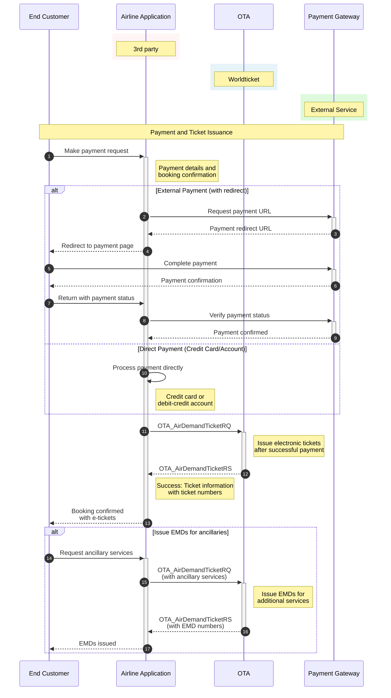

# Payment and Ticketing

The purpose is to make a payment for existing booking and issue tickets.

## Base URLs

| Environment | URL |
|-------------|-----|
| Production | https://api.worldticket.net/ota/v2015b/OTA |
| Test | https://test-api.worldticket.net/ota/v2015b/OTA |

## Supported Payment Types

| Payment Type | OTA Code | Description |
|--------------|----------|-------------|
| External payment | 32 | Third-party payment processor |
| Credit card | 5 | Direct credit card payment |
| Cash | 1 | Cash payment |
| Debit credit account | 4 | Airline account payment |
| Invoice | 40 | Invoice payment |

## Payment and Ticketing Workflow



## Make Payment for Issuing a Ticket

### Request Parameters (All Required)

| Parameter | Description | Example |
|-----------|-------------|----------|
| base_url | Base URL | https://test-api.worldticket.net/ota/v2015b/OTA |
| access_token | Access Token | Bearer {access_token} |
| local-name | Custom HTTP header | OTA_AirDemandTicketRQ |

### Request Format

```bash
curl -X POST \
    {base_url} \
    -H 'Authorization: Bearer {access_token}' \
    -H 'local-name: OTA_AirDemandTicketRQ' \
    -H 'Content-Type: application/xml' \
    -d @AirDemandTicketRQ.xml
```

### XML Request Example

```xml
<?xml version="1.0" encoding="UTF-8"?>
<OTA_AirDemandTicketRQ xmlns="http://www.opentravel.org/OTA/2003/05" Version="2.001">
    <POS>
        <Source>
            <RequestorID Type="5" ID="{agent_id}" ID_Context="{agency_id}"/>
        </Source>
    </POS>
    <DemandTicketDetail>
        <BookingReferenceID ID="{record_locator}" Type="14">
            <CompanyName Code="{airline_code}"/>
        </BookingReferenceID>
        <PaymentInfo PaymentType="5">
            <PaymentCard CardType="VI" CardNumber="{card_number}" ExpireDate="{expiry_date}">
                <CardHolderName>{cardholder_name}</CardHolderName>
                <Address>
                    <StreetNmbr>{street_address}</StreetNmbr>
                    <CityName>{city}</CityName>
                    <PostalCode>{postal_code}</PostalCode>
                    <CountryName Code="{country_code}"/>
                </Address>
            </PaymentCard>
        </PaymentInfo>
        <TicketingInfo TicketType="eTicket">
            <DeliveryInfo DeliveryMethod="Email">
                <Email>{delivery_email}</Email>
            </DeliveryInfo>
        </TicketingInfo>
    </DemandTicketDetail>
</OTA_AirDemandTicketRQ>
```

### XML Response Example

```xml
<?xml version="1.0" encoding="UTF-8"?>
<OTA_AirDemandTicketRS xmlns="http://www.opentravel.org/OTA/2003/05" Version="2.001">
    <Success/>
    <BookingReferenceID ID="{record_locator}" Type="14">
        <CompanyName Code="{airline_code}"/>
    </BookingReferenceID>
    <TicketItemInfo NetAmount="{net_amount}" PaymentType="5" TotalAmount="{total_amount}" 
                    ItemNumber="1" Type="eTicket" TicketNumber="{ticket_number}">
        <PassengerName>
            <GivenName>{first_name}</GivenName>
            <Surname>{last_name}</Surname>
        </PassengerName>
        <FlightSegmentInfo>
            <FlightSegment DepartureDateTime="{departure_datetime}" 
                          ArrivalDateTime="{arrival_datetime}"
                          FlightNumber="{flight_number}">
                <DepartureAirport LocationCode="{origin_code}"/>
                <ArrivalAirport LocationCode="{destination_code}"/>
            </FlightSegment>
        </FlightSegmentInfo>
    </TicketItemInfo>
</OTA_AirDemandTicketRS>
```

## Payment with Debit-Credit Account

### Get Available Debit-Credit Accounts

```bash
GET https://test-api.worldticket.net/payment-service/debit-credit/accounts HTTP/1.1
Host: test-api.worldticket.net
Authorization: Bearer {access_token}
```

### Response

```json
{
  "accounts": [
    {
      "accountId": "{account_id}",
      "accountName": "{account_name}",
      "balance": {
        "amount": "{balance_amount}",
        "currency": "{currency_code}"
      },
      "status": "active"
    }
  ]
}
```

### Payment with Debit-Credit Account

```xml
<PaymentInfo PaymentType="4">
    <DirectBill DirectBillID="{account_id}">
        <CompanyName Code="{airline_code}"/>
    </DirectBill>
    <PaymentAmount Amount="{payment_amount}" CurrencyCode="{currency_code}"/>
</PaymentInfo>
```

## Payment with Redirect

For asynchronous payment processing where customers are redirected to payment provider websites.

### Payment Flow

1. **Payment Request**: Initiate payment and receive redirect URL
2. **Customer Redirect**: Customer completes payment on provider site
3. **Return to Merchant**: Customer returns with payment confirmation
4. **Ticket Demand**: Request tickets after successful payment

### Get Payment URL

#### Request

```bash
POST https://api.worldticket.net/payment-service/payments/{tenant}
```

#### Request Body

```json
{
  "orderId": "{record_locator}",
  "paymentInfo": {
    "method": "credit_card",
    "provider": "stripe"
  },
  "buyerInfo": {
    "firstName": "{first_name}",
    "lastName": "{last_name}",
    "email": "{email}",
    "phone": "{phone}"
  },
  "amount": "{total_amount}",
  "currency": "{currency_code}"
}
```

#### Response

```json
{
  "paymentId": "{payment_id}",
  "asynchronousRedirectUrl": "{redirect_url}",
  "expiryTime": "{expiry_datetime}",
  "status": "pending"
}
```

### Request Tickets (After Payment)

```xml
<?xml version="1.0" encoding="UTF-8"?>
<OTA_AirDemandTicketRQ xmlns="http://www.opentravel.org/OTA/2003/05" Version="2.001">
    <POS>
        <Source>
            <RequestorID Type="5" ID="{agent_id}" ID_Context="{agency_id}"/>
        </Source>
    </POS>
    <DemandTicketDetail>
        <BookingReferenceID ID="{record_locator}" Type="14">
            <CompanyName Code="{airline_code}"/>
        </BookingReferenceID>
        <!-- No payment info required - already paid -->
        <TicketingInfo TicketType="eTicket">
            <DeliveryInfo DeliveryMethod="Email">
                <Email>{delivery_email}</Email>
            </DeliveryInfo>
        </TicketingInfo>
    </DemandTicketDetail>
</OTA_AirDemandTicketRQ>
```

## Issue EMDs for Ancillaries

Electronic Miscellaneous Documents (EMDs) for additional services.

### Request

```xml
<OTA_AirDemandTicketRQ>
    <DemandTicketDetail>
        <BookingReferenceID ID="{record_locator}" Type="14"/>
        <AncillaryServices>
            <AncillaryService ServiceType="Baggage" ServiceCode="BAGS" Quantity="1">
                <Description>Extra Baggage - 20kg</Description>
                <Price Amount="{service_price}" CurrencyCode="{currency_code}"/>
            </AncillaryService>
            <AncillaryService ServiceType="Meal" ServiceCode="MEAL" Quantity="1">
                <Description>Special Meal</Description>
                <Price Amount="{meal_price}" CurrencyCode="{currency_code}"/>
            </AncillaryService>
        </AncillaryServices>
    </DemandTicketDetail>
</OTA_AirDemandTicketRQ>
```

### Response

```xml
<OTA_AirDemandTicketRS>
    <Success/>
    <EMDItemInfo EMDNumber="{emd_number}" NetAmount="{net_amount}" TotalAmount="{total_amount}">
        <ServiceInfo ServiceType="Baggage" ServiceCode="BAGS">
            <Description>Extra Baggage - 20kg</Description>
        </ServiceInfo>
    </EMDItemInfo>
</OTA_AirDemandTicketRS>
```

## Currency Conversion

Payment currency can be different from booking currency.

### Get Conversion Rate

```bash
GET https://test-api.worldticket.net/payment-service/currencies/convert?currency_from={from_currency}&currency_to={to_currency}&amount={amount}
Authorization: Bearer {access_token}
```

### Response

```json
{
  "fromCurrency": "{from_currency}",
  "toCurrency": "{to_currency}",
  "originalAmount": "{original_amount}",
  "convertedAmount": "{converted_amount}",
  "exchangeRate": "{exchange_rate}",
  "conversionDate": "{conversion_date}"
}
```

## Error Responses

### Payment Declined

```xml
<OTA_AirDemandTicketRS>
    <Errors>
        <Error Code="PAYMENT_DECLINED" ShortText="Payment declined">
            The payment was declined by the card issuer. Please try a different card.
        </Error>
    </Errors>
</OTA_AirDemandTicketRS>
```

### Insufficient Funds

```json
{
  "errors": [
    {
      "code": "INSUFFICIENT_FUNDS",
      "message": "Insufficient funds in debit-credit account",
      "accountId": "{account_id}"
    }
  ]
}
```

### Payment Timeout

```json
{
  "errors": [
    {
      "code": "PAYMENT_TIMEOUT",
      "message": "Payment processing timed out. Please try again.",
      "paymentId": "{payment_id}"
    }
  ]
}
```