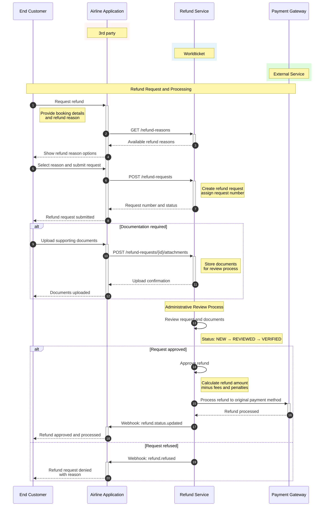

# Refund via Refund Queue µService

Comprehensive refund processing system for managing refund requests, documentation, and approvals.

## Overview

The refund process handles both voluntary and involuntary refunds through a structured workflow:

1. **Refund Request Creation**: Submit refund request with supporting documentation
2. **Review Process**: Administrative review of refund eligibility
3. **Approval/Rejection**: Decision on refund amount and processing
4. **Processing**: Actual refund execution to original payment method

## Base URLs

| Environment | URL |
|-------------|-----|
| Production | https://api.worldticket.net/refund-service |
| Test | https://test-api.worldticket.net/refund-service |

## Refund Process Workflow



## Refund Request APIs

### 1. Retrieve Refund Request List

Get all refund requests based on search criteria.

#### Request

```bash
GET https://test-api.worldticket.net/refund-service/refund-requests
```

#### Parameters (All Optional)

| Parameter | Type | Description | Example |
|-----------|------|-------------|---------|
| record_locator | string | Booking record locator | WT01C5 |
| request_number | number | Refund request number | 255 |
| ticket_number | string | Ticket number | 10263259688333 |
| passenger_lname | string | Passenger last name | Smith |
| flight_designator | string | Flight number | FL123 |
| departure_from | string | Departure date from | 2023-01-15 |
| departure_to | string | Departure date to | 2023-01-16 |
| request_from | string | Request date from | 2023-04-09T00:00:00+07:00 |
| request_to | string | Request date to | 2023-04-10T23:59:59+07:00 |
| segment | string | Route segment | JFK-LAX |
| category | string | Refund category | VOLUNTARY, INVOLUNTARY |
| statuses | List<string> | Request statuses | NEW, REVIEWED, VERIFIED, REFUNDED, REFUSED |

#### Response

```json
{
  "refundRequests": [
    {
      "requestNumber": 235,
      "recordLocator": "WT01C5",
      "passengerName": "John Smith",
      "flightInfo": {
        "flightNumber": "FL123",
        "departureDate": "2023-12-25",
        "route": "JFK-LAX"
      },
      "requestDate": "2023-04-09T10:30:00+07:00",
      "category": "VOLUNTARY",
      "status": "NEW",
      "refundAmount": {
        "amount": 450.00,
        "currency": "USD"
      },
      "reason": "Travel plan changed"
    }
  ],
  "totalCount": 1,
  "pageInfo": {
    "currentPage": 1,
    "totalPages": 1,
    "itemsPerPage": 20
  }
}
```

### 2. Retrieve Refund Reasons

Get available refund reasons for user selection.

#### Request

```bash
GET https://test-api.worldticket.net/refund-service/refund-reasons
```

#### Response

```json
{
  "refundReasons": [
    {
      "id": 4,
      "reasonCode": "refund-reason.own_reason",
      "description": "Personal reason",
      "category": "VOLUNTARY",
      "requiresDocumentation": false
    },
    {
      "id": 5,
      "reasonCode": "refund-reason.medical_emergency",
      "description": "Medical emergency",
      "category": "INVOLUNTARY",
      "requiresDocumentation": true
    },
    {
      "id": 6,
      "reasonCode": "refund-reason.flight_cancellation",
      "description": "Flight cancelled by airline",
      "category": "INVOLUNTARY",
      "requiresDocumentation": false
    }
  ]
}
```

### 3. Create Refund Request

Submit new refund request with passenger and booking details.

#### Request

```bash
POST https://test-api.worldticket.net/refund-service/refund-requests
```

#### Request Body

```json
{
  "bookingInfo": {
    "recordLocator": "WT01C5",
    "ticketNumber": "10263259688333",
    "passengerName": {
      "firstName": "John",
      "lastName": "Smith"
    }
  },
  "flightInfo": {
    "flightNumber": "FL123",
    "departureDate": "2023-12-25",
    "route": {
      "origin": "JFK",
      "destination": "LAX"
    }
  },
  "refundInfo": {
    "reasonId": 4,
    "category": "VOLUNTARY",
    "requestedAmount": {
      "amount": 450.00,
      "currency": "USD"
    },
    "description": "Unable to travel due to work commitments"
  },
  "contactInfo": {
    "email": "john.smith@email.com",
    "phone": "+1234567890"
  }
}
```

#### Response

```json
{
  "refundRequestNumber": 235,
  "status": "NEW",
  "submissionDate": "2023-04-09T10:30:00+07:00",
  "estimatedProcessingTime": "5-10 business days",
  "message": "Refund request submitted successfully"
}
```

### 4. Upload Attachments

Upload supporting documents for refund requests.

#### Request

```bash
POST https://test-api.worldticket.net/refund-service/refund-requests/{request_number}/attachments
```

**Content-Type:** `multipart/form-data`

#### File Requirements

- **Supported formats**: Image files (JPG, PNG, GIF) and PDF
- **File size limit**: 2MB per file
- **Total size limit**: 20MB per request

#### Form Data

```
file: [binary file data]
description: "Medical certificate for emergency refund"
documentType: "medical_certificate"
```

#### Response

```json
{
  "uploadedFiles": [
    {
      "fileName": "medical_certificate.pdf",
      "fileSize": 1024000,
      "uploadDate": "2023-04-09T10:35:00+07:00",
      "documentType": "medical_certificate",
      "status": "uploaded"
    }
  ],
  "message": "Documents uploaded successfully"
}
```

## Refund Workflow

### Process Flow

```
Customer Request → Document Review → Eligibility Check → Approval/Rejection → Processing → Completion
```

### Status Progression

1. **NEW**: Initial request submitted
2. **REVIEWED**: Under administrative review
3. **VERIFIED**: Documents and eligibility confirmed
4. **APPROVED**: Refund approved for processing
5. **REFUNDED**: Refund processed and completed
6. **REFUSED**: Request denied

### Example Workflow Request

```json
{
  "workflowStep": "document_review",
  "requestNumber": 235,
  "reviewerComments": "All required documentation provided",
  "nextAction": "eligibility_check",
  "estimatedCompletion": "2023-04-12T17:00:00+07:00"
}
```

## Refund Categories

### Voluntary Refunds

- **Personal reasons**: Travel plan changes, work commitments
- **Processing**: Subject to fare rules and cancellation fees
- **Timeline**: 5-10 business days
- **Documentation**: Usually not required

### Involuntary Refunds

- **Medical emergencies**: Illness, injury, death in family
- **Flight disruptions**: Airline cancellations, schedule changes
- **Force majeure**: Natural disasters, government restrictions
- **Processing**: Full or partial refund based on circumstances
- **Timeline**: 3-7 business days
- **Documentation**: May be required

## Refund Amount Calculation

### Fare Component Breakdown

```json
{
  "originalFare": {
    "baseFare": 350.00,
    "taxes": 75.00,
    "fees": 25.00,
    "total": 450.00,
    "currency": "USD"
  },
  "refundCalculation": {
    "refundableFare": 300.00,
    "refundableTaxes": 75.00,
    "cancellationFee": 50.00,
    "processingFee": 10.00,
    "totalRefund": 315.00,
    "currency": "USD"
  }
}
```

### Refund Rules

- **Refundable Fares**: Full fare minus applicable fees
- **Non-refundable Fares**: Taxes and fees only
- **Partially Used Tickets**: Pro-rated refund for unused segments
- **Group Bookings**: Individual passenger refund calculations

## Error Handling

### Invalid Request

```json
{
  "error": {
    "code": "INVALID_REQUEST",
    "message": "Missing required booking information",
    "details": {
      "missingFields": ["recordLocator", "ticketNumber"]
    }
  }
}
```

### Booking Not Eligible

```json
{
  "error": {
    "code": "NOT_ELIGIBLE_FOR_REFUND",
    "message": "This booking is not eligible for refund",
    "details": {
      "reason": "Non-refundable fare with no valid exception",
      "fareType": "Basic Economy"
    }
  }
}
```

### File Upload Error

```json
{
  "error": {
    "code": "FILE_UPLOAD_ERROR",
    "message": "File size exceeds limit",
    "details": {
      "maxFileSize": "2MB",
      "uploadedFileSize": "3.5MB"
    }
  }
}
```

## Integration with Booking System

### Automatic Refund Trigger

When cancellations occur through booking modification:

```xml
<!-- In OTA_AirBookModifyRQ -->
<CancellationInfo>
    <AutoRefundRequest>true</AutoRefundRequest>
    <RefundReason>Customer initiated cancellation</RefundReason>
</CancellationInfo>
```

### Refund Status Updates

Receive notifications of refund status changes:

```json
{
  "webhook": {
    "event": "refund.status.updated",
    "data": {
      "requestNumber": 235,
      "oldStatus": "REVIEWED",
      "newStatus": "APPROVED",
      "refundAmount": {
        "amount": 315.00,
        "currency": "USD"
      },
      "expectedProcessingDate": "2023-04-15"
    }
  }
}
```